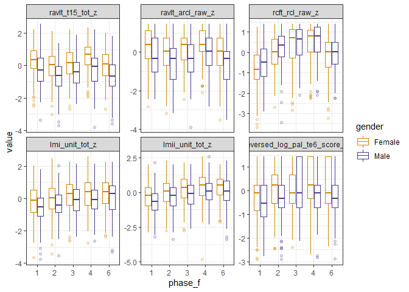

THBP T6 Gender analysis
================
Bindoff, A.

2019-10-31 18:04:01

# 

Reproducible R code and Supplementary Materials for Alty & Bindoff et
al. (*in press*). Data available through the University of Tasmania
Research Data Portal <id goes here> `thbp_t6_sex.rds` under CC-BY 4.0
(International) license.

## Data handling

Data were downloaded from THBP database on 2nd May 2019. Implausible
outliers were removed (e.g obvious coding errors). Voluntary withdrawals
and participants who met exclusion criteria were removed. Cognitive test
scores were reversed and/transformed where appropriate, then
standardized. The latent variable ‘prior cognitive reserve’ (PCR) was
calculated as per Ward et al. (reported in-text as ‘CR’) \[1\]. R script
used to clean data available on request
(`minimal_reproducible_dataset.R`).

``` r
long <- readRDS('thbp_t6_sex.rds') %>% filter(!is.na(pcr))
d0_baseline <- filter(long, phase_f == '1', !duplicated(idcode))
d0 <- arrange(long, idcode, phase) %>%
  group_by(idcode, phase_f) %>%
  filter(!duplicated(phase_f)) %>%
  ungroup()
```

## Demographics

### Test scores by phase

``` r
ggplot(long, aes(x = phase_f, y = value, colour = gender)) +
  geom_boxplot(alpha = 0.2) +
  scale_colour_manual(values = c("orange3", "slateblue4")) +
  facet_wrap(~test, scales = "free_y") +
  theme_bw()
```

<!-- -->

``` r
  table1(~ age_1 + mhq_edschool + wtar_fsiq + apoe + pcr + group | gender, d0_baseline, digits = 3, overall = "Total")  
```

\[1\] "

<table class="\&quot;Rtable1\&quot;">

<thead>

<tr>

<th class="rowlabel firstrow lastrow">

</th>

<th class="firstrow lastrow">

<span class="stratlabel">Female<br><span class="stratn">(n=378)</span></span>

</th>

<th class="firstrow lastrow">

<span class="stratlabel">Male<br><span class="stratn">(n=178)</span></span>

</th>

<th class="firstrow lastrow">

<span class="stratlabel">Total<br><span class="stratn">(n=556)</span></span>

</th>

</tr>

</thead>

<tbody>

<tr>

<td class="rowlabel firstrow">

<span class="varlabel">Age</span>

</td>

<td class="firstrow">

</td>

<td class="firstrow">

</td>

<td class="firstrow">

</td>

</tr>

<tr>

<td class="rowlabel">

Mean (SD)

</td>

<td>

59.9 (6.57)

</td>

<td>

61.0 (6.95)

</td>

<td>

60.2 (6.71)

</td>

</tr>

<tr>

<td class="rowlabel lastrow">

Median \[Min, Max\]

</td>

<td class="lastrow">

59.0 \[50.0, 78.0\]

</td>

<td class="lastrow">

61.0 \[50.0, 78.0\]

</td>

<td class="lastrow">

60.0 \[50.0, 78.0\]

</td>

</tr>

<tr>

<td class="rowlabel firstrow">

<span class="varlabel">Education (years)</span>

</td>

<td class="firstrow">

</td>

<td class="firstrow">

</td>

<td class="firstrow">

</td>

</tr>

<tr>

<td class="rowlabel">

Mean (SD)

</td>

<td>

11.2 (1.06)

</td>

<td>

11.4 (0.955)

</td>

<td>

11.2 (1.03)

</td>

</tr>

<tr>

<td class="rowlabel lastrow">

Median \[Min, Max\]

</td>

<td class="lastrow">

12.0 \[7.00, 13.0\]

</td>

<td class="lastrow">

12.0 \[9.00, 12.0\]

</td>

<td class="lastrow">

12.0 \[7.00, 13.0\]

</td>

</tr>

<tr>

<td class="rowlabel firstrow">

<span class="varlabel">WTAR FSIQ</span>

</td>

<td class="firstrow">

</td>

<td class="firstrow">

</td>

<td class="firstrow">

</td>

</tr>

<tr>

<td class="rowlabel">

Mean (SD)

</td>

<td>

113 (5.38)

</td>

<td>

112 (5.51)

</td>

<td>

112 (5.42)

</td>

</tr>

<tr>

<td class="rowlabel lastrow">

Median \[Min, Max\]

</td>

<td class="lastrow">

114 \[84.0, 123\]

</td>

<td class="lastrow">

114 \[83.0, 119\]

</td>

<td class="lastrow">

114 \[83.0, 123\]

</td>

</tr>

<tr>

<td class="rowlabel firstrow">

<span class="varlabel">apoe</span>

</td>

<td class="firstrow">

</td>

<td class="firstrow">

</td>

<td class="firstrow">

</td>

</tr>

<tr>

<td class="rowlabel">

e4-

</td>

<td>

210 (55.6%)

</td>

<td>

95 (53.4%)

</td>

<td>

305 (54.9%)

</td>

</tr>

<tr>

<td class="rowlabel">

e4+

</td>

<td>

94 (24.9%)

</td>

<td>

57 (32.0%)

</td>

<td>

151 (27.2%)

</td>

</tr>

<tr>

<td class="rowlabel lastrow">

Missing

</td>

<td class="lastrow">

74 (19.6%)

</td>

<td class="lastrow">

26 (14.6%)

</td>

<td class="lastrow">

100 (18.0%)

</td>

</tr>

<tr>

<td class="rowlabel firstrow">

<span class="varlabel">Prior Cognitive Reserve (z)</span>

</td>

<td class="firstrow">

</td>

<td class="firstrow">

</td>

<td class="firstrow">

</td>

</tr>

<tr>

<td class="rowlabel">

Mean (SD)

</td>

<td>

\-0.0890 (1.02)

</td>

<td>

0.219 (0.914)

</td>

<td>

0.00970 (0.994)

</td>

</tr>

<tr>

<td class="rowlabel lastrow">

Median \[Min, Max\]

</td>

<td class="lastrow">

0.00925 \[-2.87, 2.41\]

</td>

<td class="lastrow">

0.211 \[-2.08, 2.89\]

</td>

<td class="lastrow">

0.0551 \[-2.87, 2.89\]

</td>

</tr>

<tr>

<td class="rowlabel firstrow">

<span class="varlabel">Educational Intervention Group</span>

</td>

<td class="firstrow">

</td>

<td class="firstrow">

</td>

<td class="firstrow">

</td>

</tr>

<tr>

<td class="rowlabel">

Control

</td>

<td>

78 (20.6%)

</td>

<td>

45 (25.3%)

</td>

<td>

123 (22.1%)

</td>

</tr>

<tr>

<td class="rowlabel lastrow">

Experimental

</td>

<td class="lastrow">

300 (79.4%)

</td>

<td class="lastrow">

133 (74.7%)

</td>

<td class="lastrow">

433 (77.9%)

</td>

</tr>

</tbody>

</table>

"

``` r
  table1(~ gender + age_1 + apoe + group | phase_f, d0, overall = FALSE)  
```

\[1\] "

<table class="\&quot;Rtable1\&quot;">

<thead>

<tr>

<th class="rowlabel firstrow lastrow">

</th>

<th class="firstrow lastrow">

<span class="stratlabel">1<br><span class="stratn">(n=556)</span></span>

</th>

<th class="firstrow lastrow">

<span class="stratlabel">2<br><span class="stratn">(n=507)</span></span>

</th>

<th class="firstrow lastrow">

<span class="stratlabel">3<br><span class="stratn">(n=476)</span></span>

</th>

<th class="firstrow lastrow">

<span class="stratlabel">4<br><span class="stratn">(n=454)</span></span>

</th>

<th class="firstrow lastrow">

<span class="stratlabel">6<br><span class="stratn">(n=396)</span></span>

</th>

</tr>

</thead>

<tbody>

<tr>

<td class="rowlabel firstrow">

<span class="varlabel">gender</span>

</td>

<td class="firstrow">

</td>

<td class="firstrow">

</td>

<td class="firstrow">

</td>

<td class="firstrow">

</td>

<td class="firstrow">

</td>

</tr>

<tr>

<td class="rowlabel">

Female

</td>

<td>

378 (68.0%)

</td>

<td>

343 (67.7%)

</td>

<td>

318 (66.8%)

</td>

<td>

304 (67.0%)

</td>

<td>

265 (66.9%)

</td>

</tr>

<tr>

<td class="rowlabel lastrow">

Male

</td>

<td class="lastrow">

178 (32.0%)

</td>

<td class="lastrow">

164 (32.3%)

</td>

<td class="lastrow">

158 (33.2%)

</td>

<td class="lastrow">

150 (33.0%)

</td>

<td class="lastrow">

131 (33.1%)

</td>

</tr>

<tr>

<td class="rowlabel firstrow">

<span class="varlabel">Age</span>

</td>

<td class="firstrow">

</td>

<td class="firstrow">

</td>

<td class="firstrow">

</td>

<td class="firstrow">

</td>

<td class="firstrow">

</td>

</tr>

<tr>

<td class="rowlabel">

Mean (SD)

</td>

<td>

60.2 (6.71)

</td>

<td>

61.1 (6.70)

</td>

<td>

62.2 (6.69)

</td>

<td>

63.3 (6.64)

</td>

<td>

65.1 (6.63)

</td>

</tr>

<tr>

<td class="rowlabel lastrow">

Median \[Min, Max\]

</td>

<td class="lastrow">

60.0 \[50.0, 78.0\]

</td>

<td class="lastrow">

61.0 \[50.0, 79.0\]

</td>

<td class="lastrow">

62.0 \[51.0, 80.0\]

</td>

<td class="lastrow">

63.0 \[52.0, 81.0\]

</td>

<td class="lastrow">

65.0 \[55.0, 83.0\]

</td>

</tr>

<tr>

<td class="rowlabel firstrow">

<span class="varlabel">apoe</span>

</td>

<td class="firstrow">

</td>

<td class="firstrow">

</td>

<td class="firstrow">

</td>

<td class="firstrow">

</td>

<td class="firstrow">

</td>

</tr>

<tr>

<td class="rowlabel">

e4-

</td>

<td>

305 (54.9%)

</td>

<td>

289 (57.0%)

</td>

<td>

278 (58.4%)

</td>

<td>

265 (58.4%)

</td>

<td>

230 (58.1%)

</td>

</tr>

<tr>

<td class="rowlabel">

e4+

</td>

<td>

151 (27.2%)

</td>

<td>

142 (28.0%)

</td>

<td>

133 (27.9%)

</td>

<td>

129 (28.4%)

</td>

<td>

117 (29.5%)

</td>

</tr>

<tr>

<td class="rowlabel lastrow">

Missing

</td>

<td class="lastrow">

100 (18.0%)

</td>

<td class="lastrow">

76 (15.0%)

</td>

<td class="lastrow">

65 (13.7%)

</td>

<td class="lastrow">

60 (13.2%)

</td>

<td class="lastrow">

49 (12.4%)

</td>

</tr>

<tr>

<td class="rowlabel firstrow">

<span class="varlabel">Educational Intervention Group</span>

</td>

<td class="firstrow">

</td>

<td class="firstrow">

</td>

<td class="firstrow">

</td>

<td class="firstrow">

</td>

<td class="firstrow">

</td>

</tr>

<tr>

<td class="rowlabel">

Control

</td>

<td>

123 (22.1%)

</td>

<td>

108 (21.3%)

</td>

<td>

101 (21.2%)

</td>

<td>

97 (21.4%)

</td>

<td>

80 (20.2%)

</td>

</tr>

<tr>

<td class="rowlabel lastrow">

Experimental

</td>

<td class="lastrow">

433 (77.9%)

</td>

<td class="lastrow">

399 (78.7%)

</td>

<td class="lastrow">

375 (78.8%)

</td>

<td class="lastrow">

357 (78.6%)

</td>

<td class="lastrow">

316 (79.8%)

</td>

</tr>

</tbody>

</table>

"

#### Attrition

``` r
# R = (# at final phase - # at beginning)/# at beginning
# r = (1+R)^(1/years of study)
# rate of attrition = 1-r

1-(1+(396-556)/556)^(1/5)
```

    ## [1] 0.06561883

## Age-related cohort effects

A thin-plate regression spline was used to estimate age and gender
related cohort effects. This shows that CR varies little with age and
gender, and not in a way which would explain age or gender related
cognitive declines in our sample.

### Fig 1

``` r
m1 <- gam(pcr ~ gender + s(age_1, bs = "tp", by = gender), method = "REML", data = d0_baseline)
```

<!-- -->

``` r
summary(m0 <- lm(pcr ~ gender + age_1, data = d0_baseline))
```

    ## 
    ## Call:
    ## lm(formula = pcr ~ gender + age_1, data = d0_baseline)
    ## 
    ## Residuals:
    ##      Min       1Q   Median       3Q      Max 
    ## -2.71931 -0.59410  0.05014  0.67458  2.66886 
    ## 
    ## Coefficients:
    ##             Estimate Std. Error t value Pr(>|t|)   
    ## (Intercept) -0.98133    0.37576  -2.612  0.00926 **
    ## genderMale   0.29174    0.08933   3.266  0.00116 **
    ## age_1        0.01490    0.00622   2.396  0.01689 * 
    ## ---
    ## Signif. codes:  0 '***' 0.001 '**' 0.01 '*' 0.05 '.' 0.1 ' ' 1
    ## 
    ## Residual standard error: 0.9798 on 553 degrees of freedom
    ## Multiple R-squared:  0.03104,    Adjusted R-squared:  0.02754 
    ## F-statistic: 8.859 on 2 and 553 DF,  p-value: 0.0001633

``` r
confint(m0)
```

    ##                    2.5 %      97.5 %
    ## (Intercept) -1.719420687 -0.24323118
    ## genderMale   0.116275157  0.46721081
    ## age_1        0.002688045  0.02712281

In a linear regression analysis adjusting for age, Males had z = 0.29
higher CR than Females (p = .001), and adjusting for gender, CR
increased (contrary to expectations) with age in this cohort which may
reflect sampling bias (older participants who were willing to
participate in the study may be more educated than their average peers
of the same age).

``` r
summary(m0 <- lm(wtar_fsiq ~ gender + age_1, data = d0_baseline))
```

    ## 
    ## Call:
    ## lm(formula = wtar_fsiq ~ gender + age_1, data = d0_baseline)
    ## 
    ## Residuals:
    ##     Min      1Q  Median      3Q     Max 
    ## -30.132  -2.837   1.339   3.828  10.574 
    ## 
    ## Coefficients:
    ##             Estimate Std. Error t value Pr(>|t|)    
    ## (Intercept) 105.4317     2.0598  51.185  < 2e-16 ***
    ## genderMale   -0.5982     0.4897  -1.222 0.222368    
    ## age_1         0.1186     0.0341   3.477 0.000547 ***
    ## ---
    ## Signif. codes:  0 '***' 0.001 '**' 0.01 '*' 0.05 '.' 0.1 ' ' 1
    ## 
    ## Residual standard error: 5.371 on 553 degrees of freedom
    ## Multiple R-squared:  0.02298,    Adjusted R-squared:  0.01945 
    ## F-statistic: 6.503 on 2 and 553 DF,  p-value: 0.001616

``` r
confint(m0)
```

    ##                    2.5 %      97.5 %
    ## (Intercept) 101.38570802 109.4776857
    ## genderMale   -1.56006151   0.3636505
    ## age_1         0.05157981   0.1855230

## Gender Interactions

### Splines

#### Model selection

``` r
m1 <- glmmTMB::glmmTMB(value ~ phase_f*test + apoe + phase_f*group +
                         splines::ns(age_z, knots = c(-0.031), intercept = TRUE)*gender*test +
                         splines::ns(age_z, knots = c(-0.031), intercept = TRUE)*gender*pcr +
                         (phase_f|idcode) + (0 + test|idcode),
                       data = long,
                       REML = FALSE)
m2 <- glmmTMB::glmmTMB(value ~ phase_f*test + apoe + phase_f*group +
                         splines::ns(age_z, knots = c(-0.031), intercept = TRUE)*gender*test +
                         splines::ns(age_z, knots = c(-0.031), intercept = TRUE)*gender*pcr +
                         (phase_f + test|idcode),
                       data = long,
                       REML = FALSE)
m3 <- glmmTMB::glmmTMB(value ~ phase_f*test + apoe + phase_f*group +
                         splines::ns(age_z, knots = c(-0.031), intercept = TRUE)*gender*test +
                         splines::ns(age_z, knots = c(-0.031), intercept = TRUE)*gender*pcr +
                         ar1(0 + phase_f|idcode) + (0 + test|idcode),
                       data = long,
                       REML = FALSE)

library(glmmTMB)
long$phase_f <- numFactor(long$phase_f)
m4 <- glmmTMB::glmmTMB(value ~ phase_f*test + apoe + phase_f*group +
                         splines::ns(age_z, knots = c(-0.031), intercept = TRUE)*gender*test +
                         splines::ns(age_z, knots = c(-0.031), intercept = TRUE)*gender*pcr +
                         ou(phase_f + 0|idcode) + (test+ 0|idcode),
                       data = long,
                       REML = FALSE)
```

``` r
# pcr*test  :    adjust for mean effect of CR on test performance (lang tests likely to benefit more than spatial)
# phase_f*test : adjust for mean practice effects unique to each test
# apoe  :        adjust for effect of apoe (questionable value)
# age x gender x pcr: the interaction of interest
# group :        adjust for mean effect of THBP intervention
# (phase + test|idcode)  : random effects of individual cognitive trajectory over time and individual test-specific cognitive performance not captured in fixed effects

# knots at median age_z
# system.time(m1.1 <- glmmTMB::glmmTMB(value ~ pcr*test + phase_f*test + apoe + phase_f*group +
#                          splines::ns(age_z, knots = c(-0.031), intercept = TRUE)*gender*splines::ns(pcr, knots = 0, intercept = TRUE)*test + (phase + test|idcode),
#                                    long,
#                        REML = FALSE))


# system.time(m1 <- lmer(value ~ pcr*test + phase_f*test + apoe + phase_f*group +
#                          splines::ns(age_z, knots = c(-0.031), intercept = TRUE)*gender*pcr*test + (phase_f + test|idcode),
#                                    long,
#                        REML = FALSE))  ## 22m
```

``` r
system.time(m1 <- lmer(value ~ phase_f*test + apoe + phase_f*group +
                         splines::ns(age_z, knots = c(-0.031), intercept = TRUE)*gender*test +
                         splines::ns(age_z, knots = c(-0.031), intercept = TRUE)*gender*pcr +
                         (phase_f + test|idcode),
                       data = long,
                       REML = FALSE))  # 13min
```

    ##    user  system elapsed 
    ##  727.36   77.16  804.94

``` r
# test APOE x age x gender

system.time(m.apoe <- lme4::lmer(value ~ phase_f*test + phase_f*group +
                         age_z*pcr +
                         age_z*test +
                         age_z*apoe*gender +
                         (1|idcode),
                       data = long,
                       REML = FALSE))  #  
```

    ##    user  system elapsed 
    ##    0.57    0.01    0.58

``` r
anova(m.apoe)
```

    ## Analysis of Variance Table
    ##                   Df Sum Sq Mean Sq  F value
    ## phase_f            4 294.85  73.713 132.2082
    ## test               5   3.04   0.607   1.0896
    ## group              1   5.97   5.969  10.7059
    ## age_z              1  48.67  48.668  87.2883
    ## pcr                1   4.95   4.952   8.8818
    ## apoe               1   0.08   0.077   0.1390
    ## gender             1  17.19  17.187  30.8257
    ## phase_f:test      20 412.96  20.648  37.0328
    ## phase_f:group      4   3.25   0.812   1.4571
    ## age_z:pcr          1   1.17   1.170   2.0989
    ## test:age_z         5  14.09   2.819   5.0553
    ## age_z:apoe         1   2.20   2.201   3.9482
    ## age_z:gender       1   1.09   1.086   1.9479
    ## apoe:gender        1   0.40   0.401   0.7188
    ## age_z:apoe:gender  1   0.06   0.064   0.1142

Set up some plotting functions and estimate from model

``` r
p2 <- expand.grid(test = factor(levels(long$test)),
                    phase_f = factor(2),
                    group = factor("Control"),
                    phase = 2,
                    apoe = factor('e4-'),
                    gender = factor(unique(long$gender)),
                    pcr = round(quantile(d0_baseline$pcr, seq(0.1, 0.9, by = 0.2), na.rm = TRUE), 1),
                    age_z = seq(-1.6, 2.73, by = (2.73+1.6)/12), 
                    idcode = NA)

p2$fit <- predict(m1, p2, re.form = NA)  

xbar <- mean(d0_baseline$age_1)
sdx <- sd(d0_baseline$age_1)

p2$age_xi <- round(p2$age_z*sdx + xbar + as.numeric(p2$phase_f)-1, 1)

l1 <- dplyr::filter(long, phase_f %in% unique(p2$phase_f)) %>%
  select(age_z, pcr, value, gender, test, phase_f) %>%
  na.omit() %>% 
  mutate(age_xi = age_z*sdx + xbar + as.numeric(phase_f)-1)

alpha_pcr <- function(d, pcr0, sd = 1){
  # capture anything below or above 10th/90th percentiles
  d$pcr[d$pcr < -1.4] <- -1.4
  d$pcr[d$pcr > 1.2] <- 1.2
  d$pcr0 <- dnorm(d$pcr, pcr0, sd)
  d$PCR <- pcr0
  d
}

l2 <- bind_rows(lapply(unique(p2$pcr), function(z) alpha_pcr(l1, z, sd = 0.3)))

p2$PCR <- factor(p2$pcr)
```

#### Fig 3 in ms

Highlight data-points from participants with PCR in the region on
display (from top, 10th, 50th, 90th percentile of PCR)

``` r
plot_pcr <- function(x){
  ggplot(filter(p2, PCR == x), aes(x = age_xi, y = fit, colour = gender, group = gender)) +
      geom_point(data = filter(l2, PCR == x), size = 0.9, aes(y = value, x = age_xi, alpha = pcr0)) +
     geom_line(size = 1, aes(x = age_xi)) +
     scale_colour_manual(values = c("orange3", "slateblue4"), name = "Sex") +
      facet_grid(PCR~test, labeller = as_labeller(test_names)) +
     theme_bw() +
      scale_alpha_continuous(range = c(0, 0.33), guide = FALSE) +
    ylim(-3.7, 2.5) +
   ylab("Score (z)") +
   xlab("")
}

pl <- lapply(unique(p2$pcr), plot_pcr)
library(cowplot)
pabc <- plot_grid(pl[[1]]+theme(legend.position = 'none', 
                                axis.text.x = element_blank(), plot.margin = margin(c(2, 2, 0, 2), unit = "mm")),
                        pl[[3]]+theme(legend.position = 'none',
                                      axis.text.x = element_blank(), plot.margin = margin(c(0, 2, 0, 2), unit = "mm"),
                                      strip.background.x = element_blank(),
                                      strip.text.x = element_blank()),
                        pl[[5]]+theme(legend.position = 'none', plot.margin = margin(c(0, 2, -2, 2), unit = "mm"),
                                      strip.background.x = element_blank(),
                                      strip.text.x = element_blank()),
          get_legend(pl[[5]]+theme(legend.position = 'bottom')),
          ncol = 1,
          rel_heights = c(1.40, 1.16, 1.21, 0.16),
          labels = c("A", "B", "C"),
          label_size = 12,
          vjust = c(1.6, .7, 1))

pabc <- gridExtra::grid.arrange(pabc, right = "CR percentile")
```

<!-- -->

#### Figure 3.1 (animation, cannot be reproduced in ms)

``` r
library(gganimate)
pl <- ggplot(p2, aes(x = age_xi, y = fit, colour = gender, group = gender)) +
    geom_point(data = l1, alpha = 0.15, size = 0.9, aes(y = value, x = age_xi)) +
    geom_line(size = 1) +
    scale_colour_manual(values = c("orange3", "slateblue4")) +
    facet_wrap(~test, ncol = 3, scales = "free", labeller = as_labeller(test_names)) +
    theme_bw() +
  ylab("Score (z)") +
  xlab("Age (years)") +
  transition_states(PCR) +
   ease_aes('linear') +
   view_follow() +
  labs(title = 'Prior Cognitive Reserve = {closest_state}')

pl
```

<!-- -->

### Linear models

``` r
# pcr*test  :    adjust for effect of education on test performance (lang tests likely to benefit more than spatial)
# phase_f*test : adjust for practice effects unique to each test
# apoe  :        adjust for effect of apoe (questionable value)
# group x phase : adjust for average effect of THBP experimental group
# age x gender x pcr x test : the interactions of interest - most likely under-powered?
# (phase + test|idcode)  : random effects of individual cognitive trajectory over time and individual test-specific cognitive performance not captured in fixed effects


system.time(m2 <- lmer(value ~ phase_f*test + apoe + phase_f*group +
                         age_z*gender*pcr*test + (phase_f + test|idcode),
                                   long,
                       REML = FALSE))
```

``` r
# 3-way interactions informative and more achievable with given data
system.time(m2 <- lmer(value ~ phase_f*test + apoe + phase_f*group +
                         age_z*gender*test +
                         age_z*gender*pcr + (phase_f + test|idcode),
                                   long,
                       REML = FALSE))
```

    ##    user  system elapsed 
    ##  598.50   70.55  669.45

The effect of PCR in the age x PCR x gender x test is shown plotted
below. PCR is plotted in the rows at the 10th, 50th, and 90th
percentiles.

``` r
p2$fit <- predict(m2, p2, re.form = NA)  
```

#### Fig 2 in ms

Highlight data-points from participants with PCR in the region on
display (from top, 10th, 50th, 90th percentile of PCR)

<!-- -->

#### Fig 4 in ms

``` r
p2 <- expand.grid(test = factor(levels(long$test)),
                  phase_f = factor(2),
                  group = factor("Control"),
                  phase = 2,
                  apoe = factor('e4-'),
                  gender = factor(unique(long$gender)),
                  pcr = round(quantile(d0_baseline$pcr, seq(0.1, 0.9, by = 0.4), na.rm = TRUE), 1),
                  age_z = c(-1.525, -.776, 0.7175, 2.212, 2.96), 
                  idcode = NA)
xbar <- mean(d0_baseline$age_1)
sdx <- sd(d0_baseline$age_1)
p2$age_xi <- round(p2$age_z*sdx + xbar + as.numeric(p2$phase_f)-1, 1)
```

Bootstrap confidence intervals (\!\!warning, took 17hours on 4 CPUs\!\!)

``` r
predFun <- function(x) predict(x, newdata = p2, re.form = NA)

system.time(fit_m1 <- bootMer(m1, FUN = predFun, nsim = 100, parallel = "multicore", ncpus = 4L)) #9.6h
#saveRDS(fit_m1, file = "bootfitm1.rds")

system.time(fit_m2 <- bootMer(m2, FUN = predFun, nsim = 100, parallel = "multicore", ncpus = 4L)) #8h
#saveRDS(fit_m2, file = "bootfitm2.rds")
```

``` r
z <- cbind(p2, t(fit_m1$t))


z0 <- arrange(z, test, age_xi, pcr, gender) %>%
  select(11:110)

z1 <- data.frame(matrix(rep(0, 90*100), nrow = 90))
for(i in seq(1, nrow(z0)-1, by = 2)){
  z1[(i+1)/2,] <- z0[i,]-z0[i+1, ]
}

z0 <- arrange(z, test, age_xi, pcr, gender) %>%
  select(test, age_xi, pcr, gender) %>%
  filter(gender == "Male")

bb_ci <- as.data.frame(t(apply(z1,1,quantile,c(0.025,0.975))))
names(bb_ci) <- c("lwr","upr")
Estimate <- apply(z1, 1, mean)
z0 <- cbind(z0, Estimate, bb_ci)


bb_ci <- as.data.frame(t(apply(fit_m1$t, 2, quantile, c(0.025, 0.975))))
names(bb_ci) <- c("lwr","upr")
Estimate <- apply(fit_m1$t, 2, mean)
p2 <- cbind(p2, Estimate)

z2 <- p2 %>% arrange(test, pcr, age_xi, gender) %>%
  group_by(test, age_xi, pcr, gender) %>%
  tidyr::spread(gender, Estimate) %>%
  mutate(diff = Male - Female) %>%
  ungroup()

p2 <- cbind(p2, bb_ci)


z3 <- left_join(z2, z0, by = c('age_xi', 'pcr', 'test')) %>%
  filter(!age_xi %in% c(50, 80))

p3 <- p2 %>% filter(!age_xi %in% c(50, 80)) %>%
  group_by(test, age_xi, pcr, gender) %>%
  mutate(est = paste0(round(Estimate, 2), ' [', round(lwr, 2), ', ', round(upr, 2), ']')) %>%
  select(test, pcr, age_xi, est) %>%
  tidyr::spread(gender, est) %>%
  ungroup() %>%
  left_join(select(z3, test, pcr, age_xi, Estimate, lwr, upr), by = c('test','pcr', 'age_xi')) %>%
  mutate(Difference = paste0(round(Estimate, 2), ' [', round(lwr, 2), ', ', round(upr, 2), ']')) %>%
  select(-c(Estimate, lwr, upr)) %>%
  arrange(age_xi)
```

``` r
test_names <- c(
  `ravlt_t15_tot_z` = "RAVLT tot",
  `ravlt_arcl_raw_z` = "RAVLT rcl",
  `rcft_rcl_raw_z` = "RCFT",
  `lmi_unit_tot_z` = "LMi",
  `lmii_unit_tot_z` = "LMii",
  `reversed_log_pal_te6_score_z` = "PAL te6",
  `55` = "55yo",
  `65` = "65yo",
  `75` = "75yo",
  `-1.4` = "10th",
  `-0.4` = "30th",
  `0.1` = "50th",
  `0.6` = "70th",
  `1.2` = "90th"
)

z4 <- left_join(p3, select(z3, test, pcr, age_xi, Estimate, lwr, upr), by = c('test','age_xi','pcr')) %>%
  mutate(bootstrap = paste(test, Female, Male),
         test = case_when(test == 'reversed_log_pal_te6_score_z' ~ 'PAL te6',
                          test == 'rcft_rcl_raw_z' ~ 'RCFT',
                          test == 'ravlt_t15_tot_z' ~ 'RAVLT tot',
                          test == 'ravlt_arcl_raw_z' ~ 'RAVLT rcl',
                          test == 'lmii_unit_tot_z' ~ 'LMii',
                          test == 'lmi_unit_tot_z' ~ 'LMi')) %>%
  mutate(test = factor(test, levels = c('LMi', 'LMii', 'RAVLT tot', 'RAVLT rcl', 'RCFT', 'PAL te6')))

fig4 <- ggplot(z4, aes(y = Estimate, x = test, colour = Estimate)) +
  geom_hline(yintercept = 0, linetype = 'dotted') +
  geom_errorbar(aes(ymin = lwr, ymax = upr), width = 0.4) +
  geom_point() +
  scale_color_gradient(low = "slateblue4", high = "orange3", breaks = range(z4$Estimate), labels = c("Male", "Female"), name = '') +
  facet_grid(pcr~age_xi,labeller = as_labeller(test_names)) +
  ylab('Difference in estimated z-scores (female - male)') +
  xlab('') +
  ylim(-1.1, 1.8) +
  theme(axis.text.y = element_text(size = 8),
        axis.title.x = element_text(size = 9),
        plot.margin = margin(c(2,2,2,2), unit = 'mm'),
        panel.background = element_blank(),
        strip.background = element_rect(fill = "grey95"),
        strip.text = element_text(size = 9),
        legend.position = 'bottom',
        axis.ticks.y = element_blank()) +
  coord_flip()

library(gtable)
library(gridExtra)

fig4 <- grid.arrange(fig4, ncol = 1, right = "CR percentile")
```

<!-- -->

``` r
print(fig4)
```

    ## TableGrob (1 x 2) "arrange": 2 grobs
    ##   z     cells    name                  grob
    ## 1 1 (1-1,1-1) arrange        gtable[layout]
    ## 2 2 (1-1,2-2) arrange text[GRID.text.37522]

## Table S1 (coefficients)

Standardized coefficients with 95% CIs for linear and non-linear models
(side-by-side)

``` r
sjPlot::tab_model(m2, m1, digits = 3)
```

<table style="border-collapse:collapse; border:none;">

<tr>

<th style="border-top: double; text-align:center; font-style:normal; font-weight:bold; padding:0.2cm;  text-align:left; ">

 

</th>

<th colspan="3" style="border-top: double; text-align:center; font-style:normal; font-weight:bold; padding:0.2cm; ">

value

</th>

<th colspan="3" style="border-top: double; text-align:center; font-style:normal; font-weight:bold; padding:0.2cm; ">

value

</th>

</tr>

<tr>

<td style=" text-align:center; border-bottom:1px solid; font-style:italic; font-weight:normal;  text-align:left; ">

Predictors

</td>

<td style=" text-align:center; border-bottom:1px solid; font-style:italic; font-weight:normal;  ">

Estimates

</td>

<td style=" text-align:center; border-bottom:1px solid; font-style:italic; font-weight:normal;  ">

CI

</td>

<td style=" text-align:center; border-bottom:1px solid; font-style:italic; font-weight:normal;  ">

p

</td>

<td style=" text-align:center; border-bottom:1px solid; font-style:italic; font-weight:normal;  ">

Estimates

</td>

<td style=" text-align:center; border-bottom:1px solid; font-style:italic; font-weight:normal;  ">

CI

</td>

<td style=" text-align:center; border-bottom:1px solid; font-style:italic; font-weight:normal;  col7">

p

</td>

</tr>

<tr>

<td style=" padding:0.2cm; text-align:left; vertical-align:top; text-align:left; ">

(Intercept)

</td>

<td style=" padding:0.2cm; text-align:left; vertical-align:top; text-align:center;  ">

0.195

</td>

<td style=" padding:0.2cm; text-align:left; vertical-align:top; text-align:center;  ">

0.047 – 0.344

</td>

<td style=" padding:0.2cm; text-align:left; vertical-align:top; text-align:center;  ">

<strong>0.010</strong>

</td>

<td style=" padding:0.2cm; text-align:left; vertical-align:top; text-align:center;  ">

\-4.236

</td>

<td style=" padding:0.2cm; text-align:left; vertical-align:top; text-align:center;  ">

\-5.792 – -2.679

</td>

<td style=" padding:0.2cm; text-align:left; vertical-align:top; text-align:center;  col7">

<strong>\<0.001

</td>

</tr>

<tr>

<td style=" padding:0.2cm; text-align:left; vertical-align:top; text-align:left; ">

phase f 2

</td>

<td style=" padding:0.2cm; text-align:left; vertical-align:top; text-align:center;  ">

\-0.315

</td>

<td style=" padding:0.2cm; text-align:left; vertical-align:top; text-align:center;  ">

\-0.427 – -0.203

</td>

<td style=" padding:0.2cm; text-align:left; vertical-align:top; text-align:center;  ">

<strong>\<0.001

</td>

<td style=" padding:0.2cm; text-align:left; vertical-align:top; text-align:center;  ">

\-0.317

</td>

<td style=" padding:0.2cm; text-align:left; vertical-align:top; text-align:center;  ">

\-0.429 – -0.205

</td>

<td style=" padding:0.2cm; text-align:left; vertical-align:top; text-align:center;  col7">

<strong>\<0.001

</td>

</tr>

<tr>

<td style=" padding:0.2cm; text-align:left; vertical-align:top; text-align:left; ">

phase f 3

</td>

<td style=" padding:0.2cm; text-align:left; vertical-align:top; text-align:center;  ">

\-0.130

</td>

<td style=" padding:0.2cm; text-align:left; vertical-align:top; text-align:center;  ">

\-0.252 – -0.008

</td>

<td style=" padding:0.2cm; text-align:left; vertical-align:top; text-align:center;  ">

<strong>0.037</strong>

</td>

<td style=" padding:0.2cm; text-align:left; vertical-align:top; text-align:center;  ">

\-0.132

</td>

<td style=" padding:0.2cm; text-align:left; vertical-align:top; text-align:center;  ">

\-0.254 – -0.010

</td>

<td style=" padding:0.2cm; text-align:left; vertical-align:top; text-align:center;  col7">

<strong>0.034</strong>

</td>

</tr>

<tr>

<td style=" padding:0.2cm; text-align:left; vertical-align:top; text-align:left; ">

phase f 4

</td>

<td style=" padding:0.2cm; text-align:left; vertical-align:top; text-align:center;  ">

0.259

</td>

<td style=" padding:0.2cm; text-align:left; vertical-align:top; text-align:center;  ">

0.134 – 0.385

</td>

<td style=" padding:0.2cm; text-align:left; vertical-align:top; text-align:center;  ">

<strong>\<0.001

</td>

<td style=" padding:0.2cm; text-align:left; vertical-align:top; text-align:center;  ">

0.259

</td>

<td style=" padding:0.2cm; text-align:left; vertical-align:top; text-align:center;  ">

0.134 – 0.385

</td>

<td style=" padding:0.2cm; text-align:left; vertical-align:top; text-align:center;  col7">

<strong>\<0.001

</td>

</tr>

<tr>

<td style=" padding:0.2cm; text-align:left; vertical-align:top; text-align:left; ">

phase f 6

</td>

<td style=" padding:0.2cm; text-align:left; vertical-align:top; text-align:center;  ">

\-0.232

</td>

<td style=" padding:0.2cm; text-align:left; vertical-align:top; text-align:center;  ">

\-0.369 – -0.095

</td>

<td style=" padding:0.2cm; text-align:left; vertical-align:top; text-align:center;  ">

<strong>0.001</strong>

</td>

<td style=" padding:0.2cm; text-align:left; vertical-align:top; text-align:center;  ">

\-0.227

</td>

<td style=" padding:0.2cm; text-align:left; vertical-align:top; text-align:center;  ">

\-0.363 – -0.090

</td>

<td style=" padding:0.2cm; text-align:left; vertical-align:top; text-align:center;  col7">

<strong>0.001</strong>

</td>

</tr>

<tr>

<td style=" padding:0.2cm; text-align:left; vertical-align:top; text-align:left; ">

ravlt arcl raw z

</td>

<td style=" padding:0.2cm; text-align:left; vertical-align:top; text-align:center;  ">

\-0.065

</td>

<td style=" padding:0.2cm; text-align:left; vertical-align:top; text-align:center;  ">

\-0.147 – 0.018

</td>

<td style=" padding:0.2cm; text-align:left; vertical-align:top; text-align:center;  ">

0.125

</td>

<td style=" padding:0.2cm; text-align:left; vertical-align:top; text-align:center;  ">

1.328

</td>

<td style=" padding:0.2cm; text-align:left; vertical-align:top; text-align:center;  ">

0.208 – 2.449

</td>

<td style=" padding:0.2cm; text-align:left; vertical-align:top; text-align:center;  col7">

<strong>0.020</strong>

</td>

</tr>

<tr>

<td style=" padding:0.2cm; text-align:left; vertical-align:top; text-align:left; ">

rcft rcl raw z

</td>

<td style=" padding:0.2cm; text-align:left; vertical-align:top; text-align:center;  ">

\-1.079

</td>

<td style=" padding:0.2cm; text-align:left; vertical-align:top; text-align:center;  ">

\-1.195 – -0.962

</td>

<td style=" padding:0.2cm; text-align:left; vertical-align:top; text-align:center;  ">

<strong>\<0.001

</td>

<td style=" padding:0.2cm; text-align:left; vertical-align:top; text-align:center;  ">

\-0.748

</td>

<td style=" padding:0.2cm; text-align:left; vertical-align:top; text-align:center;  ">

\-2.611 – 1.114

</td>

<td style=" padding:0.2cm; text-align:left; vertical-align:top; text-align:center;  col7">

0.431

</td>

</tr>

<tr>

<td style=" padding:0.2cm; text-align:left; vertical-align:top; text-align:left; ">

lmi unit tot z

</td>

<td style=" padding:0.2cm; text-align:left; vertical-align:top; text-align:center;  ">

\-0.468

</td>

<td style=" padding:0.2cm; text-align:left; vertical-align:top; text-align:center;  ">

\-0.576 – -0.360

</td>

<td style=" padding:0.2cm; text-align:left; vertical-align:top; text-align:center;  ">

<strong>\<0.001

</td>

<td style=" padding:0.2cm; text-align:left; vertical-align:top; text-align:center;  ">

0.194

</td>

<td style=" padding:0.2cm; text-align:left; vertical-align:top; text-align:center;  ">

\-1.478 – 1.867

</td>

<td style=" padding:0.2cm; text-align:left; vertical-align:top; text-align:center;  col7">

0.820

</td>

</tr>

<tr>

<td style=" padding:0.2cm; text-align:left; vertical-align:top; text-align:left; ">

lmii unit tot z

</td>

<td style=" padding:0.2cm; text-align:left; vertical-align:top; text-align:center;  ">

\-0.530

</td>

<td style=" padding:0.2cm; text-align:left; vertical-align:top; text-align:center;  ">

\-0.637 – -0.422

</td>

<td style=" padding:0.2cm; text-align:left; vertical-align:top; text-align:center;  ">

<strong>\<0.001

</td>

<td style=" padding:0.2cm; text-align:left; vertical-align:top; text-align:center;  ">

0.527

</td>

<td style=" padding:0.2cm; text-align:left; vertical-align:top; text-align:center;  ">

\-1.143 – 2.198

</td>

<td style=" padding:0.2cm; text-align:left; vertical-align:top; text-align:center;  col7">

0.536

</td>

</tr>

<tr>

<td style=" padding:0.2cm; text-align:left; vertical-align:top; text-align:left; ">

reversed log pal te 6<br>score z

</td>

<td style=" padding:0.2cm; text-align:left; vertical-align:top; text-align:center;  ">

\-0.465

</td>

<td style=" padding:0.2cm; text-align:left; vertical-align:top; text-align:center;  ">

\-0.578 – -0.353

</td>

<td style=" padding:0.2cm; text-align:left; vertical-align:top; text-align:center;  ">

<strong>\<0.001

</td>

<td style=" padding:0.2cm; text-align:left; vertical-align:top; text-align:center;  ">

0.005

</td>

<td style=" padding:0.2cm; text-align:left; vertical-align:top; text-align:center;  ">

\-1.776 – 1.786

</td>

<td style=" padding:0.2cm; text-align:left; vertical-align:top; text-align:center;  col7">

0.996

</td>

</tr>

<tr>

<td style=" padding:0.2cm; text-align:left; vertical-align:top; text-align:left; ">

e 4+

</td>

<td style=" padding:0.2cm; text-align:left; vertical-align:top; text-align:center;  ">

0.052

</td>

<td style=" padding:0.2cm; text-align:left; vertical-align:top; text-align:center;  ">

\-0.052 – 0.156

</td>

<td style=" padding:0.2cm; text-align:left; vertical-align:top; text-align:center;  ">

0.325

</td>

<td style=" padding:0.2cm; text-align:left; vertical-align:top; text-align:center;  ">

0.048

</td>

<td style=" padding:0.2cm; text-align:left; vertical-align:top; text-align:center;  ">

\-0.055 – 0.151

</td>

<td style=" padding:0.2cm; text-align:left; vertical-align:top; text-align:center;  col7">

0.364

</td>

</tr>

<tr>

<td style=" padding:0.2cm; text-align:left; vertical-align:top; text-align:left; ">

Experimental

</td>

<td style=" padding:0.2cm; text-align:left; vertical-align:top; text-align:center;  ">

0.060

</td>

<td style=" padding:0.2cm; text-align:left; vertical-align:top; text-align:center;  ">

\-0.078 – 0.198

</td>

<td style=" padding:0.2cm; text-align:left; vertical-align:top; text-align:center;  ">

0.393

</td>

<td style=" padding:0.2cm; text-align:left; vertical-align:top; text-align:center;  ">

0.075

</td>

<td style=" padding:0.2cm; text-align:left; vertical-align:top; text-align:center;  ">

\-0.064 – 0.213

</td>

<td style=" padding:0.2cm; text-align:left; vertical-align:top; text-align:center;  col7">

0.291

</td>

</tr>

<tr>

<td style=" padding:0.2cm; text-align:left; vertical-align:top; text-align:left; ">

age z

</td>

<td style=" padding:0.2cm; text-align:left; vertical-align:top; text-align:center;  ">

\-0.258

</td>

<td style=" padding:0.2cm; text-align:left; vertical-align:top; text-align:center;  ">

\-0.340 – -0.176

</td>

<td style=" padding:0.2cm; text-align:left; vertical-align:top; text-align:center;  ">

<strong>\<0.001

</td>

<td style=" padding:0.2cm; text-align:left; vertical-align:top; text-align:center;  ">

</td>

<td style=" padding:0.2cm; text-align:left; vertical-align:top; text-align:center;  ">

</td>

<td style=" padding:0.2cm; text-align:left; vertical-align:top; text-align:center;  col7">

</td>

</tr>

<tr>

<td style=" padding:0.2cm; text-align:left; vertical-align:top; text-align:left; ">

Male

</td>

<td style=" padding:0.2cm; text-align:left; vertical-align:top; text-align:center;  ">

\-0.570

</td>

<td style=" padding:0.2cm; text-align:left; vertical-align:top; text-align:center;  ">

\-0.719 – -0.422

</td>

<td style=" padding:0.2cm; text-align:left; vertical-align:top; text-align:center;  ">

<strong>\<0.001

</td>

<td style=" padding:0.2cm; text-align:left; vertical-align:top; text-align:center;  ">

\-3.028

</td>

<td style=" padding:0.2cm; text-align:left; vertical-align:top; text-align:center;  ">

\-5.301 – -0.756

</td>

<td style=" padding:0.2cm; text-align:left; vertical-align:top; text-align:center;  col7">

<strong>0.009</strong>

</td>

</tr>

<tr>

<td style=" padding:0.2cm; text-align:left; vertical-align:top; text-align:left; ">

Prior Cognitive<br>Reserve(z)

</td>

<td style=" padding:0.2cm; text-align:left; vertical-align:top; text-align:center;  ">

0.080

</td>

<td style=" padding:0.2cm; text-align:left; vertical-align:top; text-align:center;  ">

0.020 – 0.141

</td>

<td style=" padding:0.2cm; text-align:left; vertical-align:top; text-align:center;  ">

<strong>0.010</strong>

</td>

<td style=" padding:0.2cm; text-align:left; vertical-align:top; text-align:center;  ">

\-0.166

</td>

<td style=" padding:0.2cm; text-align:left; vertical-align:top; text-align:center;  ">

\-1.176 – 0.843

</td>

<td style=" padding:0.2cm; text-align:left; vertical-align:top; text-align:center;  col7">

0.747

</td>

</tr>

<tr>

<td style=" padding:0.2cm; text-align:left; vertical-align:top; text-align:left; ">

phase\_f2:testravlt\_arcl\_raw\_z

</td>

<td style=" padding:0.2cm; text-align:left; vertical-align:top; text-align:center;  ">

0.073

</td>

<td style=" padding:0.2cm; text-align:left; vertical-align:top; text-align:center;  ">

\-0.039 – 0.184

</td>

<td style=" padding:0.2cm; text-align:left; vertical-align:top; text-align:center;  ">

0.200

</td>

<td style=" padding:0.2cm; text-align:left; vertical-align:top; text-align:center;  ">

0.075

</td>

<td style=" padding:0.2cm; text-align:left; vertical-align:top; text-align:center;  ">

\-0.036 – 0.187

</td>

<td style=" padding:0.2cm; text-align:left; vertical-align:top; text-align:center;  col7">

0.186

</td>

</tr>

<tr>

<td style=" padding:0.2cm; text-align:left; vertical-align:top; text-align:left; ">

phase\_f3:testravlt\_arcl\_raw\_z

</td>

<td style=" padding:0.2cm; text-align:left; vertical-align:top; text-align:center;  ">

0.003

</td>

<td style=" padding:0.2cm; text-align:left; vertical-align:top; text-align:center;  ">

\-0.108 – 0.115

</td>

<td style=" padding:0.2cm; text-align:left; vertical-align:top; text-align:center;  ">

0.953

</td>

<td style=" padding:0.2cm; text-align:left; vertical-align:top; text-align:center;  ">

0.007

</td>

<td style=" padding:0.2cm; text-align:left; vertical-align:top; text-align:center;  ">

\-0.104 – 0.118

</td>

<td style=" padding:0.2cm; text-align:left; vertical-align:top; text-align:center;  col7">

0.903

</td>

</tr>

<tr>

<td style=" padding:0.2cm; text-align:left; vertical-align:top; text-align:left; ">

phase\_f4:testravlt\_arcl\_raw\_z

</td>

<td style=" padding:0.2cm; text-align:left; vertical-align:top; text-align:center;  ">

\-0.049

</td>

<td style=" padding:0.2cm; text-align:left; vertical-align:top; text-align:center;  ">

\-0.162 – 0.065

</td>

<td style=" padding:0.2cm; text-align:left; vertical-align:top; text-align:center;  ">

0.402

</td>

<td style=" padding:0.2cm; text-align:left; vertical-align:top; text-align:center;  ">

\-0.045

</td>

<td style=" padding:0.2cm; text-align:left; vertical-align:top; text-align:center;  ">

\-0.159 – 0.068

</td>

<td style=" padding:0.2cm; text-align:left; vertical-align:top; text-align:center;  col7">

0.435

</td>

</tr>

<tr>

<td style=" padding:0.2cm; text-align:left; vertical-align:top; text-align:left; ">

phase\_f6:testravlt\_arcl\_raw\_z

</td>

<td style=" padding:0.2cm; text-align:left; vertical-align:top; text-align:center;  ">

0.001

</td>

<td style=" padding:0.2cm; text-align:left; vertical-align:top; text-align:center;  ">

\-0.120 – 0.123

</td>

<td style=" padding:0.2cm; text-align:left; vertical-align:top; text-align:center;  ">

0.982

</td>

<td style=" padding:0.2cm; text-align:left; vertical-align:top; text-align:center;  ">

0.003

</td>

<td style=" padding:0.2cm; text-align:left; vertical-align:top; text-align:center;  ">

\-0.119 – 0.124

</td>

<td style=" padding:0.2cm; text-align:left; vertical-align:top; text-align:center;  col7">

0.965

</td>

</tr>

<tr>

<td style=" padding:0.2cm; text-align:left; vertical-align:top; text-align:left; ">

phase\_f2:testrcft\_rcl\_raw\_z

</td>

<td style=" padding:0.2cm; text-align:left; vertical-align:top; text-align:center;  ">

1.142

</td>

<td style=" padding:0.2cm; text-align:left; vertical-align:top; text-align:center;  ">

1.029 – 1.255

</td>

<td style=" padding:0.2cm; text-align:left; vertical-align:top; text-align:center;  ">

<strong>\<0.001

</td>

<td style=" padding:0.2cm; text-align:left; vertical-align:top; text-align:center;  ">

1.144

</td>

<td style=" padding:0.2cm; text-align:left; vertical-align:top; text-align:center;  ">

1.031 – 1.257

</td>

<td style=" padding:0.2cm; text-align:left; vertical-align:top; text-align:center;  col7">

<strong>\<0.001

</td>

</tr>

<tr>

<td style=" padding:0.2cm; text-align:left; vertical-align:top; text-align:left; ">

phase\_f3:testrcft\_rcl\_raw\_z

</td>

<td style=" padding:0.2cm; text-align:left; vertical-align:top; text-align:center;  ">

1.303

</td>

<td style=" padding:0.2cm; text-align:left; vertical-align:top; text-align:center;  ">

1.189 – 1.417

</td>

<td style=" padding:0.2cm; text-align:left; vertical-align:top; text-align:center;  ">

<strong>\<0.001

</td>

<td style=" padding:0.2cm; text-align:left; vertical-align:top; text-align:center;  ">

1.305

</td>

<td style=" padding:0.2cm; text-align:left; vertical-align:top; text-align:center;  ">

1.191 – 1.420

</td>

<td style=" padding:0.2cm; text-align:left; vertical-align:top; text-align:center;  col7">

<strong>\<0.001

</td>

</tr>

<tr>

<td style=" padding:0.2cm; text-align:left; vertical-align:top; text-align:left; ">

phase\_f4:testrcft\_rcl\_raw\_z

</td>

<td style=" padding:0.2cm; text-align:left; vertical-align:top; text-align:center;  ">

1.074

</td>

<td style=" padding:0.2cm; text-align:left; vertical-align:top; text-align:center;  ">

0.955 – 1.192

</td>

<td style=" padding:0.2cm; text-align:left; vertical-align:top; text-align:center;  ">

<strong>\<0.001

</td>

<td style=" padding:0.2cm; text-align:left; vertical-align:top; text-align:center;  ">

1.075

</td>

<td style=" padding:0.2cm; text-align:left; vertical-align:top; text-align:center;  ">

0.956 – 1.195

</td>

<td style=" padding:0.2cm; text-align:left; vertical-align:top; text-align:center;  col7">

<strong>\<0.001

</td>

</tr>

<tr>

<td style=" padding:0.2cm; text-align:left; vertical-align:top; text-align:left; ">

phase\_f6:testrcft\_rcl\_raw\_z

</td>

<td style=" padding:0.2cm; text-align:left; vertical-align:top; text-align:center;  ">

0.929

</td>

<td style=" padding:0.2cm; text-align:left; vertical-align:top; text-align:center;  ">

0.796 – 1.062

</td>

<td style=" padding:0.2cm; text-align:left; vertical-align:top; text-align:center;  ">

<strong>\<0.001

</td>

<td style=" padding:0.2cm; text-align:left; vertical-align:top; text-align:center;  ">

0.927

</td>

<td style=" padding:0.2cm; text-align:left; vertical-align:top; text-align:center;  ">

0.794 – 1.061

</td>

<td style=" padding:0.2cm; text-align:left; vertical-align:top; text-align:center;  col7">

<strong>\<0.001

</td>

</tr>

<tr>

<td style=" padding:0.2cm; text-align:left; vertical-align:top; text-align:left; ">

phase\_f2:testlmi\_unit\_tot\_z

</td>

<td style=" padding:0.2cm; text-align:left; vertical-align:top; text-align:center;  ">

0.511

</td>

<td style=" padding:0.2cm; text-align:left; vertical-align:top; text-align:center;  ">

0.398 – 0.623

</td>

<td style=" padding:0.2cm; text-align:left; vertical-align:top; text-align:center;  ">

<strong>\<0.001

</td>

<td style=" padding:0.2cm; text-align:left; vertical-align:top; text-align:center;  ">

0.513

</td>

<td style=" padding:0.2cm; text-align:left; vertical-align:top; text-align:center;  ">

0.401 – 0.626

</td>

<td style=" padding:0.2cm; text-align:left; vertical-align:top; text-align:center;  col7">

<strong>\<0.001

</td>

</tr>

<tr>

<td style=" padding:0.2cm; text-align:left; vertical-align:top; text-align:left; ">

phase\_f3:testlmi\_unit\_tot\_z

</td>

<td style=" padding:0.2cm; text-align:left; vertical-align:top; text-align:center;  ">

0.554

</td>

<td style=" padding:0.2cm; text-align:left; vertical-align:top; text-align:center;  ">

0.441 – 0.667

</td>

<td style=" padding:0.2cm; text-align:left; vertical-align:top; text-align:center;  ">

<strong>\<0.001

</td>

<td style=" padding:0.2cm; text-align:left; vertical-align:top; text-align:center;  ">

0.557

</td>

<td style=" padding:0.2cm; text-align:left; vertical-align:top; text-align:center;  ">

0.444 – 0.671

</td>

<td style=" padding:0.2cm; text-align:left; vertical-align:top; text-align:center;  col7">

<strong>\<0.001

</td>

</tr>

<tr>

<td style=" padding:0.2cm; text-align:left; vertical-align:top; text-align:left; ">

phase\_f4:testlmi\_unit\_tot\_z

</td>

<td style=" padding:0.2cm; text-align:left; vertical-align:top; text-align:center;  ">

0.259

</td>

<td style=" padding:0.2cm; text-align:left; vertical-align:top; text-align:center;  ">

0.142 – 0.377

</td>

<td style=" padding:0.2cm; text-align:left; vertical-align:top; text-align:center;  ">

<strong>\<0.001

</td>

<td style=" padding:0.2cm; text-align:left; vertical-align:top; text-align:center;  ">

0.263

</td>

<td style=" padding:0.2cm; text-align:left; vertical-align:top; text-align:center;  ">

0.145 – 0.380

</td>

<td style=" padding:0.2cm; text-align:left; vertical-align:top; text-align:center;  col7">

<strong>\<0.001

</td>

</tr>

<tr>

<td style=" padding:0.2cm; text-align:left; vertical-align:top; text-align:left; ">

phase\_f6:testlmi\_unit\_tot\_z

</td>

<td style=" padding:0.2cm; text-align:left; vertical-align:top; text-align:center;  ">

0.759

</td>

<td style=" padding:0.2cm; text-align:left; vertical-align:top; text-align:center;  ">

0.630 – 0.889

</td>

<td style=" padding:0.2cm; text-align:left; vertical-align:top; text-align:center;  ">

<strong>\<0.001

</td>

<td style=" padding:0.2cm; text-align:left; vertical-align:top; text-align:center;  ">

0.762

</td>

<td style=" padding:0.2cm; text-align:left; vertical-align:top; text-align:center;  ">

0.632 – 0.892

</td>

<td style=" padding:0.2cm; text-align:left; vertical-align:top; text-align:center;  col7">

<strong>\<0.001

</td>

</tr>

<tr>

<td style=" padding:0.2cm; text-align:left; vertical-align:top; text-align:left; ">

phase\_f2:testlmii\_unit\_tot\_z

</td>

<td style=" padding:0.2cm; text-align:left; vertical-align:top; text-align:center;  ">

0.596

</td>

<td style=" padding:0.2cm; text-align:left; vertical-align:top; text-align:center;  ">

0.484 – 0.709

</td>

<td style=" padding:0.2cm; text-align:left; vertical-align:top; text-align:center;  ">

<strong>\<0.001

</td>

<td style=" padding:0.2cm; text-align:left; vertical-align:top; text-align:center;  ">

0.599

</td>

<td style=" padding:0.2cm; text-align:left; vertical-align:top; text-align:center;  ">

0.487 – 0.712

</td>

<td style=" padding:0.2cm; text-align:left; vertical-align:top; text-align:center;  col7">

<strong>\<0.001

</td>

</tr>

<tr>

<td style=" padding:0.2cm; text-align:left; vertical-align:top; text-align:left; ">

phase\_f3:testlmii\_unit\_tot\_z

</td>

<td style=" padding:0.2cm; text-align:left; vertical-align:top; text-align:center;  ">

0.664

</td>

<td style=" padding:0.2cm; text-align:left; vertical-align:top; text-align:center;  ">

0.551 – 0.777

</td>

<td style=" padding:0.2cm; text-align:left; vertical-align:top; text-align:center;  ">

<strong>\<0.001

</td>

<td style=" padding:0.2cm; text-align:left; vertical-align:top; text-align:center;  ">

0.668

</td>

<td style=" padding:0.2cm; text-align:left; vertical-align:top; text-align:center;  ">

0.555 – 0.782

</td>

<td style=" padding:0.2cm; text-align:left; vertical-align:top; text-align:center;  col7">

<strong>\<0.001

</td>

</tr>

<tr>

<td style=" padding:0.2cm; text-align:left; vertical-align:top; text-align:left; ">

phase\_f4:testlmii\_unit\_tot\_z

</td>

<td style=" padding:0.2cm; text-align:left; vertical-align:top; text-align:center;  ">

0.389

</td>

<td style=" padding:0.2cm; text-align:left; vertical-align:top; text-align:center;  ">

0.272 – 0.506

</td>

<td style=" padding:0.2cm; text-align:left; vertical-align:top; text-align:center;  ">

<strong>\<0.001

</td>

<td style=" padding:0.2cm; text-align:left; vertical-align:top; text-align:center;  ">

0.393

</td>

<td style=" padding:0.2cm; text-align:left; vertical-align:top; text-align:center;  ">

0.276 – 0.511

</td>

<td style=" padding:0.2cm; text-align:left; vertical-align:top; text-align:center;  col7">

<strong>\<0.001

</td>

</tr>

<tr>

<td style=" padding:0.2cm; text-align:left; vertical-align:top; text-align:left; ">

phase\_f6:testlmii\_unit\_tot\_z

</td>

<td style=" padding:0.2cm; text-align:left; vertical-align:top; text-align:center;  ">

0.856

</td>

<td style=" padding:0.2cm; text-align:left; vertical-align:top; text-align:center;  ">

0.726 – 0.985

</td>

<td style=" padding:0.2cm; text-align:left; vertical-align:top; text-align:center;  ">

<strong>\<0.001

</td>

<td style=" padding:0.2cm; text-align:left; vertical-align:top; text-align:center;  ">

0.858

</td>

<td style=" padding:0.2cm; text-align:left; vertical-align:top; text-align:center;  ">

0.728 – 0.988

</td>

<td style=" padding:0.2cm; text-align:left; vertical-align:top; text-align:center;  col7">

<strong>\<0.001

</td>

</tr>

<tr>

<td style=" padding:0.2cm; text-align:left; vertical-align:top; text-align:left; ">

phase\_f2:testreversed\_log\_pal\_te6\_score\_z

</td>

<td style=" padding:0.2cm; text-align:left; vertical-align:top; text-align:center;  ">

0.603

</td>

<td style=" padding:0.2cm; text-align:left; vertical-align:top; text-align:center;  ">

0.490 – 0.716

</td>

<td style=" padding:0.2cm; text-align:left; vertical-align:top; text-align:center;  ">

<strong>\<0.001

</td>

<td style=" padding:0.2cm; text-align:left; vertical-align:top; text-align:center;  ">

0.604

</td>

<td style=" padding:0.2cm; text-align:left; vertical-align:top; text-align:center;  ">

0.491 – 0.717

</td>

<td style=" padding:0.2cm; text-align:left; vertical-align:top; text-align:center;  col7">

<strong>\<0.001

</td>

</tr>

<tr>

<td style=" padding:0.2cm; text-align:left; vertical-align:top; text-align:left; ">

phase\_f3:testreversed\_log\_pal\_te6\_score\_z

</td>

<td style=" padding:0.2cm; text-align:left; vertical-align:top; text-align:center;  ">

0.478

</td>

<td style=" padding:0.2cm; text-align:left; vertical-align:top; text-align:center;  ">

0.364 – 0.591

</td>

<td style=" padding:0.2cm; text-align:left; vertical-align:top; text-align:center;  ">

<strong>\<0.001

</td>

<td style=" padding:0.2cm; text-align:left; vertical-align:top; text-align:center;  ">

0.478

</td>

<td style=" padding:0.2cm; text-align:left; vertical-align:top; text-align:center;  ">

0.364 – 0.592

</td>

<td style=" padding:0.2cm; text-align:left; vertical-align:top; text-align:center;  col7">

<strong>\<0.001

</td>

</tr>

<tr>

<td style=" padding:0.2cm; text-align:left; vertical-align:top; text-align:left; ">

phase\_f4:testreversed\_log\_pal\_te6\_score\_z

</td>

<td style=" padding:0.2cm; text-align:left; vertical-align:top; text-align:center;  ">

0.170

</td>

<td style=" padding:0.2cm; text-align:left; vertical-align:top; text-align:center;  ">

0.052 – 0.288

</td>

<td style=" padding:0.2cm; text-align:left; vertical-align:top; text-align:center;  ">

<strong>0.005</strong>

</td>

<td style=" padding:0.2cm; text-align:left; vertical-align:top; text-align:center;  ">

0.169

</td>

<td style=" padding:0.2cm; text-align:left; vertical-align:top; text-align:center;  ">

0.051 – 0.288

</td>

<td style=" padding:0.2cm; text-align:left; vertical-align:top; text-align:center;  col7">

<strong>0.005</strong>

</td>

</tr>

<tr>

<td style=" padding:0.2cm; text-align:left; vertical-align:top; text-align:left; ">

phase\_f6:testreversed\_log\_pal\_te6\_score\_z

</td>

<td style=" padding:0.2cm; text-align:left; vertical-align:top; text-align:center;  ">

0.583

</td>

<td style=" padding:0.2cm; text-align:left; vertical-align:top; text-align:center;  ">

0.451 – 0.715

</td>

<td style=" padding:0.2cm; text-align:left; vertical-align:top; text-align:center;  ">

<strong>\<0.001

</td>

<td style=" padding:0.2cm; text-align:left; vertical-align:top; text-align:center;  ">

0.575

</td>

<td style=" padding:0.2cm; text-align:left; vertical-align:top; text-align:center;  ">

0.443 – 0.707

</td>

<td style=" padding:0.2cm; text-align:left; vertical-align:top; text-align:center;  col7">

<strong>\<0.001

</td>

</tr>

<tr>

<td style=" padding:0.2cm; text-align:left; vertical-align:top; text-align:left; ">

phase\_f2:groupExperimental

</td>

<td style=" padding:0.2cm; text-align:left; vertical-align:top; text-align:center;  ">

\-0.038

</td>

<td style=" padding:0.2cm; text-align:left; vertical-align:top; text-align:center;  ">

\-0.136 – 0.059

</td>

<td style=" padding:0.2cm; text-align:left; vertical-align:top; text-align:center;  ">

0.442

</td>

<td style=" padding:0.2cm; text-align:left; vertical-align:top; text-align:center;  ">

\-0.041

</td>

<td style=" padding:0.2cm; text-align:left; vertical-align:top; text-align:center;  ">

\-0.139 – 0.057

</td>

<td style=" padding:0.2cm; text-align:left; vertical-align:top; text-align:center;  col7">

0.412

</td>

</tr>

<tr>

<td style=" padding:0.2cm; text-align:left; vertical-align:top; text-align:left; ">

phase\_f3:groupExperimental

</td>

<td style=" padding:0.2cm; text-align:left; vertical-align:top; text-align:center;  ">

\-0.011

</td>

<td style=" padding:0.2cm; text-align:left; vertical-align:top; text-align:center;  ">

\-0.120 – 0.099

</td>

<td style=" padding:0.2cm; text-align:left; vertical-align:top; text-align:center;  ">

0.850

</td>

<td style=" padding:0.2cm; text-align:left; vertical-align:top; text-align:center;  ">

\-0.014

</td>

<td style=" padding:0.2cm; text-align:left; vertical-align:top; text-align:center;  ">

\-0.124 – 0.096

</td>

<td style=" padding:0.2cm; text-align:left; vertical-align:top; text-align:center;  col7">

0.806

</td>

</tr>

<tr>

<td style=" padding:0.2cm; text-align:left; vertical-align:top; text-align:left; ">

phase\_f4:groupExperimental

</td>

<td style=" padding:0.2cm; text-align:left; vertical-align:top; text-align:center;  ">

0.026

</td>

<td style=" padding:0.2cm; text-align:left; vertical-align:top; text-align:center;  ">

\-0.085 – 0.137

</td>

<td style=" padding:0.2cm; text-align:left; vertical-align:top; text-align:center;  ">

0.643

</td>

<td style=" padding:0.2cm; text-align:left; vertical-align:top; text-align:center;  ">

0.022

</td>

<td style=" padding:0.2cm; text-align:left; vertical-align:top; text-align:center;  ">

\-0.089 – 0.134

</td>

<td style=" padding:0.2cm; text-align:left; vertical-align:top; text-align:center;  col7">

0.695

</td>

</tr>

<tr>

<td style=" padding:0.2cm; text-align:left; vertical-align:top; text-align:left; ">

phase\_f6:groupExperimental

</td>

<td style=" padding:0.2cm; text-align:left; vertical-align:top; text-align:center;  ">

0.089

</td>

<td style=" padding:0.2cm; text-align:left; vertical-align:top; text-align:center;  ">

\-0.025 – 0.204

</td>

<td style=" padding:0.2cm; text-align:left; vertical-align:top; text-align:center;  ">

0.128

</td>

<td style=" padding:0.2cm; text-align:left; vertical-align:top; text-align:center;  ">

0.085

</td>

<td style=" padding:0.2cm; text-align:left; vertical-align:top; text-align:center;  ">

\-0.030 – 0.200

</td>

<td style=" padding:0.2cm; text-align:left; vertical-align:top; text-align:center;  col7">

0.148

</td>

</tr>

<tr>

<td style=" padding:0.2cm; text-align:left; vertical-align:top; text-align:left; ">

age\_z:genderMale

</td>

<td style=" padding:0.2cm; text-align:left; vertical-align:top; text-align:center;  ">

\-0.127

</td>

<td style=" padding:0.2cm; text-align:left; vertical-align:top; text-align:center;  ">

\-0.244 – -0.009

</td>

<td style=" padding:0.2cm; text-align:left; vertical-align:top; text-align:center;  ">

<strong>0.036</strong>

</td>

<td style=" padding:0.2cm; text-align:left; vertical-align:top; text-align:center;  ">

</td>

<td style=" padding:0.2cm; text-align:left; vertical-align:top; text-align:center;  ">

</td>

<td style=" padding:0.2cm; text-align:left; vertical-align:top; text-align:center;  col7">

</td>

</tr>

<tr>

<td style=" padding:0.2cm; text-align:left; vertical-align:top; text-align:left; ">

testravlt\_arcl\_raw\_z:age\_z

</td>

<td style=" padding:0.2cm; text-align:left; vertical-align:top; text-align:center;  ">

0.066

</td>

<td style=" padding:0.2cm; text-align:left; vertical-align:top; text-align:center;  ">

0.015 – 0.117

</td>

<td style=" padding:0.2cm; text-align:left; vertical-align:top; text-align:center;  ">

<strong>0.012</strong>

</td>

<td style=" padding:0.2cm; text-align:left; vertical-align:top; text-align:center;  ">

</td>

<td style=" padding:0.2cm; text-align:left; vertical-align:top; text-align:center;  ">

</td>

<td style=" padding:0.2cm; text-align:left; vertical-align:top; text-align:center;  col7">

</td>

</tr>

<tr>

<td style=" padding:0.2cm; text-align:left; vertical-align:top; text-align:left; ">

testrcft\_rcl\_raw\_z:age\_z

</td>

<td style=" padding:0.2cm; text-align:left; vertical-align:top; text-align:center;  ">

0.012

</td>

<td style=" padding:0.2cm; text-align:left; vertical-align:top; text-align:center;  ">

\-0.081 – 0.104

</td>

<td style=" padding:0.2cm; text-align:left; vertical-align:top; text-align:center;  ">

0.803

</td>

<td style=" padding:0.2cm; text-align:left; vertical-align:top; text-align:center;  ">

</td>

<td style=" padding:0.2cm; text-align:left; vertical-align:top; text-align:center;  ">

</td>

<td style=" padding:0.2cm; text-align:left; vertical-align:top; text-align:center;  col7">

</td>

</tr>

<tr>

<td style=" padding:0.2cm; text-align:left; vertical-align:top; text-align:left; ">

testlmi\_unit\_tot\_z:age\_z

</td>

<td style=" padding:0.2cm; text-align:left; vertical-align:top; text-align:center;  ">

0.011

</td>

<td style=" padding:0.2cm; text-align:left; vertical-align:top; text-align:center;  ">

\-0.072 – 0.094

</td>

<td style=" padding:0.2cm; text-align:left; vertical-align:top; text-align:center;  ">

0.803

</td>

<td style=" padding:0.2cm; text-align:left; vertical-align:top; text-align:center;  ">

</td>

<td style=" padding:0.2cm; text-align:left; vertical-align:top; text-align:center;  ">

</td>

<td style=" padding:0.2cm; text-align:left; vertical-align:top; text-align:center;  col7">

</td>

</tr>

<tr>

<td style=" padding:0.2cm; text-align:left; vertical-align:top; text-align:left; ">

testlmii\_unit\_tot\_z:age\_z

</td>

<td style=" padding:0.2cm; text-align:left; vertical-align:top; text-align:center;  ">

0.038

</td>

<td style=" padding:0.2cm; text-align:left; vertical-align:top; text-align:center;  ">

\-0.044 – 0.121

</td>

<td style=" padding:0.2cm; text-align:left; vertical-align:top; text-align:center;  ">

0.362

</td>

<td style=" padding:0.2cm; text-align:left; vertical-align:top; text-align:center;  ">

</td>

<td style=" padding:0.2cm; text-align:left; vertical-align:top; text-align:center;  ">

</td>

<td style=" padding:0.2cm; text-align:left; vertical-align:top; text-align:center;  col7">

</td>

</tr>

<tr>

<td style=" padding:0.2cm; text-align:left; vertical-align:top; text-align:left; ">

testreversed\_log\_pal\_te6\_score\_z:age\_z

</td>

<td style=" padding:0.2cm; text-align:left; vertical-align:top; text-align:center;  ">

0.042

</td>

<td style=" padding:0.2cm; text-align:left; vertical-align:top; text-align:center;  ">

\-0.046 – 0.129

</td>

<td style=" padding:0.2cm; text-align:left; vertical-align:top; text-align:center;  ">

0.350

</td>

<td style=" padding:0.2cm; text-align:left; vertical-align:top; text-align:center;  ">

</td>

<td style=" padding:0.2cm; text-align:left; vertical-align:top; text-align:center;  ">

</td>

<td style=" padding:0.2cm; text-align:left; vertical-align:top; text-align:center;  col7">

</td>

</tr>

<tr>

<td style=" padding:0.2cm; text-align:left; vertical-align:top; text-align:left; ">

testravlt\_arcl\_raw\_z:genderMale

</td>

<td style=" padding:0.2cm; text-align:left; vertical-align:top; text-align:center;  ">

0.131

</td>

<td style=" padding:0.2cm; text-align:left; vertical-align:top; text-align:center;  ">

0.045 – 0.217

</td>

<td style=" padding:0.2cm; text-align:left; vertical-align:top; text-align:center;  ">

<strong>0.003</strong>

</td>

<td style=" padding:0.2cm; text-align:left; vertical-align:top; text-align:center;  ">

0.125

</td>

<td style=" padding:0.2cm; text-align:left; vertical-align:top; text-align:center;  ">

\-1.649 – 1.899

</td>

<td style=" padding:0.2cm; text-align:left; vertical-align:top; text-align:center;  col7">

0.890

</td>

</tr>

<tr>

<td style=" padding:0.2cm; text-align:left; vertical-align:top; text-align:left; ">

testrcft\_rcl\_raw\_z:genderMale

</td>

<td style=" padding:0.2cm; text-align:left; vertical-align:top; text-align:center;  ">

0.761

</td>

<td style=" padding:0.2cm; text-align:left; vertical-align:top; text-align:center;  ">

0.598 – 0.924

</td>

<td style=" padding:0.2cm; text-align:left; vertical-align:top; text-align:center;  ">

<strong>\<0.001

</td>

<td style=" padding:0.2cm; text-align:left; vertical-align:top; text-align:center;  ">

3.073

</td>

<td style=" padding:0.2cm; text-align:left; vertical-align:top; text-align:center;  ">

0.243 – 5.904

</td>

<td style=" padding:0.2cm; text-align:left; vertical-align:top; text-align:center;  col7">

<strong>0.034</strong>

</td>

</tr>

<tr>

<td style=" padding:0.2cm; text-align:left; vertical-align:top; text-align:left; ">

testlmi\_unit\_tot\_z:genderMale

</td>

<td style=" padding:0.2cm; text-align:left; vertical-align:top; text-align:center;  ">

0.202

</td>

<td style=" padding:0.2cm; text-align:left; vertical-align:top; text-align:center;  ">

0.056 – 0.347

</td>

<td style=" padding:0.2cm; text-align:left; vertical-align:top; text-align:center;  ">

<strong>0.007</strong>

</td>

<td style=" padding:0.2cm; text-align:left; vertical-align:top; text-align:center;  ">

2.531

</td>

<td style=" padding:0.2cm; text-align:left; vertical-align:top; text-align:center;  ">

\-0.019 – 5.082

</td>

<td style=" padding:0.2cm; text-align:left; vertical-align:top; text-align:center;  col7">

0.052

</td>

</tr>

<tr>

<td style=" padding:0.2cm; text-align:left; vertical-align:top; text-align:left; ">

testlmii\_unit\_tot\_z:genderMale

</td>

<td style=" padding:0.2cm; text-align:left; vertical-align:top; text-align:center;  ">

0.170

</td>

<td style=" padding:0.2cm; text-align:left; vertical-align:top; text-align:center;  ">

0.025 – 0.315

</td>

<td style=" padding:0.2cm; text-align:left; vertical-align:top; text-align:center;  ">

<strong>0.022</strong>

</td>

<td style=" padding:0.2cm; text-align:left; vertical-align:top; text-align:center;  ">

2.192

</td>

<td style=" padding:0.2cm; text-align:left; vertical-align:top; text-align:center;  ">

\-0.359 – 4.744

</td>

<td style=" padding:0.2cm; text-align:left; vertical-align:top; text-align:center;  col7">

0.092

</td>

</tr>

<tr>

<td style=" padding:0.2cm; text-align:left; vertical-align:top; text-align:left; ">

testreversed\_log\_pal\_te6\_score\_z:genderMale

</td>

<td style=" padding:0.2cm; text-align:left; vertical-align:top; text-align:center;  ">

0.361

</td>

<td style=" padding:0.2cm; text-align:left; vertical-align:top; text-align:center;  ">

0.207 – 0.515

</td>

<td style=" padding:0.2cm; text-align:left; vertical-align:top; text-align:center;  ">

<strong>\<0.001

</td>

<td style=" padding:0.2cm; text-align:left; vertical-align:top; text-align:center;  ">

2.465

</td>

<td style=" padding:0.2cm; text-align:left; vertical-align:top; text-align:center;  ">

\-0.246 – 5.176

</td>

<td style=" padding:0.2cm; text-align:left; vertical-align:top; text-align:center;  col7">

0.075

</td>

</tr>

<tr>

<td style=" padding:0.2cm; text-align:left; vertical-align:top; text-align:left; ">

age\_z:pcr

</td>

<td style=" padding:0.2cm; text-align:left; vertical-align:top; text-align:center;  ">

0.007

</td>

<td style=" padding:0.2cm; text-align:left; vertical-align:top; text-align:center;  ">

\-0.042 – 0.057

</td>

<td style=" padding:0.2cm; text-align:left; vertical-align:top; text-align:center;  ">

0.770

</td>

<td style=" padding:0.2cm; text-align:left; vertical-align:top; text-align:center;  ">

</td>

<td style=" padding:0.2cm; text-align:left; vertical-align:top; text-align:center;  ">

</td>

<td style=" padding:0.2cm; text-align:left; vertical-align:top; text-align:center;  col7">

</td>

</tr>

<tr>

<td style=" padding:0.2cm; text-align:left; vertical-align:top; text-align:left; ">

genderMale:pcr

</td>

<td style=" padding:0.2cm; text-align:left; vertical-align:top; text-align:center;  ">

\-0.033

</td>

<td style=" padding:0.2cm; text-align:left; vertical-align:top; text-align:center;  ">

\-0.142 – 0.077

</td>

<td style=" padding:0.2cm; text-align:left; vertical-align:top; text-align:center;  ">

0.559

</td>

<td style=" padding:0.2cm; text-align:left; vertical-align:top; text-align:center;  ">

1.814

</td>

<td style=" padding:0.2cm; text-align:left; vertical-align:top; text-align:center;  ">

0.308 – 3.320

</td>

<td style=" padding:0.2cm; text-align:left; vertical-align:top; text-align:center;  col7">

<strong>0.019</strong>

</td>

</tr>

<tr>

<td style=" padding:0.2cm; text-align:left; vertical-align:top; text-align:left; ">

testravlt\_arcl\_raw\_z:age\_z:genderMale

</td>

<td style=" padding:0.2cm; text-align:left; vertical-align:top; text-align:center;  ">

0.011

</td>

<td style=" padding:0.2cm; text-align:left; vertical-align:top; text-align:center;  ">

\-0.073 – 0.096

</td>

<td style=" padding:0.2cm; text-align:left; vertical-align:top; text-align:center;  ">

0.790

</td>

<td style=" padding:0.2cm; text-align:left; vertical-align:top; text-align:center;  ">

</td>

<td style=" padding:0.2cm; text-align:left; vertical-align:top; text-align:center;  ">

</td>

<td style=" padding:0.2cm; text-align:left; vertical-align:top; text-align:center;  col7">

</td>

</tr>

<tr>

<td style=" padding:0.2cm; text-align:left; vertical-align:top; text-align:left; ">

testrcft\_rcl\_raw\_z:age\_z:genderMale

</td>

<td style=" padding:0.2cm; text-align:left; vertical-align:top; text-align:center;  ">

0.090

</td>

<td style=" padding:0.2cm; text-align:left; vertical-align:top; text-align:center;  ">

\-0.052 – 0.233

</td>

<td style=" padding:0.2cm; text-align:left; vertical-align:top; text-align:center;  ">

0.215

</td>

<td style=" padding:0.2cm; text-align:left; vertical-align:top; text-align:center;  ">

</td>

<td style=" padding:0.2cm; text-align:left; vertical-align:top; text-align:center;  ">

</td>

<td style=" padding:0.2cm; text-align:left; vertical-align:top; text-align:center;  col7">

</td>

</tr>

<tr>

<td style=" padding:0.2cm; text-align:left; vertical-align:top; text-align:left; ">

testlmi\_unit\_tot\_z:age\_z:genderMale

</td>

<td style=" padding:0.2cm; text-align:left; vertical-align:top; text-align:center;  ">

0.201

</td>

<td style=" padding:0.2cm; text-align:left; vertical-align:top; text-align:center;  ">

0.073 – 0.330

</td>

<td style=" padding:0.2cm; text-align:left; vertical-align:top; text-align:center;  ">

<strong>0.002</strong>

</td>

<td style=" padding:0.2cm; text-align:left; vertical-align:top; text-align:center;  ">

</td>

<td style=" padding:0.2cm; text-align:left; vertical-align:top; text-align:center;  ">

</td>

<td style=" padding:0.2cm; text-align:left; vertical-align:top; text-align:center;  col7">

</td>

</tr>

<tr>

<td style=" padding:0.2cm; text-align:left; vertical-align:top; text-align:left; ">

testlmii\_unit\_tot\_z:age\_z:genderMale

</td>

<td style=" padding:0.2cm; text-align:left; vertical-align:top; text-align:center;  ">

0.159

</td>

<td style=" padding:0.2cm; text-align:left; vertical-align:top; text-align:center;  ">

0.031 – 0.287

</td>

<td style=" padding:0.2cm; text-align:left; vertical-align:top; text-align:center;  ">

<strong>0.015</strong>

</td>

<td style=" padding:0.2cm; text-align:left; vertical-align:top; text-align:center;  ">

</td>

<td style=" padding:0.2cm; text-align:left; vertical-align:top; text-align:center;  ">

</td>

<td style=" padding:0.2cm; text-align:left; vertical-align:top; text-align:center;  col7">

</td>

</tr>

<tr>

<td style=" padding:0.2cm; text-align:left; vertical-align:top; text-align:left; ">

testreversed\_log\_pal\_te6\_score\_z:age\_z:genderMale

</td>

<td style=" padding:0.2cm; text-align:left; vertical-align:top; text-align:center;  ">

\-0.000

</td>

<td style=" padding:0.2cm; text-align:left; vertical-align:top; text-align:center;  ">

\-0.135 – 0.135

</td>

<td style=" padding:0.2cm; text-align:left; vertical-align:top; text-align:center;  ">

1.000

</td>

<td style=" padding:0.2cm; text-align:left; vertical-align:top; text-align:center;  ">

</td>

<td style=" padding:0.2cm; text-align:left; vertical-align:top; text-align:center;  ">

</td>

<td style=" padding:0.2cm; text-align:left; vertical-align:top; text-align:center;  col7">

</td>

</tr>

<tr>

<td style=" padding:0.2cm; text-align:left; vertical-align:top; text-align:left; ">

age\_z:genderMale:pcr

</td>

<td style=" padding:0.2cm; text-align:left; vertical-align:top; text-align:center;  ">

0.065

</td>

<td style=" padding:0.2cm; text-align:left; vertical-align:top; text-align:center;  ">

\-0.021 – 0.150

</td>

<td style=" padding:0.2cm; text-align:left; vertical-align:top; text-align:center;  ">

0.139

</td>

<td style=" padding:0.2cm; text-align:left; vertical-align:top; text-align:center;  ">

</td>

<td style=" padding:0.2cm; text-align:left; vertical-align:top; text-align:center;  ">

</td>

<td style=" padding:0.2cm; text-align:left; vertical-align:top; text-align:center;  col7">

</td>

</tr>

<tr>

<td style=" padding:0.2cm; text-align:left; vertical-align:top; text-align:left; ">

splines::ns(age\_z, knots = c(-0.031), intercept = TRUE)1

</td>

<td style=" padding:0.2cm; text-align:left; vertical-align:top; text-align:center;  ">

</td>

<td style=" padding:0.2cm; text-align:left; vertical-align:top; text-align:center;  ">

</td>

<td style=" padding:0.2cm; text-align:left; vertical-align:top; text-align:center;  ">

</td>

<td style=" padding:0.2cm; text-align:left; vertical-align:top; text-align:center;  ">

1.698

</td>

<td style=" padding:0.2cm; text-align:left; vertical-align:top; text-align:center;  ">

0.943 – 2.453

</td>

<td style=" padding:0.2cm; text-align:left; vertical-align:top; text-align:center;  col7">

<strong>\<0.001

</td>

</tr>

<tr>

<td style=" padding:0.2cm; text-align:left; vertical-align:top; text-align:left; ">

splines::ns(age\_z, knots = c(-0.031), intercept = TRUE)2

</td>

<td style=" padding:0.2cm; text-align:left; vertical-align:top; text-align:center;  ">

</td>

<td style=" padding:0.2cm; text-align:left; vertical-align:top; text-align:center;  ">

</td>

<td style=" padding:0.2cm; text-align:left; vertical-align:top; text-align:center;  ">

</td>

<td style=" padding:0.2cm; text-align:left; vertical-align:top; text-align:center;  ">

9.386

</td>

<td style=" padding:0.2cm; text-align:left; vertical-align:top; text-align:center;  ">

6.178 – 12.595

</td>

<td style=" padding:0.2cm; text-align:left; vertical-align:top; text-align:center;  col7">

<strong>\<0.001

</td>

</tr>

<tr>

<td style=" padding:0.2cm; text-align:left; vertical-align:top; text-align:left; ">

splines::ns(age\_z, knots = c(-0.031), intercept = TRUE)1:genderMale

</td>

<td style=" padding:0.2cm; text-align:left; vertical-align:top; text-align:center;  ">

</td>

<td style=" padding:0.2cm; text-align:left; vertical-align:top; text-align:center;  ">

</td>

<td style=" padding:0.2cm; text-align:left; vertical-align:top; text-align:center;  ">

</td>

<td style=" padding:0.2cm; text-align:left; vertical-align:top; text-align:center;  ">

1.116

</td>

<td style=" padding:0.2cm; text-align:left; vertical-align:top; text-align:center;  ">

\-0.063 – 2.295

</td>

<td style=" padding:0.2cm; text-align:left; vertical-align:top; text-align:center;  col7">

0.064

</td>

</tr>

<tr>

<td style=" padding:0.2cm; text-align:left; vertical-align:top; text-align:left; ">

splines::ns(age\_z, knots = c(-0.031), intercept = TRUE)2:genderMale

</td>

<td style=" padding:0.2cm; text-align:left; vertical-align:top; text-align:center;  ">

</td>

<td style=" padding:0.2cm; text-align:left; vertical-align:top; text-align:center;  ">

</td>

<td style=" padding:0.2cm; text-align:left; vertical-align:top; text-align:center;  ">

</td>

<td style=" padding:0.2cm; text-align:left; vertical-align:top; text-align:center;  ">

5.148

</td>

<td style=" padding:0.2cm; text-align:left; vertical-align:top; text-align:center;  ">

0.441 – 9.854

</td>

<td style=" padding:0.2cm; text-align:left; vertical-align:top; text-align:center;  col7">

<strong>0.032</strong>

</td>

</tr>

<tr>

<td style=" padding:0.2cm; text-align:left; vertical-align:top; text-align:left; ">

testravlt\_arcl\_raw\_z:splines::ns(age\_z, knots = c(-0.031), intercept
= TRUE)1

</td>

<td style=" padding:0.2cm; text-align:left; vertical-align:top; text-align:center;  ">

</td>

<td style=" padding:0.2cm; text-align:left; vertical-align:top; text-align:center;  ">

</td>

<td style=" padding:0.2cm; text-align:left; vertical-align:top; text-align:center;  ">

</td>

<td style=" padding:0.2cm; text-align:left; vertical-align:top; text-align:center;  ">

\-0.603

</td>

<td style=" padding:0.2cm; text-align:left; vertical-align:top; text-align:center;  ">

\-1.202 – -0.004

</td>

<td style=" padding:0.2cm; text-align:left; vertical-align:top; text-align:center;  col7">

<strong>0.049</strong>

</td>

</tr>

<tr>

<td style=" padding:0.2cm; text-align:left; vertical-align:top; text-align:left; ">

testrcft\_rcl\_raw\_z:splines::ns(age\_z, knots = c(-0.031), intercept =
TRUE)1

</td>

<td style=" padding:0.2cm; text-align:left; vertical-align:top; text-align:center;  ">

</td>

<td style=" padding:0.2cm; text-align:left; vertical-align:top; text-align:center;  ">

</td>

<td style=" padding:0.2cm; text-align:left; vertical-align:top; text-align:center;  ">

</td>

<td style=" padding:0.2cm; text-align:left; vertical-align:top; text-align:center;  ">

\-0.152

</td>

<td style=" padding:0.2cm; text-align:left; vertical-align:top; text-align:center;  ">

\-1.091 – 0.787

</td>

<td style=" padding:0.2cm; text-align:left; vertical-align:top; text-align:center;  col7">

0.751

</td>

</tr>

<tr>

<td style=" padding:0.2cm; text-align:left; vertical-align:top; text-align:left; ">

testlmi\_unit\_tot\_z:splines::ns(age\_z, knots = c(-0.031), intercept =
TRUE)1

</td>

<td style=" padding:0.2cm; text-align:left; vertical-align:top; text-align:center;  ">

</td>

<td style=" padding:0.2cm; text-align:left; vertical-align:top; text-align:center;  ">

</td>

<td style=" padding:0.2cm; text-align:left; vertical-align:top; text-align:center;  ">

</td>

<td style=" padding:0.2cm; text-align:left; vertical-align:top; text-align:center;  ">

\-0.384

</td>

<td style=" padding:0.2cm; text-align:left; vertical-align:top; text-align:center;  ">

\-1.230 – 0.462

</td>

<td style=" padding:0.2cm; text-align:left; vertical-align:top; text-align:center;  col7">

0.374

</td>

</tr>

<tr>

<td style=" padding:0.2cm; text-align:left; vertical-align:top; text-align:left; ">

testlmii\_unit\_tot\_z:splines::ns(age\_z, knots = c(-0.031), intercept
= TRUE)1

</td>

<td style=" padding:0.2cm; text-align:left; vertical-align:top; text-align:center;  ">

</td>

<td style=" padding:0.2cm; text-align:left; vertical-align:top; text-align:center;  ">

</td>

<td style=" padding:0.2cm; text-align:left; vertical-align:top; text-align:center;  ">

</td>

<td style=" padding:0.2cm; text-align:left; vertical-align:top; text-align:center;  ">

\-0.514

</td>

<td style=" padding:0.2cm; text-align:left; vertical-align:top; text-align:center;  ">

\-1.361 – 0.333

</td>

<td style=" padding:0.2cm; text-align:left; vertical-align:top; text-align:center;  col7">

0.234

</td>

</tr>

<tr>

<td style=" padding:0.2cm; text-align:left; vertical-align:top; text-align:left; ">

testreversed\_log\_pal\_te6\_score\_z:splines::ns(age\_z, knots =
c(-0.031), intercept = TRUE)1

</td>

<td style=" padding:0.2cm; text-align:left; vertical-align:top; text-align:center;  ">

</td>

<td style=" padding:0.2cm; text-align:left; vertical-align:top; text-align:center;  ">

</td>

<td style=" padding:0.2cm; text-align:left; vertical-align:top; text-align:center;  ">

</td>

<td style=" padding:0.2cm; text-align:left; vertical-align:top; text-align:center;  ">

\-0.092

</td>

<td style=" padding:0.2cm; text-align:left; vertical-align:top; text-align:center;  ">

\-0.993 – 0.809

</td>

<td style=" padding:0.2cm; text-align:left; vertical-align:top; text-align:center;  col7">

0.841

</td>

</tr>

<tr>

<td style=" padding:0.2cm; text-align:left; vertical-align:top; text-align:left; ">

testravlt\_arcl\_raw\_z:splines::ns(age\_z, knots = c(-0.031), intercept
= TRUE)2

</td>

<td style=" padding:0.2cm; text-align:left; vertical-align:top; text-align:center;  ">

</td>

<td style=" padding:0.2cm; text-align:left; vertical-align:top; text-align:center;  ">

</td>

<td style=" padding:0.2cm; text-align:left; vertical-align:top; text-align:center;  ">

</td>

<td style=" padding:0.2cm; text-align:left; vertical-align:top; text-align:center;  ">

\-2.925

</td>

<td style=" padding:0.2cm; text-align:left; vertical-align:top; text-align:center;  ">

\-5.209 – -0.642

</td>

<td style=" padding:0.2cm; text-align:left; vertical-align:top; text-align:center;  col7">

<strong>0.012</strong>

</td>

</tr>

<tr>

<td style=" padding:0.2cm; text-align:left; vertical-align:top; text-align:left; ">

testrcft\_rcl\_raw\_z:splines::ns(age\_z, knots = c(-0.031), intercept =
TRUE)2

</td>

<td style=" padding:0.2cm; text-align:left; vertical-align:top; text-align:center;  ">

</td>

<td style=" padding:0.2cm; text-align:left; vertical-align:top; text-align:center;  ">

</td>

<td style=" padding:0.2cm; text-align:left; vertical-align:top; text-align:center;  ">

</td>

<td style=" padding:0.2cm; text-align:left; vertical-align:top; text-align:center;  ">

\-0.689

</td>

<td style=" padding:0.2cm; text-align:left; vertical-align:top; text-align:center;  ">

\-4.509 – 3.131

</td>

<td style=" padding:0.2cm; text-align:left; vertical-align:top; text-align:center;  col7">

0.724

</td>

</tr>

<tr>

<td style=" padding:0.2cm; text-align:left; vertical-align:top; text-align:left; ">

testlmi\_unit\_tot\_z:splines::ns(age\_z, knots = c(-0.031), intercept =
TRUE)2

</td>

<td style=" padding:0.2cm; text-align:left; vertical-align:top; text-align:center;  ">

</td>

<td style=" padding:0.2cm; text-align:left; vertical-align:top; text-align:center;  ">

</td>

<td style=" padding:0.2cm; text-align:left; vertical-align:top; text-align:center;  ">

</td>

<td style=" padding:0.2cm; text-align:left; vertical-align:top; text-align:center;  ">

\-1.340

</td>

<td style=" padding:0.2cm; text-align:left; vertical-align:top; text-align:center;  ">

\-4.768 – 2.089

</td>

<td style=" padding:0.2cm; text-align:left; vertical-align:top; text-align:center;  col7">

0.444

</td>

</tr>

<tr>

<td style=" padding:0.2cm; text-align:left; vertical-align:top; text-align:left; ">

testlmii\_unit\_tot\_z:splines::ns(age\_z, knots = c(-0.031), intercept
= TRUE)2

</td>

<td style=" padding:0.2cm; text-align:left; vertical-align:top; text-align:center;  ">

</td>

<td style=" padding:0.2cm; text-align:left; vertical-align:top; text-align:center;  ">

</td>

<td style=" padding:0.2cm; text-align:left; vertical-align:top; text-align:center;  ">

</td>

<td style=" padding:0.2cm; text-align:left; vertical-align:top; text-align:center;  ">

\-2.191

</td>

<td style=" padding:0.2cm; text-align:left; vertical-align:top; text-align:center;  ">

\-5.616 – 1.234

</td>

<td style=" padding:0.2cm; text-align:left; vertical-align:top; text-align:center;  col7">

0.210

</td>

</tr>

<tr>

<td style=" padding:0.2cm; text-align:left; vertical-align:top; text-align:left; ">

testreversed\_log\_pal\_te6\_score\_z:splines::ns(age\_z, knots =
c(-0.031), intercept = TRUE)2

</td>

<td style=" padding:0.2cm; text-align:left; vertical-align:top; text-align:center;  ">

</td>

<td style=" padding:0.2cm; text-align:left; vertical-align:top; text-align:center;  ">

</td>

<td style=" padding:0.2cm; text-align:left; vertical-align:top; text-align:center;  ">

</td>

<td style=" padding:0.2cm; text-align:left; vertical-align:top; text-align:center;  ">

\-1.044

</td>

<td style=" padding:0.2cm; text-align:left; vertical-align:top; text-align:center;  ">

\-4.696 – 2.607

</td>

<td style=" padding:0.2cm; text-align:left; vertical-align:top; text-align:center;  col7">

0.575

</td>

</tr>

<tr>

<td style=" padding:0.2cm; text-align:left; vertical-align:top; text-align:left; ">

splines::ns(age\_z, knots = c(-0.031), intercept = TRUE)1:pcr

</td>

<td style=" padding:0.2cm; text-align:left; vertical-align:top; text-align:center;  ">

</td>

<td style=" padding:0.2cm; text-align:left; vertical-align:top; text-align:center;  ">

</td>

<td style=" padding:0.2cm; text-align:left; vertical-align:top; text-align:center;  ">

</td>

<td style=" padding:0.2cm; text-align:left; vertical-align:top; text-align:center;  ">

0.195

</td>

<td style=" padding:0.2cm; text-align:left; vertical-align:top; text-align:center;  ">

\-0.313 – 0.704

</td>

<td style=" padding:0.2cm; text-align:left; vertical-align:top; text-align:center;  col7">

0.452

</td>

</tr>

<tr>

<td style=" padding:0.2cm; text-align:left; vertical-align:top; text-align:left; ">

splines::ns(age\_z, knots = c(-0.031), intercept = TRUE)2:pcr

</td>

<td style=" padding:0.2cm; text-align:left; vertical-align:top; text-align:center;  ">

</td>

<td style=" padding:0.2cm; text-align:left; vertical-align:top; text-align:center;  ">

</td>

<td style=" padding:0.2cm; text-align:left; vertical-align:top; text-align:center;  ">

</td>

<td style=" padding:0.2cm; text-align:left; vertical-align:top; text-align:center;  ">

0.452

</td>

<td style=" padding:0.2cm; text-align:left; vertical-align:top; text-align:center;  ">

\-1.626 – 2.530

</td>

<td style=" padding:0.2cm; text-align:left; vertical-align:top; text-align:center;  col7">

0.670

</td>

</tr>

<tr>

<td style=" padding:0.2cm; text-align:left; vertical-align:top; text-align:left; ">

testravlt\_arcl\_raw\_z:splines::ns(age\_z, knots = c(-0.031), intercept
= TRUE)1:genderMale

</td>

<td style=" padding:0.2cm; text-align:left; vertical-align:top; text-align:center;  ">

</td>

<td style=" padding:0.2cm; text-align:left; vertical-align:top; text-align:center;  ">

</td>

<td style=" padding:0.2cm; text-align:left; vertical-align:top; text-align:center;  ">

</td>

<td style=" padding:0.2cm; text-align:left; vertical-align:top; text-align:center;  ">

0.052

</td>

<td style=" padding:0.2cm; text-align:left; vertical-align:top; text-align:center;  ">

\-0.930 – 1.034

</td>

<td style=" padding:0.2cm; text-align:left; vertical-align:top; text-align:center;  col7">

0.918

</td>

</tr>

<tr>

<td style=" padding:0.2cm; text-align:left; vertical-align:top; text-align:left; ">

testrcft\_rcl\_raw\_z:splines::ns(age\_z, knots = c(-0.031), intercept =
TRUE)1:genderMale

</td>

<td style=" padding:0.2cm; text-align:left; vertical-align:top; text-align:center;  ">

</td>

<td style=" padding:0.2cm; text-align:left; vertical-align:top; text-align:center;  ">

</td>

<td style=" padding:0.2cm; text-align:left; vertical-align:top; text-align:center;  ">

</td>

<td style=" padding:0.2cm; text-align:left; vertical-align:top; text-align:center;  ">

\-1.148

</td>

<td style=" padding:0.2cm; text-align:left; vertical-align:top; text-align:center;  ">

\-2.649 – 0.352

</td>

<td style=" padding:0.2cm; text-align:left; vertical-align:top; text-align:center;  col7">

0.134

</td>

</tr>

<tr>

<td style=" padding:0.2cm; text-align:left; vertical-align:top; text-align:left; ">

testlmi\_unit\_tot\_z:splines::ns(age\_z, knots = c(-0.031), intercept =
TRUE)1:genderMale

</td>

<td style=" padding:0.2cm; text-align:left; vertical-align:top; text-align:center;  ">

</td>

<td style=" padding:0.2cm; text-align:left; vertical-align:top; text-align:center;  ">

</td>

<td style=" padding:0.2cm; text-align:left; vertical-align:top; text-align:center;  ">

</td>

<td style=" padding:0.2cm; text-align:left; vertical-align:top; text-align:center;  ">

\-0.598

</td>

<td style=" padding:0.2cm; text-align:left; vertical-align:top; text-align:center;  ">

\-1.954 – 0.757

</td>

<td style=" padding:0.2cm; text-align:left; vertical-align:top; text-align:center;  col7">

0.387

</td>

</tr>

<tr>

<td style=" padding:0.2cm; text-align:left; vertical-align:top; text-align:left; ">

testlmii\_unit\_tot\_z:splines::ns(age\_z, knots = c(-0.031), intercept
= TRUE)1:genderMale

</td>

<td style=" padding:0.2cm; text-align:left; vertical-align:top; text-align:center;  ">

</td>

<td style=" padding:0.2cm; text-align:left; vertical-align:top; text-align:center;  ">

</td>

<td style=" padding:0.2cm; text-align:left; vertical-align:top; text-align:center;  ">

</td>

<td style=" padding:0.2cm; text-align:left; vertical-align:top; text-align:center;  ">

\-0.608

</td>

<td style=" padding:0.2cm; text-align:left; vertical-align:top; text-align:center;  ">

\-1.966 – 0.750

</td>

<td style=" padding:0.2cm; text-align:left; vertical-align:top; text-align:center;  col7">

0.380

</td>

</tr>

<tr>

<td style=" padding:0.2cm; text-align:left; vertical-align:top; text-align:left; ">

testreversed\_log\_pal\_te6\_score\_z:splines::ns(age\_z, knots =
c(-0.031), intercept = TRUE)1:genderMale

</td>

<td style=" padding:0.2cm; text-align:left; vertical-align:top; text-align:center;  ">

</td>

<td style=" padding:0.2cm; text-align:left; vertical-align:top; text-align:center;  ">

</td>

<td style=" padding:0.2cm; text-align:left; vertical-align:top; text-align:center;  ">

</td>

<td style=" padding:0.2cm; text-align:left; vertical-align:top; text-align:center;  ">

\-1.444

</td>

<td style=" padding:0.2cm; text-align:left; vertical-align:top; text-align:center;  ">

\-2.885 – -0.004

</td>

<td style=" padding:0.2cm; text-align:left; vertical-align:top; text-align:center;  col7">

<strong>0.050</strong>

</td>

</tr>

<tr>

<td style=" padding:0.2cm; text-align:left; vertical-align:top; text-align:left; ">

testravlt\_arcl\_raw\_z:splines::ns(age\_z, knots = c(-0.031), intercept
= TRUE)2:genderMale

</td>

<td style=" padding:0.2cm; text-align:left; vertical-align:top; text-align:center;  ">

</td>

<td style=" padding:0.2cm; text-align:left; vertical-align:top; text-align:center;  ">

</td>

<td style=" padding:0.2cm; text-align:left; vertical-align:top; text-align:center;  ">

</td>

<td style=" padding:0.2cm; text-align:left; vertical-align:top; text-align:center;  ">

\-0.013

</td>

<td style=" padding:0.2cm; text-align:left; vertical-align:top; text-align:center;  ">

\-3.656 – 3.630

</td>

<td style=" padding:0.2cm; text-align:left; vertical-align:top; text-align:center;  col7">

0.994

</td>

</tr>

<tr>

<td style=" padding:0.2cm; text-align:left; vertical-align:top; text-align:left; ">

testrcft\_rcl\_raw\_z:splines::ns(age\_z, knots = c(-0.031), intercept =
TRUE)2:genderMale

</td>

<td style=" padding:0.2cm; text-align:left; vertical-align:top; text-align:center;  ">

</td>

<td style=" padding:0.2cm; text-align:left; vertical-align:top; text-align:center;  ">

</td>

<td style=" padding:0.2cm; text-align:left; vertical-align:top; text-align:center;  ">

</td>

<td style=" padding:0.2cm; text-align:left; vertical-align:top; text-align:center;  ">

\-4.766

</td>

<td style=" padding:0.2cm; text-align:left; vertical-align:top; text-align:center;  ">

\-10.614 – 1.082

</td>

<td style=" padding:0.2cm; text-align:left; vertical-align:top; text-align:center;  col7">

0.110

</td>

</tr>

<tr>

<td style=" padding:0.2cm; text-align:left; vertical-align:top; text-align:left; ">

testlmi\_unit\_tot\_z:splines::ns(age\_z, knots = c(-0.031), intercept =
TRUE)2:genderMale

</td>

<td style=" padding:0.2cm; text-align:left; vertical-align:top; text-align:center;  ">

</td>

<td style=" padding:0.2cm; text-align:left; vertical-align:top; text-align:center;  ">

</td>

<td style=" padding:0.2cm; text-align:left; vertical-align:top; text-align:center;  ">

</td>

<td style=" padding:0.2cm; text-align:left; vertical-align:top; text-align:center;  ">

\-5.110

</td>

<td style=" padding:0.2cm; text-align:left; vertical-align:top; text-align:center;  ">

\-10.377 – 0.157

</td>

<td style=" padding:0.2cm; text-align:left; vertical-align:top; text-align:center;  col7">

0.057

</td>

</tr>

<tr>

<td style=" padding:0.2cm; text-align:left; vertical-align:top; text-align:left; ">

testlmii\_unit\_tot\_z:splines::ns(age\_z, knots = c(-0.031), intercept
= TRUE)2:genderMale

</td>

<td style=" padding:0.2cm; text-align:left; vertical-align:top; text-align:center;  ">

</td>

<td style=" padding:0.2cm; text-align:left; vertical-align:top; text-align:center;  ">

</td>

<td style=" padding:0.2cm; text-align:left; vertical-align:top; text-align:center;  ">

</td>

<td style=" padding:0.2cm; text-align:left; vertical-align:top; text-align:center;  ">

\-4.386

</td>

<td style=" padding:0.2cm; text-align:left; vertical-align:top; text-align:center;  ">

\-9.655 – 0.883

</td>

<td style=" padding:0.2cm; text-align:left; vertical-align:top; text-align:center;  col7">

0.103

</td>

</tr>

<tr>

<td style=" padding:0.2cm; text-align:left; vertical-align:top; text-align:left; ">

testreversed\_log\_pal\_te6\_score\_z:splines::ns(age\_z, knots =
c(-0.031), intercept = TRUE)2:genderMale

</td>

<td style=" padding:0.2cm; text-align:left; vertical-align:top; text-align:center;  ">

</td>

<td style=" padding:0.2cm; text-align:left; vertical-align:top; text-align:center;  ">

</td>

<td style=" padding:0.2cm; text-align:left; vertical-align:top; text-align:center;  ">

</td>

<td style=" padding:0.2cm; text-align:left; vertical-align:top; text-align:center;  ">

\-4.120

</td>

<td style=" padding:0.2cm; text-align:left; vertical-align:top; text-align:center;  ">

\-9.716 – 1.476

</td>

<td style=" padding:0.2cm; text-align:left; vertical-align:top; text-align:center;  col7">

0.149

</td>

</tr>

<tr>

<td style=" padding:0.2cm; text-align:left; vertical-align:top; text-align:left; ">

splines::ns(age\_z, knots = c(-0.031), intercept = TRUE)1:genderMale:pcr

</td>

<td style=" padding:0.2cm; text-align:left; vertical-align:top; text-align:center;  ">

</td>

<td style=" padding:0.2cm; text-align:left; vertical-align:top; text-align:center;  ">

</td>

<td style=" padding:0.2cm; text-align:left; vertical-align:top; text-align:center;  ">

</td>

<td style=" padding:0.2cm; text-align:left; vertical-align:top; text-align:center;  ">

\-1.026

</td>

<td style=" padding:0.2cm; text-align:left; vertical-align:top; text-align:center;  ">

\-1.791 – -0.262

</td>

<td style=" padding:0.2cm; text-align:left; vertical-align:top; text-align:center;  col7">

<strong>0.009</strong>

</td>

</tr>

<tr>

<td style=" padding:0.2cm; text-align:left; vertical-align:top; text-align:left; ">

splines::ns(age\_z, knots = c(-0.031), intercept = TRUE)2:genderMale:pcr

</td>

<td style=" padding:0.2cm; text-align:left; vertical-align:top; text-align:center;  ">

</td>

<td style=" padding:0.2cm; text-align:left; vertical-align:top; text-align:center;  ">

</td>

<td style=" padding:0.2cm; text-align:left; vertical-align:top; text-align:center;  ">

</td>

<td style=" padding:0.2cm; text-align:left; vertical-align:top; text-align:center;  ">

\-3.731

</td>

<td style=" padding:0.2cm; text-align:left; vertical-align:top; text-align:center;  ">

\-6.876 – -0.587

</td>

<td style=" padding:0.2cm; text-align:left; vertical-align:top; text-align:center;  col7">

<strong>0.020</strong>

</td>

</tr>

<tr>

<td colspan="7" style="font-weight:bold; text-align:left; padding-top:.8em;">

Random Effects

</td>

</tr>

<tr>

<td style=" padding:0.2cm; text-align:left; vertical-align:top; text-align:left; padding-top:0.1cm; padding-bottom:0.1cm;">

σ<sup>2</sup>

</td>

<td style=" padding:0.2cm; text-align:left; vertical-align:top; padding-top:0.1cm; padding-bottom:0.1cm; text-align:left;" colspan="3">

0.33

</td>

<td style=" padding:0.2cm; text-align:left; vertical-align:top; padding-top:0.1cm; padding-bottom:0.1cm; text-align:left;" colspan="3">

0.33

</td>

<tr>

<td style=" padding:0.2cm; text-align:left; vertical-align:top; text-align:left; padding-top:0.1cm; padding-bottom:0.1cm;">

τ<sub>00</sub>

</td>

<td style=" padding:0.2cm; text-align:left; vertical-align:top; padding-top:0.1cm; padding-bottom:0.1cm; text-align:left;" colspan="3">

0.51 <sub>idcode</sub>

</td>

<td style=" padding:0.2cm; text-align:left; vertical-align:top; padding-top:0.1cm; padding-bottom:0.1cm; text-align:left;" colspan="3">

0.51 <sub>idcode</sub>

</td>

<tr>

<td style=" padding:0.2cm; text-align:left; vertical-align:top; text-align:left; padding-top:0.1cm; padding-bottom:0.1cm;">

τ<sub>11</sub>

</td>

<td style=" padding:0.2cm; text-align:left; vertical-align:top; padding-top:0.1cm; padding-bottom:0.1cm; text-align:left;" colspan="3">

0.07 <sub>idcode.phase\_f2</sub>

</td>

<td style=" padding:0.2cm; text-align:left; vertical-align:top; padding-top:0.1cm; padding-bottom:0.1cm; text-align:left;" colspan="3">

0.07 <sub>idcode.phase\_f2</sub>

</td>

<tr>

<td style=" padding:0.2cm; text-align:left; vertical-align:top; text-align:left; padding-top:0.1cm; padding-bottom:0.1cm;">

</td>

<td style=" padding:0.2cm; text-align:left; vertical-align:top; padding-top:0.1cm; padding-bottom:0.1cm; text-align:left;" colspan="3">

0.12 <sub>idcode.phase\_f3</sub>

</td>

<td style=" padding:0.2cm; text-align:left; vertical-align:top; padding-top:0.1cm; padding-bottom:0.1cm; text-align:left;" colspan="3">

0.12 <sub>idcode.phase\_f3</sub>

</td>

<tr>

<td style=" padding:0.2cm; text-align:left; vertical-align:top; text-align:left; padding-top:0.1cm; padding-bottom:0.1cm;">

</td>

<td style=" padding:0.2cm; text-align:left; vertical-align:top; padding-top:0.1cm; padding-bottom:0.1cm; text-align:left;" colspan="3">

0.12 <sub>idcode.phase\_f4</sub>

</td>

<td style=" padding:0.2cm; text-align:left; vertical-align:top; padding-top:0.1cm; padding-bottom:0.1cm; text-align:left;" colspan="3">

0.12 <sub>idcode.phase\_f4</sub>

</td>

<tr>

<td style=" padding:0.2cm; text-align:left; vertical-align:top; text-align:left; padding-top:0.1cm; padding-bottom:0.1cm;">

</td>

<td style=" padding:0.2cm; text-align:left; vertical-align:top; padding-top:0.1cm; padding-bottom:0.1cm; text-align:left;" colspan="3">

0.11 <sub>idcode.phase\_f6</sub>

</td>

<td style=" padding:0.2cm; text-align:left; vertical-align:top; padding-top:0.1cm; padding-bottom:0.1cm; text-align:left;" colspan="3">

0.10 <sub>idcode.phase\_f6</sub>

</td>

<tr>

<td style=" padding:0.2cm; text-align:left; vertical-align:top; text-align:left; padding-top:0.1cm; padding-bottom:0.1cm;">

</td>

<td style=" padding:0.2cm; text-align:left; vertical-align:top; padding-top:0.1cm; padding-bottom:0.1cm; text-align:left;" colspan="3">

0.03 <sub>idcode.testravlt\_arcl\_raw\_z</sub>

</td>

<td style=" padding:0.2cm; text-align:left; vertical-align:top; padding-top:0.1cm; padding-bottom:0.1cm; text-align:left;" colspan="3">

0.03 <sub>idcode.testravlt\_arcl\_raw\_z</sub>

</td>

<tr>

<td style=" padding:0.2cm; text-align:left; vertical-align:top; text-align:left; padding-top:0.1cm; padding-bottom:0.1cm;">

</td>

<td style=" padding:0.2cm; text-align:left; vertical-align:top; padding-top:0.1cm; padding-bottom:0.1cm; text-align:left;" colspan="3">

0.52 <sub>idcode.testrcft\_rcl\_raw\_z</sub>

</td>

<td style=" padding:0.2cm; text-align:left; vertical-align:top; padding-top:0.1cm; padding-bottom:0.1cm; text-align:left;" colspan="3">

0.52 <sub>idcode.testrcft\_rcl\_raw\_z</sub>

</td>

<tr>

<td style=" padding:0.2cm; text-align:left; vertical-align:top; text-align:left; padding-top:0.1cm; padding-bottom:0.1cm;">

</td>

<td style=" padding:0.2cm; text-align:left; vertical-align:top; padding-top:0.1cm; padding-bottom:0.1cm; text-align:left;" colspan="3">

0.39 <sub>idcode.testlmi\_unit\_tot\_z</sub>

</td>

<td style=" padding:0.2cm; text-align:left; vertical-align:top; padding-top:0.1cm; padding-bottom:0.1cm; text-align:left;" colspan="3">

0.38 <sub>idcode.testlmi\_unit\_tot\_z</sub>

</td>

<tr>

<td style=" padding:0.2cm; text-align:left; vertical-align:top; text-align:left; padding-top:0.1cm; padding-bottom:0.1cm;">

</td>

<td style=" padding:0.2cm; text-align:left; vertical-align:top; padding-top:0.1cm; padding-bottom:0.1cm; text-align:left;" colspan="3">

0.38 <sub>idcode.testlmii\_unit\_tot\_z</sub>

</td>

<td style=" padding:0.2cm; text-align:left; vertical-align:top; padding-top:0.1cm; padding-bottom:0.1cm; text-align:left;" colspan="3">

0.38 <sub>idcode.testlmii\_unit\_tot\_z</sub>

</td>

<tr>

<td style=" padding:0.2cm; text-align:left; vertical-align:top; text-align:left; padding-top:0.1cm; padding-bottom:0.1cm;">

</td>

<td style=" padding:0.2cm; text-align:left; vertical-align:top; padding-top:0.1cm; padding-bottom:0.1cm; text-align:left;" colspan="3">

0.45 <sub>idcode.testreversed\_log\_pal\_te6\_score\_z</sub>

</td>

<td style=" padding:0.2cm; text-align:left; vertical-align:top; padding-top:0.1cm; padding-bottom:0.1cm; text-align:left;" colspan="3">

0.45 <sub>idcode.testreversed\_log\_pal\_te6\_score\_z</sub>

</td>

<tr>

<td style=" padding:0.2cm; text-align:left; vertical-align:top; text-align:left; padding-top:0.1cm; padding-bottom:0.1cm;">

ρ<sub>01</sub>

</td>

<td style=" padding:0.2cm; text-align:left; vertical-align:top; padding-top:0.1cm; padding-bottom:0.1cm; text-align:left;" colspan="3">

\-0.26

</td>

<td style=" padding:0.2cm; text-align:left; vertical-align:top; padding-top:0.1cm; padding-bottom:0.1cm; text-align:left;" colspan="3">

\-0.27

</td>

<tr>

<td style=" padding:0.2cm; text-align:left; vertical-align:top; text-align:left; padding-top:0.1cm; padding-bottom:0.1cm;">

</td>

<td style=" padding:0.2cm; text-align:left; vertical-align:top; padding-top:0.1cm; padding-bottom:0.1cm; text-align:left;" colspan="3">

\-0.27

</td>

<td style=" padding:0.2cm; text-align:left; vertical-align:top; padding-top:0.1cm; padding-bottom:0.1cm; text-align:left;" colspan="3">

\-0.29

</td>

<tr>

<td style=" padding:0.2cm; text-align:left; vertical-align:top; text-align:left; padding-top:0.1cm; padding-bottom:0.1cm;">

</td>

<td style=" padding:0.2cm; text-align:left; vertical-align:top; padding-top:0.1cm; padding-bottom:0.1cm; text-align:left;" colspan="3">

\-0.29

</td>

<td style=" padding:0.2cm; text-align:left; vertical-align:top; padding-top:0.1cm; padding-bottom:0.1cm; text-align:left;" colspan="3">

\-0.31

</td>

<tr>

<td style=" padding:0.2cm; text-align:left; vertical-align:top; text-align:left; padding-top:0.1cm; padding-bottom:0.1cm;">

</td>

<td style=" padding:0.2cm; text-align:left; vertical-align:top; padding-top:0.1cm; padding-bottom:0.1cm; text-align:left;" colspan="3">

\-0.20

</td>

<td style=" padding:0.2cm; text-align:left; vertical-align:top; padding-top:0.1cm; padding-bottom:0.1cm; text-align:left;" colspan="3">

\-0.22

</td>

<tr>

<td style=" padding:0.2cm; text-align:left; vertical-align:top; text-align:left; padding-top:0.1cm; padding-bottom:0.1cm;">

</td>

<td style=" padding:0.2cm; text-align:left; vertical-align:top; padding-top:0.1cm; padding-bottom:0.1cm; text-align:left;" colspan="3">

0.09

</td>

<td style=" padding:0.2cm; text-align:left; vertical-align:top; padding-top:0.1cm; padding-bottom:0.1cm; text-align:left;" colspan="3">

0.09

</td>

<tr>

<td style=" padding:0.2cm; text-align:left; vertical-align:top; text-align:left; padding-top:0.1cm; padding-bottom:0.1cm;">

</td>

<td style=" padding:0.2cm; text-align:left; vertical-align:top; padding-top:0.1cm; padding-bottom:0.1cm; text-align:left;" colspan="3">

\-0.56

</td>

<td style=" padding:0.2cm; text-align:left; vertical-align:top; padding-top:0.1cm; padding-bottom:0.1cm; text-align:left;" colspan="3">

\-0.56

</td>

<tr>

<td style=" padding:0.2cm; text-align:left; vertical-align:top; text-align:left; padding-top:0.1cm; padding-bottom:0.1cm;">

</td>

<td style=" padding:0.2cm; text-align:left; vertical-align:top; padding-top:0.1cm; padding-bottom:0.1cm; text-align:left;" colspan="3">

\-0.36

</td>

<td style=" padding:0.2cm; text-align:left; vertical-align:top; padding-top:0.1cm; padding-bottom:0.1cm; text-align:left;" colspan="3">

\-0.35

</td>

<tr>

<td style=" padding:0.2cm; text-align:left; vertical-align:top; text-align:left; padding-top:0.1cm; padding-bottom:0.1cm;">

</td>

<td style=" padding:0.2cm; text-align:left; vertical-align:top; padding-top:0.1cm; padding-bottom:0.1cm; text-align:left;" colspan="3">

\-0.38

</td>

<td style=" padding:0.2cm; text-align:left; vertical-align:top; padding-top:0.1cm; padding-bottom:0.1cm; text-align:left;" colspan="3">

\-0.38

</td>

<tr>

<td style=" padding:0.2cm; text-align:left; vertical-align:top; text-align:left; padding-top:0.1cm; padding-bottom:0.1cm;">

</td>

<td style=" padding:0.2cm; text-align:left; vertical-align:top; padding-top:0.1cm; padding-bottom:0.1cm; text-align:left;" colspan="3">

\-0.52

</td>

<td style=" padding:0.2cm; text-align:left; vertical-align:top; padding-top:0.1cm; padding-bottom:0.1cm; text-align:left;" colspan="3">

\-0.52

</td>

<tr>

<td style=" padding:0.2cm; text-align:left; vertical-align:top; text-align:left; padding-top:0.1cm; padding-bottom:0.1cm;">

ICC

</td>

<td style=" padding:0.2cm; text-align:left; vertical-align:top; padding-top:0.1cm; padding-bottom:0.1cm; text-align:left;" colspan="3">

0.61

</td>

<td style=" padding:0.2cm; text-align:left; vertical-align:top; padding-top:0.1cm; padding-bottom:0.1cm; text-align:left;" colspan="3">

0.60

</td>

<tr>

<td style=" padding:0.2cm; text-align:left; vertical-align:top; text-align:left; padding-top:0.1cm; padding-bottom:0.1cm;">

N

</td>

<td style=" padding:0.2cm; text-align:left; vertical-align:top; padding-top:0.1cm; padding-bottom:0.1cm; text-align:left;" colspan="3">

457 <sub>idcode</sub>

</td>

<td style=" padding:0.2cm; text-align:left; vertical-align:top; padding-top:0.1cm; padding-bottom:0.1cm; text-align:left;" colspan="3">

457 <sub>idcode</sub>

</td>

<tr>

<td style=" padding:0.2cm; text-align:left; vertical-align:top; text-align:left; padding-top:0.1cm; padding-bottom:0.1cm; border-top:1px solid;">

Observations

</td>

<td style=" padding:0.2cm; text-align:left; vertical-align:top; padding-top:0.1cm; padding-bottom:0.1cm; text-align:left; border-top:1px solid;" colspan="3">

11276

</td>

<td style=" padding:0.2cm; text-align:left; vertical-align:top; padding-top:0.1cm; padding-bottom:0.1cm; text-align:left; border-top:1px solid;" colspan="3">

11276

</td>

</tr>

<tr>

<td style=" padding:0.2cm; text-align:left; vertical-align:top; text-align:left; padding-top:0.1cm; padding-bottom:0.1cm;">

Marginal R<sup>2</sup> / Conditional R<sup>2</sup>

</td>

<td style=" padding:0.2cm; text-align:left; vertical-align:top; padding-top:0.1cm; padding-bottom:0.1cm; text-align:left;" colspan="3">

0.171 / 0.673

</td>

<td style=" padding:0.2cm; text-align:left; vertical-align:top; padding-top:0.1cm; padding-bottom:0.1cm; text-align:left;" colspan="3">

0.176 / 0.672

</td>

</tr>

</table>

## Table S2

These confidence intervals were estimated in preparation for Fig 4 in
ms.

``` r
sjPlot::tab_df(p3)
```

<table style="border-collapse:collapse; border:none;">

<tr>

<th style="border-top: double; text-align:center; font-style:italic; font-weight:normal; padding:0.2cm; border-bottom:1px solid black; text-align:left; ">

test

</th>

<th style="border-top: double; text-align:center; font-style:italic; font-weight:normal; padding:0.2cm; border-bottom:1px solid black; ">

pcr

</th>

<th style="border-top: double; text-align:center; font-style:italic; font-weight:normal; padding:0.2cm; border-bottom:1px solid black; ">

age\_xi

</th>

<th style="border-top: double; text-align:center; font-style:italic; font-weight:normal; padding:0.2cm; border-bottom:1px solid black; ">

Female

</th>

<th style="border-top: double; text-align:center; font-style:italic; font-weight:normal; padding:0.2cm; border-bottom:1px solid black; ">

Male

</th>

<th style="border-top: double; text-align:center; font-style:italic; font-weight:normal; padding:0.2cm; border-bottom:1px solid black; ">

Difference

</th>

</tr>

<tr>

<td style=" padding:0.2cm; text-align:left; vertical-align:top; text-align:left; ">

1

</td>

<td style=" padding:0.2cm; text-align:left; vertical-align:top; text-align:center; ">

\-1.40

</td>

<td style=" padding:0.2cm; text-align:left; vertical-align:top; text-align:center; ">

55.00

</td>

<td style=" padding:0.2cm; text-align:left; vertical-align:top; text-align:center; ">

0.01 \[-0.17, 0.2\]

</td>

<td style=" padding:0.2cm; text-align:left; vertical-align:top; text-align:center; ">

\-0.29 \[-0.55, -0.06\]

</td>

<td style=" padding:0.2cm; text-align:left; vertical-align:top; text-align:center; ">

0.3 \[0.07, 0.55\]

</td>

</tr>

<tr>

<td style=" padding:0.2cm; text-align:left; vertical-align:top; text-align:left; ">

1

</td>

<td style=" padding:0.2cm; text-align:left; vertical-align:top; text-align:center; ">

0.10

</td>

<td style=" padding:0.2cm; text-align:left; vertical-align:top; text-align:center; ">

55.00

</td>

<td style=" padding:0.2cm; text-align:left; vertical-align:top; text-align:center; ">

0.11 \[-0.06, 0.28\]

</td>

<td style=" padding:0.2cm; text-align:left; vertical-align:top; text-align:center; ">

\-0.3 \[-0.48, -0.12\]

</td>

<td style=" padding:0.2cm; text-align:left; vertical-align:top; text-align:center; ">

0.41 \[0.24, 0.6\]

</td>

</tr>

<tr>

<td style=" padding:0.2cm; text-align:left; vertical-align:top; text-align:left; ">

1

</td>

<td style=" padding:0.2cm; text-align:left; vertical-align:top; text-align:center; ">

1.20

</td>

<td style=" padding:0.2cm; text-align:left; vertical-align:top; text-align:center; ">

55.00

</td>

<td style=" padding:0.2cm; text-align:left; vertical-align:top; text-align:center; ">

0.18 \[-0.03, 0.39\]

</td>

<td style=" padding:0.2cm; text-align:left; vertical-align:top; text-align:center; ">

\-0.31 \[-0.54, -0.06\]

</td>

<td style=" padding:0.2cm; text-align:left; vertical-align:top; text-align:center; ">

0.49 \[0.25, 0.72\]

</td>

</tr>

<tr>

<td style=" padding:0.2cm; text-align:left; vertical-align:top; text-align:left; ">

2

</td>

<td style=" padding:0.2cm; text-align:left; vertical-align:top; text-align:center; ">

\-1.40

</td>

<td style=" padding:0.2cm; text-align:left; vertical-align:top; text-align:center; ">

55.00

</td>

<td style=" padding:0.2cm; text-align:left; vertical-align:top; text-align:center; ">

0.01 \[-0.14, 0.19\]

</td>

<td style=" padding:0.2cm; text-align:left; vertical-align:top; text-align:center; ">

\-0.29 \[-0.55, -0.05\]

</td>

<td style=" padding:0.2cm; text-align:left; vertical-align:top; text-align:center; ">

0.3 \[0.01, 0.54\]

</td>

</tr>

<tr>

<td style=" padding:0.2cm; text-align:left; vertical-align:top; text-align:left; ">

2

</td>

<td style=" padding:0.2cm; text-align:left; vertical-align:top; text-align:center; ">

0.10

</td>

<td style=" padding:0.2cm; text-align:left; vertical-align:top; text-align:center; ">

55.00

</td>

<td style=" padding:0.2cm; text-align:left; vertical-align:top; text-align:center; ">

0.11 \[-0.04, 0.29\]

</td>

<td style=" padding:0.2cm; text-align:left; vertical-align:top; text-align:center; ">

\-0.3 \[-0.51, -0.09\]

</td>

<td style=" padding:0.2cm; text-align:left; vertical-align:top; text-align:center; ">

0.41 \[0.23, 0.58\]

</td>

</tr>

<tr>

<td style=" padding:0.2cm; text-align:left; vertical-align:top; text-align:left; ">

2

</td>

<td style=" padding:0.2cm; text-align:left; vertical-align:top; text-align:center; ">

1.20

</td>

<td style=" padding:0.2cm; text-align:left; vertical-align:top; text-align:center; ">

55.00

</td>

<td style=" padding:0.2cm; text-align:left; vertical-align:top; text-align:center; ">

0.19 \[-0.02, 0.42\]

</td>

<td style=" padding:0.2cm; text-align:left; vertical-align:top; text-align:center; ">

\-0.31 \[-0.58, -0.04\]

</td>

<td style=" padding:0.2cm; text-align:left; vertical-align:top; text-align:center; ">

0.49 \[0.25, 0.75\]

</td>

</tr>

<tr>

<td style=" padding:0.2cm; text-align:left; vertical-align:top; text-align:left; ">

3

</td>

<td style=" padding:0.2cm; text-align:left; vertical-align:top; text-align:center; ">

\-1.40

</td>

<td style=" padding:0.2cm; text-align:left; vertical-align:top; text-align:center; ">

55.00

</td>

<td style=" padding:0.2cm; text-align:left; vertical-align:top; text-align:center; ">

\-0.06 \[-0.23, 0.1\]

</td>

<td style=" padding:0.2cm; text-align:left; vertical-align:top; text-align:center; ">

\-0.29 \[-0.57, -0.02\]

</td>

<td style=" padding:0.2cm; text-align:left; vertical-align:top; text-align:center; ">

0.23 \[0, 0.48\]

</td>

</tr>

<tr>

<td style=" padding:0.2cm; text-align:left; vertical-align:top; text-align:left; ">

3

</td>

<td style=" padding:0.2cm; text-align:left; vertical-align:top; text-align:center; ">

0.10

</td>

<td style=" padding:0.2cm; text-align:left; vertical-align:top; text-align:center; ">

55.00

</td>

<td style=" padding:0.2cm; text-align:left; vertical-align:top; text-align:center; ">

0.04 \[-0.16, 0.23\]

</td>

<td style=" padding:0.2cm; text-align:left; vertical-align:top; text-align:center; ">

\-0.3 \[-0.52, -0.1\]

</td>

<td style=" padding:0.2cm; text-align:left; vertical-align:top; text-align:center; ">

0.34 \[0.18, 0.52\]

</td>

</tr>

<tr>

<td style=" padding:0.2cm; text-align:left; vertical-align:top; text-align:left; ">

3

</td>

<td style=" padding:0.2cm; text-align:left; vertical-align:top; text-align:center; ">

1.20

</td>

<td style=" padding:0.2cm; text-align:left; vertical-align:top; text-align:center; ">

55.00

</td>

<td style=" padding:0.2cm; text-align:left; vertical-align:top; text-align:center; ">

0.11 \[-0.11, 0.33\]

</td>

<td style=" padding:0.2cm; text-align:left; vertical-align:top; text-align:center; ">

\-0.31 \[-0.59, -0.04\]

</td>

<td style=" padding:0.2cm; text-align:left; vertical-align:top; text-align:center; ">

0.42 \[0.18, 0.71\]

</td>

</tr>

<tr>

<td style=" padding:0.2cm; text-align:left; vertical-align:top; text-align:left; ">

4

</td>

<td style=" padding:0.2cm; text-align:left; vertical-align:top; text-align:center; ">

\-1.40

</td>

<td style=" padding:0.2cm; text-align:left; vertical-align:top; text-align:center; ">

55.00

</td>

<td style=" padding:0.2cm; text-align:left; vertical-align:top; text-align:center; ">

\-0.02 \[-0.19, 0.15\]

</td>

<td style=" padding:0.2cm; text-align:left; vertical-align:top; text-align:center; ">

\-0.38 \[-0.61, -0.11\]

</td>

<td style=" padding:0.2cm; text-align:left; vertical-align:top; text-align:center; ">

0.36 \[0.14, 0.59\]

</td>

</tr>

<tr>

<td style=" padding:0.2cm; text-align:left; vertical-align:top; text-align:left; ">

4

</td>

<td style=" padding:0.2cm; text-align:left; vertical-align:top; text-align:center; ">

0.10

</td>

<td style=" padding:0.2cm; text-align:left; vertical-align:top; text-align:center; ">

55.00

</td>

<td style=" padding:0.2cm; text-align:left; vertical-align:top; text-align:center; ">

0.08 \[-0.09, 0.25\]

</td>

<td style=" padding:0.2cm; text-align:left; vertical-align:top; text-align:center; ">

\-0.39 \[-0.57, -0.17\]

</td>

<td style=" padding:0.2cm; text-align:left; vertical-align:top; text-align:center; ">

0.47 \[0.3, 0.64\]

</td>

</tr>

<tr>

<td style=" padding:0.2cm; text-align:left; vertical-align:top; text-align:left; ">

4

</td>

<td style=" padding:0.2cm; text-align:left; vertical-align:top; text-align:center; ">

1.20

</td>

<td style=" padding:0.2cm; text-align:left; vertical-align:top; text-align:center; ">

55.00

</td>

<td style=" padding:0.2cm; text-align:left; vertical-align:top; text-align:center; ">

0.15 \[-0.06, 0.35\]

</td>

<td style=" padding:0.2cm; text-align:left; vertical-align:top; text-align:center; ">

\-0.4 \[-0.65, -0.12\]

</td>

<td style=" padding:0.2cm; text-align:left; vertical-align:top; text-align:center; ">

0.55 \[0.33, 0.81\]

</td>

</tr>

<tr>

<td style=" padding:0.2cm; text-align:left; vertical-align:top; text-align:left; ">

5

</td>

<td style=" padding:0.2cm; text-align:left; vertical-align:top; text-align:center; ">

\-1.40

</td>

<td style=" padding:0.2cm; text-align:left; vertical-align:top; text-align:center; ">

55.00

</td>

<td style=" padding:0.2cm; text-align:left; vertical-align:top; text-align:center; ">

0.04 \[-0.12, 0.23\]

</td>

<td style=" padding:0.2cm; text-align:left; vertical-align:top; text-align:center; ">

0.36 \[0.07, 0.63\]

</td>

<td style=" padding:0.2cm; text-align:left; vertical-align:top; text-align:center; ">

\-0.33 \[-0.57, -0.09\]

</td>

</tr>

<tr>

<td style=" padding:0.2cm; text-align:left; vertical-align:top; text-align:left; ">

5

</td>

<td style=" padding:0.2cm; text-align:left; vertical-align:top; text-align:center; ">

0.10

</td>

<td style=" padding:0.2cm; text-align:left; vertical-align:top; text-align:center; ">

55.00

</td>

<td style=" padding:0.2cm; text-align:left; vertical-align:top; text-align:center; ">

0.14 \[0, 0.31\]

</td>

<td style=" padding:0.2cm; text-align:left; vertical-align:top; text-align:center; ">

0.36 \[0.16, 0.51\]

</td>

<td style=" padding:0.2cm; text-align:left; vertical-align:top; text-align:center; ">

\-0.22 \[-0.37, -0.05\]

</td>

</tr>

<tr>

<td style=" padding:0.2cm; text-align:left; vertical-align:top; text-align:left; ">

5

</td>

<td style=" padding:0.2cm; text-align:left; vertical-align:top; text-align:center; ">

1.20

</td>

<td style=" padding:0.2cm; text-align:left; vertical-align:top; text-align:center; ">

55.00

</td>

<td style=" padding:0.2cm; text-align:left; vertical-align:top; text-align:center; ">

0.21 \[0.01, 0.41\]

</td>

<td style=" padding:0.2cm; text-align:left; vertical-align:top; text-align:center; ">

0.35 \[0.08, 0.56\]

</td>

<td style=" padding:0.2cm; text-align:left; vertical-align:top; text-align:center; ">

\-0.14 \[-0.34, 0.08\]

</td>

</tr>

<tr>

<td style=" padding:0.2cm; text-align:left; vertical-align:top; text-align:left; ">

6

</td>

<td style=" padding:0.2cm; text-align:left; vertical-align:top; text-align:center; ">

\-1.40

</td>

<td style=" padding:0.2cm; text-align:left; vertical-align:top; text-align:center; ">

55.00

</td>

<td style=" padding:0.2cm; text-align:left; vertical-align:top; text-align:center; ">

0.09 \[-0.08, 0.27\]

</td>

<td style=" padding:0.2cm; text-align:left; vertical-align:top; text-align:center; ">

0.08 \[-0.19, 0.34\]

</td>

<td style=" padding:0.2cm; text-align:left; vertical-align:top; text-align:center; ">

0.01 \[-0.26, 0.25\]

</td>

</tr>

<tr>

<td style=" padding:0.2cm; text-align:left; vertical-align:top; text-align:left; ">

6

</td>

<td style=" padding:0.2cm; text-align:left; vertical-align:top; text-align:center; ">

0.10

</td>

<td style=" padding:0.2cm; text-align:left; vertical-align:top; text-align:center; ">

55.00

</td>

<td style=" padding:0.2cm; text-align:left; vertical-align:top; text-align:center; ">

0.19 \[0.03, 0.33\]

</td>

<td style=" padding:0.2cm; text-align:left; vertical-align:top; text-align:center; ">

0.08 \[-0.12, 0.24\]

</td>

<td style=" padding:0.2cm; text-align:left; vertical-align:top; text-align:center; ">

0.11 \[-0.01, 0.28\]

</td>

</tr>

<tr>

<td style=" padding:0.2cm; text-align:left; vertical-align:top; text-align:left; ">

6

</td>

<td style=" padding:0.2cm; text-align:left; vertical-align:top; text-align:center; ">

1.20

</td>

<td style=" padding:0.2cm; text-align:left; vertical-align:top; text-align:center; ">

55.00

</td>

<td style=" padding:0.2cm; text-align:left; vertical-align:top; text-align:center; ">

0.26 \[0.06, 0.44\]

</td>

<td style=" padding:0.2cm; text-align:left; vertical-align:top; text-align:center; ">

0.07 \[-0.23, 0.24\]

</td>

<td style=" padding:0.2cm; text-align:left; vertical-align:top; text-align:center; ">

0.19 \[-0.04, 0.43\]

</td>

</tr>

<tr>

<td style=" padding:0.2cm; text-align:left; vertical-align:top; text-align:left; ">

1

</td>

<td style=" padding:0.2cm; text-align:left; vertical-align:top; text-align:center; ">

\-1.40

</td>

<td style=" padding:0.2cm; text-align:left; vertical-align:top; text-align:center; ">

65.00

</td>

<td style=" padding:0.2cm; text-align:left; vertical-align:top; text-align:center; ">

\-0.39 \[-0.56, -0.16\]

</td>

<td style=" padding:0.2cm; text-align:left; vertical-align:top; text-align:center; ">

\-0.56 \[-0.8, -0.35\]

</td>

<td style=" padding:0.2cm; text-align:left; vertical-align:top; text-align:center; ">

0.17 \[-0.09, 0.42\]

</td>

</tr>

<tr>

<td style=" padding:0.2cm; text-align:left; vertical-align:top; text-align:left; ">

1

</td>

<td style=" padding:0.2cm; text-align:left; vertical-align:top; text-align:center; ">

0.10

</td>

<td style=" padding:0.2cm; text-align:left; vertical-align:top; text-align:center; ">

65.00

</td>

<td style=" padding:0.2cm; text-align:left; vertical-align:top; text-align:center; ">

\-0.26 \[-0.42, -0.07\]

</td>

<td style=" padding:0.2cm; text-align:left; vertical-align:top; text-align:center; ">

\-0.49 \[-0.67, -0.28\]

</td>

<td style=" padding:0.2cm; text-align:left; vertical-align:top; text-align:center; ">

0.23 \[0.04, 0.39\]

</td>

</tr>

<tr>

<td style=" padding:0.2cm; text-align:left; vertical-align:top; text-align:left; ">

1

</td>

<td style=" padding:0.2cm; text-align:left; vertical-align:top; text-align:center; ">

1.20

</td>

<td style=" padding:0.2cm; text-align:left; vertical-align:top; text-align:center; ">

65.00

</td>

<td style=" padding:0.2cm; text-align:left; vertical-align:top; text-align:center; ">

\-0.16 \[-0.33, 0.03\]

</td>

<td style=" padding:0.2cm; text-align:left; vertical-align:top; text-align:center; ">

\-0.43 \[-0.62, -0.2\]

</td>

<td style=" padding:0.2cm; text-align:left; vertical-align:top; text-align:center; ">

0.27 \[0.04, 0.53\]

</td>

</tr>

<tr>

<td style=" padding:0.2cm; text-align:left; vertical-align:top; text-align:left; ">

2

</td>

<td style=" padding:0.2cm; text-align:left; vertical-align:top; text-align:center; ">

\-1.40

</td>

<td style=" padding:0.2cm; text-align:left; vertical-align:top; text-align:center; ">

65.00

</td>

<td style=" padding:0.2cm; text-align:left; vertical-align:top; text-align:center; ">

\-0.34 \[-0.5, -0.12\]

</td>

<td style=" padding:0.2cm; text-align:left; vertical-align:top; text-align:center; ">

\-0.59 \[-0.84, -0.38\]

</td>

<td style=" padding:0.2cm; text-align:left; vertical-align:top; text-align:center; ">

0.25 \[0.02, 0.49\]

</td>

</tr>

<tr>

<td style=" padding:0.2cm; text-align:left; vertical-align:top; text-align:left; ">

2

</td>

<td style=" padding:0.2cm; text-align:left; vertical-align:top; text-align:center; ">

0.10

</td>

<td style=" padding:0.2cm; text-align:left; vertical-align:top; text-align:center; ">

65.00

</td>

<td style=" padding:0.2cm; text-align:left; vertical-align:top; text-align:center; ">

\-0.21 \[-0.34, -0.01\]

</td>

<td style=" padding:0.2cm; text-align:left; vertical-align:top; text-align:center; ">

\-0.52 \[-0.72, -0.33\]

</td>

<td style=" padding:0.2cm; text-align:left; vertical-align:top; text-align:center; ">

0.31 \[0.13, 0.47\]

</td>

</tr>

<tr>

<td style=" padding:0.2cm; text-align:left; vertical-align:top; text-align:left; ">

2

</td>

<td style=" padding:0.2cm; text-align:left; vertical-align:top; text-align:center; ">

1.20

</td>

<td style=" padding:0.2cm; text-align:left; vertical-align:top; text-align:center; ">

65.00

</td>

<td style=" padding:0.2cm; text-align:left; vertical-align:top; text-align:center; ">

\-0.11 \[-0.29, 0.11\]

</td>

<td style=" padding:0.2cm; text-align:left; vertical-align:top; text-align:center; ">

\-0.47 \[-0.71, -0.22\]

</td>

<td style=" padding:0.2cm; text-align:left; vertical-align:top; text-align:center; ">

0.36 \[0.08, 0.59\]

</td>

</tr>

<tr>

<td style=" padding:0.2cm; text-align:left; vertical-align:top; text-align:left; ">

3

</td>

<td style=" padding:0.2cm; text-align:left; vertical-align:top; text-align:center; ">

\-1.40

</td>

<td style=" padding:0.2cm; text-align:left; vertical-align:top; text-align:center; ">

65.00

</td>

<td style=" padding:0.2cm; text-align:left; vertical-align:top; text-align:center; ">

\-0.37 \[-0.52, -0.18\]

</td>

<td style=" padding:0.2cm; text-align:left; vertical-align:top; text-align:center; ">

\-0.77 \[-0.98, -0.51\]

</td>

<td style=" padding:0.2cm; text-align:left; vertical-align:top; text-align:center; ">

0.4 \[0.13, 0.66\]

</td>

</tr>

<tr>

<td style=" padding:0.2cm; text-align:left; vertical-align:top; text-align:left; ">

3

</td>

<td style=" padding:0.2cm; text-align:left; vertical-align:top; text-align:center; ">

0.10

</td>

<td style=" padding:0.2cm; text-align:left; vertical-align:top; text-align:center; ">

65.00

</td>

<td style=" padding:0.2cm; text-align:left; vertical-align:top; text-align:center; ">

\-0.24 \[-0.4, -0.06\]

</td>

<td style=" padding:0.2cm; text-align:left; vertical-align:top; text-align:center; ">

\-0.7 \[-0.91, -0.53\]

</td>

<td style=" padding:0.2cm; text-align:left; vertical-align:top; text-align:center; ">

0.46 \[0.27, 0.62\]

</td>

</tr>

<tr>

<td style=" padding:0.2cm; text-align:left; vertical-align:top; text-align:left; ">

3

</td>

<td style=" padding:0.2cm; text-align:left; vertical-align:top; text-align:center; ">

1.20

</td>

<td style=" padding:0.2cm; text-align:left; vertical-align:top; text-align:center; ">

65.00

</td>

<td style=" padding:0.2cm; text-align:left; vertical-align:top; text-align:center; ">

\-0.14 \[-0.34, 0.08\]

</td>

<td style=" padding:0.2cm; text-align:left; vertical-align:top; text-align:center; ">

\-0.64 \[-0.89, -0.41\]

</td>

<td style=" padding:0.2cm; text-align:left; vertical-align:top; text-align:center; ">

0.5 \[0.24, 0.75\]

</td>

</tr>

<tr>

<td style=" padding:0.2cm; text-align:left; vertical-align:top; text-align:left; ">

4

</td>

<td style=" padding:0.2cm; text-align:left; vertical-align:top; text-align:center; ">

\-1.40

</td>

<td style=" padding:0.2cm; text-align:left; vertical-align:top; text-align:center; ">

65.00

</td>

<td style=" padding:0.2cm; text-align:left; vertical-align:top; text-align:center; ">

\-0.42 \[-0.6, -0.22\]

</td>

<td style=" padding:0.2cm; text-align:left; vertical-align:top; text-align:center; ">

\-0.96 \[-1.15, -0.75\]

</td>

<td style=" padding:0.2cm; text-align:left; vertical-align:top; text-align:center; ">

0.54 \[0.3, 0.82\]

</td>

</tr>

<tr>

<td style=" padding:0.2cm; text-align:left; vertical-align:top; text-align:left; ">

4

</td>

<td style=" padding:0.2cm; text-align:left; vertical-align:top; text-align:center; ">

0.10

</td>

<td style=" padding:0.2cm; text-align:left; vertical-align:top; text-align:center; ">

65.00

</td>

<td style=" padding:0.2cm; text-align:left; vertical-align:top; text-align:center; ">

\-0.29 \[-0.45, -0.11\]

</td>

<td style=" padding:0.2cm; text-align:left; vertical-align:top; text-align:center; ">

\-0.89 \[-1.09, -0.71\]

</td>

<td style=" padding:0.2cm; text-align:left; vertical-align:top; text-align:center; ">

0.6 \[0.41, 0.75\]

</td>

</tr>

<tr>

<td style=" padding:0.2cm; text-align:left; vertical-align:top; text-align:left; ">

4

</td>

<td style=" padding:0.2cm; text-align:left; vertical-align:top; text-align:center; ">

1.20

</td>

<td style=" padding:0.2cm; text-align:left; vertical-align:top; text-align:center; ">

65.00

</td>

<td style=" padding:0.2cm; text-align:left; vertical-align:top; text-align:center; ">

\-0.2 \[-0.37, -0.01\]

</td>

<td style=" padding:0.2cm; text-align:left; vertical-align:top; text-align:center; ">

\-0.84 \[-1.08, -0.61\]

</td>

<td style=" padding:0.2cm; text-align:left; vertical-align:top; text-align:center; ">

0.64 \[0.38, 0.84\]

</td>

</tr>

<tr>

<td style=" padding:0.2cm; text-align:left; vertical-align:top; text-align:left; ">

5

</td>

<td style=" padding:0.2cm; text-align:left; vertical-align:top; text-align:center; ">

\-1.40

</td>

<td style=" padding:0.2cm; text-align:left; vertical-align:top; text-align:center; ">

65.00

</td>

<td style=" padding:0.2cm; text-align:left; vertical-align:top; text-align:center; ">

\-0.35 \[-0.52, -0.2\]

</td>

<td style=" padding:0.2cm; text-align:left; vertical-align:top; text-align:center; ">

\-0.11 \[-0.33, 0.13\]

</td>

<td style=" padding:0.2cm; text-align:left; vertical-align:top; text-align:center; ">

\-0.23 \[-0.48, 0.02\]

</td>

</tr>

<tr>

<td style=" padding:0.2cm; text-align:left; vertical-align:top; text-align:left; ">

5

</td>

<td style=" padding:0.2cm; text-align:left; vertical-align:top; text-align:center; ">

0.10

</td>

<td style=" padding:0.2cm; text-align:left; vertical-align:top; text-align:center; ">

65.00

</td>

<td style=" padding:0.2cm; text-align:left; vertical-align:top; text-align:center; ">

\-0.21 \[-0.36, -0.05\]

</td>

<td style=" padding:0.2cm; text-align:left; vertical-align:top; text-align:center; ">

\-0.04 \[-0.2, 0.12\]

</td>

<td style=" padding:0.2cm; text-align:left; vertical-align:top; text-align:center; ">

\-0.17 \[-0.31, -0.03\]

</td>

</tr>

<tr>

<td style=" padding:0.2cm; text-align:left; vertical-align:top; text-align:left; ">

5

</td>

<td style=" padding:0.2cm; text-align:left; vertical-align:top; text-align:center; ">

1.20

</td>

<td style=" padding:0.2cm; text-align:left; vertical-align:top; text-align:center; ">

65.00

</td>

<td style=" padding:0.2cm; text-align:left; vertical-align:top; text-align:center; ">

\-0.12 \[-0.29, 0.08\]

</td>

<td style=" padding:0.2cm; text-align:left; vertical-align:top; text-align:center; ">

0.01 \[-0.19, 0.22\]

</td>

<td style=" padding:0.2cm; text-align:left; vertical-align:top; text-align:center; ">

\-0.13 \[-0.33, 0.08\]

</td>

</tr>

<tr>

<td style=" padding:0.2cm; text-align:left; vertical-align:top; text-align:left; ">

6

</td>

<td style=" padding:0.2cm; text-align:left; vertical-align:top; text-align:center; ">

\-1.40

</td>

<td style=" padding:0.2cm; text-align:left; vertical-align:top; text-align:center; ">

65.00

</td>

<td style=" padding:0.2cm; text-align:left; vertical-align:top; text-align:center; ">

\-0.23 \[-0.44, -0.05\]

</td>

<td style=" padding:0.2cm; text-align:left; vertical-align:top; text-align:center; ">

\-0.51 \[-0.75, -0.28\]

</td>

<td style=" padding:0.2cm; text-align:left; vertical-align:top; text-align:center; ">

0.28 \[0.01, 0.53\]

</td>

</tr>

<tr>

<td style=" padding:0.2cm; text-align:left; vertical-align:top; text-align:left; ">

6

</td>

<td style=" padding:0.2cm; text-align:left; vertical-align:top; text-align:center; ">

0.10

</td>

<td style=" padding:0.2cm; text-align:left; vertical-align:top; text-align:center; ">

65.00

</td>

<td style=" padding:0.2cm; text-align:left; vertical-align:top; text-align:center; ">

\-0.1 \[-0.27, 0.09\]

</td>

<td style=" padding:0.2cm; text-align:left; vertical-align:top; text-align:center; ">

\-0.44 \[-0.67, -0.27\]

</td>

<td style=" padding:0.2cm; text-align:left; vertical-align:top; text-align:center; ">

0.34 \[0.16, 0.51\]

</td>

</tr>

<tr>

<td style=" padding:0.2cm; text-align:left; vertical-align:top; text-align:left; ">

6

</td>

<td style=" padding:0.2cm; text-align:left; vertical-align:top; text-align:center; ">

1.20

</td>

<td style=" padding:0.2cm; text-align:left; vertical-align:top; text-align:center; ">

65.00

</td>

<td style=" padding:0.2cm; text-align:left; vertical-align:top; text-align:center; ">

0 \[-0.17, 0.21\]

</td>

<td style=" padding:0.2cm; text-align:left; vertical-align:top; text-align:center; ">

\-0.39 \[-0.6, -0.15\]

</td>

<td style=" padding:0.2cm; text-align:left; vertical-align:top; text-align:center; ">

0.38 \[0.19, 0.61\]

</td>

</tr>

<tr>

<td style=" padding:0.2cm; text-align:left; vertical-align:top; text-align:left; ">

1

</td>

<td style=" padding:0.2cm; text-align:left; vertical-align:top; text-align:center; ">

\-1.40

</td>

<td style=" padding:0.2cm; text-align:left; vertical-align:top; text-align:center; ">

75.10

</td>

<td style=" padding:0.2cm; text-align:left; vertical-align:top; text-align:center; ">

\-0.74 \[-1.12, -0.39\]

</td>

<td style=" padding:0.2cm; text-align:left; vertical-align:top; text-align:center; ">

\-1.49 \[-1.87, -1.08\]

</td>

<td style=" padding:0.2cm; text-align:left; vertical-align:top; text-align:center; ">

0.74 \[0.24, 1.19\]

</td>

</tr>

<tr>

<td style=" padding:0.2cm; text-align:left; vertical-align:top; text-align:left; ">

1

</td>

<td style=" padding:0.2cm; text-align:left; vertical-align:top; text-align:center; ">

0.10

</td>

<td style=" padding:0.2cm; text-align:left; vertical-align:top; text-align:center; ">

75.10

</td>

<td style=" padding:0.2cm; text-align:left; vertical-align:top; text-align:center; ">

\-0.69 \[-0.99, -0.41\]

</td>

<td style=" padding:0.2cm; text-align:left; vertical-align:top; text-align:center; ">

\-1.04 \[-1.35, -0.73\]

</td>

<td style=" padding:0.2cm; text-align:left; vertical-align:top; text-align:center; ">

0.35 \[-0.05, 0.71\]

</td>

</tr>

<tr>

<td style=" padding:0.2cm; text-align:left; vertical-align:top; text-align:left; ">

1

</td>

<td style=" padding:0.2cm; text-align:left; vertical-align:top; text-align:center; ">

1.20

</td>

<td style=" padding:0.2cm; text-align:left; vertical-align:top; text-align:center; ">

75.10

</td>

<td style=" padding:0.2cm; text-align:left; vertical-align:top; text-align:center; ">

\-0.64 \[-1.03, -0.25\]

</td>

<td style=" padding:0.2cm; text-align:left; vertical-align:top; text-align:center; ">

\-0.71 \[-1.12, -0.29\]

</td>

<td style=" padding:0.2cm; text-align:left; vertical-align:top; text-align:center; ">

0.07 \[-0.41, 0.56\]

</td>

</tr>

<tr>

<td style=" padding:0.2cm; text-align:left; vertical-align:top; text-align:left; ">

2

</td>

<td style=" padding:0.2cm; text-align:left; vertical-align:top; text-align:center; ">

\-1.40

</td>

<td style=" padding:0.2cm; text-align:left; vertical-align:top; text-align:center; ">

75.10

</td>

<td style=" padding:0.2cm; text-align:left; vertical-align:top; text-align:center; ">

\-0.66 \[-1.01, -0.34\]

</td>

<td style=" padding:0.2cm; text-align:left; vertical-align:top; text-align:center; ">

\-1.46 \[-1.91, -1.07\]

</td>

<td style=" padding:0.2cm; text-align:left; vertical-align:top; text-align:center; ">

0.8 \[0.29, 1.28\]

</td>

</tr>

<tr>

<td style=" padding:0.2cm; text-align:left; vertical-align:top; text-align:left; ">

2

</td>

<td style=" padding:0.2cm; text-align:left; vertical-align:top; text-align:center; ">

0.10

</td>

<td style=" padding:0.2cm; text-align:left; vertical-align:top; text-align:center; ">

75.10

</td>

<td style=" padding:0.2cm; text-align:left; vertical-align:top; text-align:center; ">

\-0.6 \[-0.86, -0.35\]

</td>

<td style=" padding:0.2cm; text-align:left; vertical-align:top; text-align:center; ">

\-1.02 \[-1.47, -0.69\]

</td>

<td style=" padding:0.2cm; text-align:left; vertical-align:top; text-align:center; ">

0.41 \[-0.03, 0.8\]

</td>

</tr>

<tr>

<td style=" padding:0.2cm; text-align:left; vertical-align:top; text-align:left; ">

2

</td>

<td style=" padding:0.2cm; text-align:left; vertical-align:top; text-align:center; ">

1.20

</td>

<td style=" padding:0.2cm; text-align:left; vertical-align:top; text-align:center; ">

75.10

</td>

<td style=" padding:0.2cm; text-align:left; vertical-align:top; text-align:center; ">

\-0.56 \[-0.99, -0.18\]

</td>

<td style=" padding:0.2cm; text-align:left; vertical-align:top; text-align:center; ">

\-0.69 \[-1.16, -0.34\]

</td>

<td style=" padding:0.2cm; text-align:left; vertical-align:top; text-align:center; ">

0.13 \[-0.44, 0.68\]

</td>

</tr>

<tr>

<td style=" padding:0.2cm; text-align:left; vertical-align:top; text-align:left; ">

3

</td>

<td style=" padding:0.2cm; text-align:left; vertical-align:top; text-align:center; ">

\-1.40

</td>

<td style=" padding:0.2cm; text-align:left; vertical-align:top; text-align:center; ">

75.10

</td>

<td style=" padding:0.2cm; text-align:left; vertical-align:top; text-align:center; ">

\-0.65 \[-0.96, -0.34\]

</td>

<td style=" padding:0.2cm; text-align:left; vertical-align:top; text-align:center; ">

\-1.82 \[-2.18, -1.43\]

</td>

<td style=" padding:0.2cm; text-align:left; vertical-align:top; text-align:center; ">

1.18 \[0.6, 1.65\]

</td>

</tr>

<tr>

<td style=" padding:0.2cm; text-align:left; vertical-align:top; text-align:left; ">

3

</td>

<td style=" padding:0.2cm; text-align:left; vertical-align:top; text-align:center; ">

0.10

</td>

<td style=" padding:0.2cm; text-align:left; vertical-align:top; text-align:center; ">

75.10

</td>

<td style=" padding:0.2cm; text-align:left; vertical-align:top; text-align:center; ">

\-0.59 \[-0.84, -0.3\]

</td>

<td style=" padding:0.2cm; text-align:left; vertical-align:top; text-align:center; ">

\-1.38 \[-1.69, -1.09\]

</td>

<td style=" padding:0.2cm; text-align:left; vertical-align:top; text-align:center; ">

0.79 \[0.38, 1.24\]

</td>

</tr>

<tr>

<td style=" padding:0.2cm; text-align:left; vertical-align:top; text-align:left; ">

3

</td>

<td style=" padding:0.2cm; text-align:left; vertical-align:top; text-align:center; ">

1.20

</td>

<td style=" padding:0.2cm; text-align:left; vertical-align:top; text-align:center; ">

75.10

</td>

<td style=" padding:0.2cm; text-align:left; vertical-align:top; text-align:center; ">

\-0.55 \[-0.92, -0.14\]

</td>

<td style=" padding:0.2cm; text-align:left; vertical-align:top; text-align:center; ">

\-1.05 \[-1.43, -0.66\]

</td>

<td style=" padding:0.2cm; text-align:left; vertical-align:top; text-align:center; ">

0.5 \[-0.1, 1.18\]

</td>

</tr>

<tr>

<td style=" padding:0.2cm; text-align:left; vertical-align:top; text-align:left; ">

4

</td>

<td style=" padding:0.2cm; text-align:left; vertical-align:top; text-align:center; ">

\-1.40

</td>

<td style=" padding:0.2cm; text-align:left; vertical-align:top; text-align:center; ">

75.10

</td>

<td style=" padding:0.2cm; text-align:left; vertical-align:top; text-align:center; ">

\-0.89 \[-1.21, -0.56\]

</td>

<td style=" padding:0.2cm; text-align:left; vertical-align:top; text-align:center; ">

\-2.19 \[-2.57, -1.78\]

</td>

<td style=" padding:0.2cm; text-align:left; vertical-align:top; text-align:center; ">

1.3 \[0.87, 1.77\]

</td>

</tr>

<tr>

<td style=" padding:0.2cm; text-align:left; vertical-align:top; text-align:left; ">

4

</td>

<td style=" padding:0.2cm; text-align:left; vertical-align:top; text-align:center; ">

0.10

</td>

<td style=" padding:0.2cm; text-align:left; vertical-align:top; text-align:center; ">

75.10

</td>

<td style=" padding:0.2cm; text-align:left; vertical-align:top; text-align:center; ">

\-0.83 \[-1.1, -0.6\]

</td>

<td style=" padding:0.2cm; text-align:left; vertical-align:top; text-align:center; ">

\-1.75 \[-2.06, -1.46\]

</td>

<td style=" padding:0.2cm; text-align:left; vertical-align:top; text-align:center; ">

0.92 \[0.55, 1.26\]

</td>

</tr>

<tr>

<td style=" padding:0.2cm; text-align:left; vertical-align:top; text-align:left; ">

4

</td>

<td style=" padding:0.2cm; text-align:left; vertical-align:top; text-align:center; ">

1.20

</td>

<td style=" padding:0.2cm; text-align:left; vertical-align:top; text-align:center; ">

75.10

</td>

<td style=" padding:0.2cm; text-align:left; vertical-align:top; text-align:center; ">

\-0.79 \[-1.19, -0.47\]

</td>

<td style=" padding:0.2cm; text-align:left; vertical-align:top; text-align:center; ">

\-1.42 \[-1.81, -1.04\]

</td>

<td style=" padding:0.2cm; text-align:left; vertical-align:top; text-align:center; ">

0.63 \[0.1, 1.13\]

</td>

</tr>

<tr>

<td style=" padding:0.2cm; text-align:left; vertical-align:top; text-align:left; ">

5

</td>

<td style=" padding:0.2cm; text-align:left; vertical-align:top; text-align:center; ">

\-1.40

</td>

<td style=" padding:0.2cm; text-align:left; vertical-align:top; text-align:center; ">

75.10

</td>

<td style=" padding:0.2cm; text-align:left; vertical-align:top; text-align:center; ">

\-0.76 \[-1.15, -0.41\]

</td>

<td style=" padding:0.2cm; text-align:left; vertical-align:top; text-align:center; ">

\-0.92 \[-1.34, -0.55\]

</td>

<td style=" padding:0.2cm; text-align:left; vertical-align:top; text-align:center; ">

0.16 \[-0.26, 0.64\]

</td>

</tr>

<tr>

<td style=" padding:0.2cm; text-align:left; vertical-align:top; text-align:left; ">

5

</td>

<td style=" padding:0.2cm; text-align:left; vertical-align:top; text-align:center; ">

0.10

</td>

<td style=" padding:0.2cm; text-align:left; vertical-align:top; text-align:center; ">

75.10

</td>

<td style=" padding:0.2cm; text-align:left; vertical-align:top; text-align:center; ">

\-0.7 \[-0.99, -0.43\]

</td>

<td style=" padding:0.2cm; text-align:left; vertical-align:top; text-align:center; ">

\-0.48 \[-0.77, -0.12\]

</td>

<td style=" padding:0.2cm; text-align:left; vertical-align:top; text-align:center; ">

\-0.22 \[-0.57, 0.1\]

</td>

</tr>

<tr>

<td style=" padding:0.2cm; text-align:left; vertical-align:top; text-align:left; ">

5

</td>

<td style=" padding:0.2cm; text-align:left; vertical-align:top; text-align:center; ">

1.20

</td>

<td style=" padding:0.2cm; text-align:left; vertical-align:top; text-align:center; ">

75.10

</td>

<td style=" padding:0.2cm; text-align:left; vertical-align:top; text-align:center; ">

\-0.66 \[-1.06, -0.32\]

</td>

<td style=" padding:0.2cm; text-align:left; vertical-align:top; text-align:center; ">

\-0.15 \[-0.57, 0.29\]

</td>

<td style=" padding:0.2cm; text-align:left; vertical-align:top; text-align:center; ">

\-0.51 \[-1.07, 0.02\]

</td>

</tr>

<tr>

<td style=" padding:0.2cm; text-align:left; vertical-align:top; text-align:left; ">

6

</td>

<td style=" padding:0.2cm; text-align:left; vertical-align:top; text-align:center; ">

\-1.40

</td>

<td style=" padding:0.2cm; text-align:left; vertical-align:top; text-align:center; ">

75.10

</td>

<td style=" padding:0.2cm; text-align:left; vertical-align:top; text-align:center; ">

\-0.67 \[-1, -0.36\]

</td>

<td style=" padding:0.2cm; text-align:left; vertical-align:top; text-align:center; ">

\-1.26 \[-1.63, -0.85\]

</td>

<td style=" padding:0.2cm; text-align:left; vertical-align:top; text-align:center; ">

0.59 \[0.14, 1.02\]

</td>

</tr>

<tr>

<td style=" padding:0.2cm; text-align:left; vertical-align:top; text-align:left; ">

6

</td>

<td style=" padding:0.2cm; text-align:left; vertical-align:top; text-align:center; ">

0.10

</td>

<td style=" padding:0.2cm; text-align:left; vertical-align:top; text-align:center; ">

75.10

</td>

<td style=" padding:0.2cm; text-align:left; vertical-align:top; text-align:center; ">

\-0.61 \[-0.85, -0.35\]

</td>

<td style=" padding:0.2cm; text-align:left; vertical-align:top; text-align:center; ">

\-0.81 \[-1.1, -0.49\]

</td>

<td style=" padding:0.2cm; text-align:left; vertical-align:top; text-align:center; ">

0.2 \[-0.17, 0.52\]

</td>

</tr>

<tr>

<td style=" padding:0.2cm; text-align:left; vertical-align:top; text-align:left; ">

6

</td>

<td style=" padding:0.2cm; text-align:left; vertical-align:top; text-align:center; ">

1.20

</td>

<td style=" padding:0.2cm; text-align:left; vertical-align:top; text-align:center; ">

75.10

</td>

<td style=" padding:0.2cm; text-align:left; vertical-align:top; text-align:center; ">

\-0.57 \[-0.93, -0.21\]

</td>

<td style=" padding:0.2cm; text-align:left; vertical-align:top; text-align:center; ">

\-0.49 \[-0.87, -0.06\]

</td>

<td style=" padding:0.2cm; text-align:left; vertical-align:top; text-align:center; ">

\-0.09 \[-0.61, 0.37\]

</td>

</tr>

<tr>

<td style=" padding:0.2cm; text-align:left; vertical-align:top; text-align:left; ">

1

</td>

<td style=" padding:0.2cm; text-align:left; vertical-align:top; text-align:center; ">

\-1.40

</td>

<td style=" padding:0.2cm; text-align:left; vertical-align:top; text-align:center; ">

80.10

</td>

<td style=" padding:0.2cm; text-align:left; vertical-align:top; text-align:center; ">

\-0.91 \[-1.42, -0.41\]

</td>

<td style=" padding:0.2cm; text-align:left; vertical-align:top; text-align:center; ">

\-2.07 \[-2.65, -1.4\]

</td>

<td style=" padding:0.2cm; text-align:left; vertical-align:top; text-align:center; ">

1.16 \[0.33, 1.85\]

</td>

</tr>

<tr>

<td style=" padding:0.2cm; text-align:left; vertical-align:top; text-align:left; ">

1

</td>

<td style=" padding:0.2cm; text-align:left; vertical-align:top; text-align:center; ">

0.10

</td>

<td style=" padding:0.2cm; text-align:left; vertical-align:top; text-align:center; ">

80.10

</td>

<td style=" padding:0.2cm; text-align:left; vertical-align:top; text-align:center; ">

\-0.91 \[-1.34, -0.54\]

</td>

<td style=" padding:0.2cm; text-align:left; vertical-align:top; text-align:center; ">

\-1.38 \[-1.82, -0.95\]

</td>

<td style=" padding:0.2cm; text-align:left; vertical-align:top; text-align:center; ">

0.47 \[-0.15, 1.04\]

</td>

</tr>

<tr>

<td style=" padding:0.2cm; text-align:left; vertical-align:top; text-align:left; ">

1

</td>

<td style=" padding:0.2cm; text-align:left; vertical-align:top; text-align:center; ">

1.20

</td>

<td style=" padding:0.2cm; text-align:left; vertical-align:top; text-align:center; ">

80.10

</td>

<td style=" padding:0.2cm; text-align:left; vertical-align:top; text-align:center; ">

\-0.91 \[-1.48, -0.29\]

</td>

<td style=" padding:0.2cm; text-align:left; vertical-align:top; text-align:center; ">

\-0.88 \[-1.49, -0.21\]

</td>

<td style=" padding:0.2cm; text-align:left; vertical-align:top; text-align:center; ">

\-0.03 \[-0.82, 0.72\]

</td>

</tr>

<tr>

<td style=" padding:0.2cm; text-align:left; vertical-align:top; text-align:left; ">

2

</td>

<td style=" padding:0.2cm; text-align:left; vertical-align:top; text-align:center; ">

\-1.40

</td>

<td style=" padding:0.2cm; text-align:left; vertical-align:top; text-align:center; ">

80.10

</td>

<td style=" padding:0.2cm; text-align:left; vertical-align:top; text-align:center; ">

\-0.81 \[-1.37, -0.33\]

</td>

<td style=" padding:0.2cm; text-align:left; vertical-align:top; text-align:center; ">

\-2 \[-2.61, -1.38\]

</td>

<td style=" padding:0.2cm; text-align:left; vertical-align:top; text-align:center; ">

1.19 \[0.38, 1.9\]

</td>

</tr>

<tr>

<td style=" padding:0.2cm; text-align:left; vertical-align:top; text-align:left; ">

2

</td>

<td style=" padding:0.2cm; text-align:left; vertical-align:top; text-align:center; ">

0.10

</td>

<td style=" padding:0.2cm; text-align:left; vertical-align:top; text-align:center; ">

80.10

</td>

<td style=" padding:0.2cm; text-align:left; vertical-align:top; text-align:center; ">

\-0.81 \[-1.18, -0.41\]

</td>

<td style=" padding:0.2cm; text-align:left; vertical-align:top; text-align:center; ">

\-1.31 \[-1.9, -0.85\]

</td>

<td style=" padding:0.2cm; text-align:left; vertical-align:top; text-align:center; ">

0.5 \[-0.18, 1.06\]

</td>

</tr>

<tr>

<td style=" padding:0.2cm; text-align:left; vertical-align:top; text-align:left; ">

2

</td>

<td style=" padding:0.2cm; text-align:left; vertical-align:top; text-align:center; ">

1.20

</td>

<td style=" padding:0.2cm; text-align:left; vertical-align:top; text-align:center; ">

80.10

</td>

<td style=" padding:0.2cm; text-align:left; vertical-align:top; text-align:center; ">

\-0.81 \[-1.41, -0.25\]

</td>

<td style=" padding:0.2cm; text-align:left; vertical-align:top; text-align:center; ">

\-0.81 \[-1.45, -0.27\]

</td>

<td style=" padding:0.2cm; text-align:left; vertical-align:top; text-align:center; ">

0 \[-0.93, 0.76\]

</td>

</tr>

<tr>

<td style=" padding:0.2cm; text-align:left; vertical-align:top; text-align:left; ">

3

</td>

<td style=" padding:0.2cm; text-align:left; vertical-align:top; text-align:center; ">

\-1.40

</td>

<td style=" padding:0.2cm; text-align:left; vertical-align:top; text-align:center; ">

80.10

</td>

<td style=" padding:0.2cm; text-align:left; vertical-align:top; text-align:center; ">

\-0.78 \[-1.27, -0.26\]

</td>

<td style=" padding:0.2cm; text-align:left; vertical-align:top; text-align:center; ">

\-2.46 \[-2.97, -1.82\]

</td>

<td style=" padding:0.2cm; text-align:left; vertical-align:top; text-align:center; ">

1.68 \[0.84, 2.46\]

</td>

</tr>

<tr>

<td style=" padding:0.2cm; text-align:left; vertical-align:top; text-align:left; ">

3

</td>

<td style=" padding:0.2cm; text-align:left; vertical-align:top; text-align:center; ">

0.10

</td>

<td style=" padding:0.2cm; text-align:left; vertical-align:top; text-align:center; ">

80.10

</td>

<td style=" padding:0.2cm; text-align:left; vertical-align:top; text-align:center; ">

\-0.78 \[-1.18, -0.32\]

</td>

<td style=" padding:0.2cm; text-align:left; vertical-align:top; text-align:center; ">

\-1.77 \[-2.21, -1.26\]

</td>

<td style=" padding:0.2cm; text-align:left; vertical-align:top; text-align:center; ">

0.99 \[0.36, 1.66\]

</td>

</tr>

<tr>

<td style=" padding:0.2cm; text-align:left; vertical-align:top; text-align:left; ">

3

</td>

<td style=" padding:0.2cm; text-align:left; vertical-align:top; text-align:center; ">

1.20

</td>

<td style=" padding:0.2cm; text-align:left; vertical-align:top; text-align:center; ">

80.10

</td>

<td style=" padding:0.2cm; text-align:left; vertical-align:top; text-align:center; ">

\-0.78 \[-1.37, -0.16\]

</td>

<td style=" padding:0.2cm; text-align:left; vertical-align:top; text-align:center; ">

\-1.27 \[-1.85, -0.61\]

</td>

<td style=" padding:0.2cm; text-align:left; vertical-align:top; text-align:center; ">

0.49 \[-0.48, 1.52\]

</td>

</tr>

<tr>

<td style=" padding:0.2cm; text-align:left; vertical-align:top; text-align:left; ">

4

</td>

<td style=" padding:0.2cm; text-align:left; vertical-align:top; text-align:center; ">

\-1.40

</td>

<td style=" padding:0.2cm; text-align:left; vertical-align:top; text-align:center; ">

80.10

</td>

<td style=" padding:0.2cm; text-align:left; vertical-align:top; text-align:center; ">

\-1.13 \[-1.6, -0.64\]

</td>

<td style=" padding:0.2cm; text-align:left; vertical-align:top; text-align:center; ">

\-2.93 \[-3.53, -2.3\]

</td>

<td style=" padding:0.2cm; text-align:left; vertical-align:top; text-align:center; ">

1.8 \[1.13, 2.52\]

</td>

</tr>

<tr>

<td style=" padding:0.2cm; text-align:left; vertical-align:top; text-align:left; ">

4

</td>

<td style=" padding:0.2cm; text-align:left; vertical-align:top; text-align:center; ">

0.10

</td>

<td style=" padding:0.2cm; text-align:left; vertical-align:top; text-align:center; ">

80.10

</td>

<td style=" padding:0.2cm; text-align:left; vertical-align:top; text-align:center; ">

\-1.13 \[-1.51, -0.79\]

</td>

<td style=" padding:0.2cm; text-align:left; vertical-align:top; text-align:center; ">

\-2.24 \[-2.73, -1.75\]

</td>

<td style=" padding:0.2cm; text-align:left; vertical-align:top; text-align:center; ">

1.11 \[0.59, 1.68\]

</td>

</tr>

<tr>

<td style=" padding:0.2cm; text-align:left; vertical-align:top; text-align:left; ">

4

</td>

<td style=" padding:0.2cm; text-align:left; vertical-align:top; text-align:center; ">

1.20

</td>

<td style=" padding:0.2cm; text-align:left; vertical-align:top; text-align:center; ">

80.10

</td>

<td style=" padding:0.2cm; text-align:left; vertical-align:top; text-align:center; ">

\-1.13 \[-1.65, -0.67\]

</td>

<td style=" padding:0.2cm; text-align:left; vertical-align:top; text-align:center; ">

\-1.74 \[-2.35, -1.19\]

</td>

<td style=" padding:0.2cm; text-align:left; vertical-align:top; text-align:center; ">

0.61 \[-0.34, 1.46\]

</td>

</tr>

<tr>

<td style=" padding:0.2cm; text-align:left; vertical-align:top; text-align:left; ">

5

</td>

<td style=" padding:0.2cm; text-align:left; vertical-align:top; text-align:center; ">

\-1.40

</td>

<td style=" padding:0.2cm; text-align:left; vertical-align:top; text-align:center; ">

80.10

</td>

<td style=" padding:0.2cm; text-align:left; vertical-align:top; text-align:center; ">

\-0.97 \[-1.56, -0.43\]

</td>

<td style=" padding:0.2cm; text-align:left; vertical-align:top; text-align:center; ">

\-1.39 \[-2.08, -0.85\]

</td>

<td style=" padding:0.2cm; text-align:left; vertical-align:top; text-align:center; ">

0.42 \[-0.29, 1.12\]

</td>

</tr>

<tr>

<td style=" padding:0.2cm; text-align:left; vertical-align:top; text-align:left; ">

5

</td>

<td style=" padding:0.2cm; text-align:left; vertical-align:top; text-align:center; ">

0.10

</td>

<td style=" padding:0.2cm; text-align:left; vertical-align:top; text-align:center; ">

80.10

</td>

<td style=" padding:0.2cm; text-align:left; vertical-align:top; text-align:center; ">

\-0.97 \[-1.36, -0.58\]

</td>

<td style=" padding:0.2cm; text-align:left; vertical-align:top; text-align:center; ">

\-0.7 \[-1.21, -0.13\]

</td>

<td style=" padding:0.2cm; text-align:left; vertical-align:top; text-align:center; ">

\-0.27 \[-0.88, 0.26\]

</td>

</tr>

<tr>

<td style=" padding:0.2cm; text-align:left; vertical-align:top; text-align:left; ">

5

</td>

<td style=" padding:0.2cm; text-align:left; vertical-align:top; text-align:center; ">

1.20

</td>

<td style=" padding:0.2cm; text-align:left; vertical-align:top; text-align:center; ">

80.10

</td>

<td style=" padding:0.2cm; text-align:left; vertical-align:top; text-align:center; ">

\-0.97 \[-1.54, -0.46\]

</td>

<td style=" padding:0.2cm; text-align:left; vertical-align:top; text-align:center; ">

\-0.2 \[-0.9, 0.5\]

</td>

<td style=" padding:0.2cm; text-align:left; vertical-align:top; text-align:center; ">

\-0.77 \[-1.7, 0.03\]

</td>

</tr>

<tr>

<td style=" padding:0.2cm; text-align:left; vertical-align:top; text-align:left; ">

6

</td>

<td style=" padding:0.2cm; text-align:left; vertical-align:top; text-align:center; ">

\-1.40

</td>

<td style=" padding:0.2cm; text-align:left; vertical-align:top; text-align:center; ">

80.10

</td>

<td style=" padding:0.2cm; text-align:left; vertical-align:top; text-align:center; ">

\-0.91 \[-1.4, -0.42\]

</td>

<td style=" padding:0.2cm; text-align:left; vertical-align:top; text-align:center; ">

\-1.66 \[-2.25, -1.05\]

</td>

<td style=" padding:0.2cm; text-align:left; vertical-align:top; text-align:center; ">

0.75 \[0.07, 1.38\]

</td>

</tr>

<tr>

<td style=" padding:0.2cm; text-align:left; vertical-align:top; text-align:left; ">

6

</td>

<td style=" padding:0.2cm; text-align:left; vertical-align:top; text-align:center; ">

0.10

</td>

<td style=" padding:0.2cm; text-align:left; vertical-align:top; text-align:center; ">

80.10

</td>

<td style=" padding:0.2cm; text-align:left; vertical-align:top; text-align:center; ">

\-0.91 \[-1.25, -0.51\]

</td>

<td style=" padding:0.2cm; text-align:left; vertical-align:top; text-align:center; ">

\-0.98 \[-1.44, -0.49\]

</td>

<td style=" padding:0.2cm; text-align:left; vertical-align:top; text-align:center; ">

0.06 \[-0.55, 0.65\]

</td>

</tr>

<tr>

<td style=" padding:0.2cm; text-align:left; vertical-align:top; text-align:left; border-bottom: double; ">

6

</td>

<td style=" padding:0.2cm; text-align:left; vertical-align:top; text-align:center; border-bottom: double; ">

1.20

</td>

<td style=" padding:0.2cm; text-align:left; vertical-align:top; text-align:center; border-bottom: double; ">

80.10

</td>

<td style=" padding:0.2cm; text-align:left; vertical-align:top; text-align:center; border-bottom: double; ">

\-0.91 \[-1.46, -0.32\]

</td>

<td style=" padding:0.2cm; text-align:left; vertical-align:top; text-align:center; border-bottom: double; ">

\-0.47 \[-1.06, 0.2\]

</td>

<td style=" padding:0.2cm; text-align:left; vertical-align:top; text-align:center; border-bottom: double; ">

\-0.44 \[-1.32, 0.33\]

</td>

</tr>

</table>

## Table S3

Estimated coefficients for a model of age x gender x APOE interactions.

``` r
sjPlot::tab_model(m.apoe)
```

<table style="border-collapse:collapse; border:none;">

<tr>

<th style="border-top: double; text-align:center; font-style:normal; font-weight:bold; padding:0.2cm;  text-align:left; ">

 

</th>

<th colspan="3" style="border-top: double; text-align:center; font-style:normal; font-weight:bold; padding:0.2cm; ">

value

</th>

</tr>

<tr>

<td style=" text-align:center; border-bottom:1px solid; font-style:italic; font-weight:normal;  text-align:left; ">

Predictors

</td>

<td style=" text-align:center; border-bottom:1px solid; font-style:italic; font-weight:normal;  ">

Estimates

</td>

<td style=" text-align:center; border-bottom:1px solid; font-style:italic; font-weight:normal;  ">

CI

</td>

<td style=" text-align:center; border-bottom:1px solid; font-style:italic; font-weight:normal;  ">

p

</td>

</tr>

<tr>

<td style=" padding:0.2cm; text-align:left; vertical-align:top; text-align:left; ">

(Intercept)

</td>

<td style=" padding:0.2cm; text-align:left; vertical-align:top; text-align:center;  ">

0.10

</td>

<td style=" padding:0.2cm; text-align:left; vertical-align:top; text-align:center;  ">

\-0.05 – 0.24

</td>

<td style=" padding:0.2cm; text-align:left; vertical-align:top; text-align:center;  ">

0.193

</td>

</tr>

<tr>

<td style=" padding:0.2cm; text-align:left; vertical-align:top; text-align:left; ">

phase f 2

</td>

<td style=" padding:0.2cm; text-align:left; vertical-align:top; text-align:center;  ">

\-0.31

</td>

<td style=" padding:0.2cm; text-align:left; vertical-align:top; text-align:center;  ">

\-0.44 – -0.19

</td>

<td style=" padding:0.2cm; text-align:left; vertical-align:top; text-align:center;  ">

<strong>\<0.001

</td>

</tr>

<tr>

<td style=" padding:0.2cm; text-align:left; vertical-align:top; text-align:left; ">

phase f 3

</td>

<td style=" padding:0.2cm; text-align:left; vertical-align:top; text-align:center;  ">

\-0.14

</td>

<td style=" padding:0.2cm; text-align:left; vertical-align:top; text-align:center;  ">

\-0.27 – -0.01

</td>

<td style=" padding:0.2cm; text-align:left; vertical-align:top; text-align:center;  ">

<strong>0.033</strong>

</td>

</tr>

<tr>

<td style=" padding:0.2cm; text-align:left; vertical-align:top; text-align:left; ">

phase f 4

</td>

<td style=" padding:0.2cm; text-align:left; vertical-align:top; text-align:center;  ">

0.25

</td>

<td style=" padding:0.2cm; text-align:left; vertical-align:top; text-align:center;  ">

0.12 – 0.38

</td>

<td style=" padding:0.2cm; text-align:left; vertical-align:top; text-align:center;  ">

<strong>\<0.001

</td>

</tr>

<tr>

<td style=" padding:0.2cm; text-align:left; vertical-align:top; text-align:left; ">

phase f 6

</td>

<td style=" padding:0.2cm; text-align:left; vertical-align:top; text-align:center;  ">

\-0.22

</td>

<td style=" padding:0.2cm; text-align:left; vertical-align:top; text-align:center;  ">

\-0.37 – -0.08

</td>

<td style=" padding:0.2cm; text-align:left; vertical-align:top; text-align:center;  ">

<strong>0.003</strong>

</td>

</tr>

<tr>

<td style=" padding:0.2cm; text-align:left; vertical-align:top; text-align:left; ">

ravlt arcl raw z

</td>

<td style=" padding:0.2cm; text-align:left; vertical-align:top; text-align:center;  ">

\-0.02

</td>

<td style=" padding:0.2cm; text-align:left; vertical-align:top; text-align:center;  ">

\-0.12 – 0.08

</td>

<td style=" padding:0.2cm; text-align:left; vertical-align:top; text-align:center;  ">

0.724

</td>

</tr>

<tr>

<td style=" padding:0.2cm; text-align:left; vertical-align:top; text-align:left; ">

rcft rcl raw z

</td>

<td style=" padding:0.2cm; text-align:left; vertical-align:top; text-align:center;  ">

\-0.80

</td>

<td style=" padding:0.2cm; text-align:left; vertical-align:top; text-align:center;  ">

\-0.90 – -0.71

</td>

<td style=" padding:0.2cm; text-align:left; vertical-align:top; text-align:center;  ">

<strong>\<0.001

</td>

</tr>

<tr>

<td style=" padding:0.2cm; text-align:left; vertical-align:top; text-align:left; ">

lmi unit tot z

</td>

<td style=" padding:0.2cm; text-align:left; vertical-align:top; text-align:center;  ">

\-0.39

</td>

<td style=" padding:0.2cm; text-align:left; vertical-align:top; text-align:center;  ">

\-0.48 – -0.29

</td>

<td style=" padding:0.2cm; text-align:left; vertical-align:top; text-align:center;  ">

<strong>\<0.001

</td>

</tr>

<tr>

<td style=" padding:0.2cm; text-align:left; vertical-align:top; text-align:left; ">

lmii unit tot z

</td>

<td style=" padding:0.2cm; text-align:left; vertical-align:top; text-align:center;  ">

\-0.46

</td>

<td style=" padding:0.2cm; text-align:left; vertical-align:top; text-align:center;  ">

\-0.56 – -0.36

</td>

<td style=" padding:0.2cm; text-align:left; vertical-align:top; text-align:center;  ">

<strong>\<0.001

</td>

</tr>

<tr>

<td style=" padding:0.2cm; text-align:left; vertical-align:top; text-align:left; ">

reversed log pal te 6<br>score z

</td>

<td style=" padding:0.2cm; text-align:left; vertical-align:top; text-align:center;  ">

\-0.33

</td>

<td style=" padding:0.2cm; text-align:left; vertical-align:top; text-align:center;  ">

\-0.43 – -0.24

</td>

<td style=" padding:0.2cm; text-align:left; vertical-align:top; text-align:center;  ">

<strong>\<0.001

</td>

</tr>

<tr>

<td style=" padding:0.2cm; text-align:left; vertical-align:top; text-align:left; ">

Experimental

</td>

<td style=" padding:0.2cm; text-align:left; vertical-align:top; text-align:center;  ">

0.04

</td>

<td style=" padding:0.2cm; text-align:left; vertical-align:top; text-align:center;  ">

\-0.10 – 0.18

</td>

<td style=" padding:0.2cm; text-align:left; vertical-align:top; text-align:center;  ">

0.557

</td>

</tr>

<tr>

<td style=" padding:0.2cm; text-align:left; vertical-align:top; text-align:left; ">

age z

</td>

<td style=" padding:0.2cm; text-align:left; vertical-align:top; text-align:center;  ">

\-0.34

</td>

<td style=" padding:0.2cm; text-align:left; vertical-align:top; text-align:center;  ">

\-0.41 – -0.26

</td>

<td style=" padding:0.2cm; text-align:left; vertical-align:top; text-align:center;  ">

<strong>\<0.001

</td>

</tr>

<tr>

<td style=" padding:0.2cm; text-align:left; vertical-align:top; text-align:left; ">

Prior Cognitive<br>Reserve(z)

</td>

<td style=" padding:0.2cm; text-align:left; vertical-align:top; text-align:center;  ">

0.09

</td>

<td style=" padding:0.2cm; text-align:left; vertical-align:top; text-align:center;  ">

0.04 – 0.15

</td>

<td style=" padding:0.2cm; text-align:left; vertical-align:top; text-align:center;  ">

<strong>\<0.001

</td>

</tr>

<tr>

<td style=" padding:0.2cm; text-align:left; vertical-align:top; text-align:left; ">

e 4+

</td>

<td style=" padding:0.2cm; text-align:left; vertical-align:top; text-align:center;  ">

0.08

</td>

<td style=" padding:0.2cm; text-align:left; vertical-align:top; text-align:center;  ">

\-0.06 – 0.21

</td>

<td style=" padding:0.2cm; text-align:left; vertical-align:top; text-align:center;  ">

0.272

</td>

</tr>

<tr>

<td style=" padding:0.2cm; text-align:left; vertical-align:top; text-align:left; ">

Male

</td>

<td style=" padding:0.2cm; text-align:left; vertical-align:top; text-align:center;  ">

\-0.27

</td>

<td style=" padding:0.2cm; text-align:left; vertical-align:top; text-align:center;  ">

\-0.41 – -0.13

</td>

<td style=" padding:0.2cm; text-align:left; vertical-align:top; text-align:center;  ">

<strong>\<0.001

</td>

</tr>

<tr>

<td style=" padding:0.2cm; text-align:left; vertical-align:top; text-align:left; ">

phase\_f2:testravlt\_arcl\_raw\_z

</td>

<td style=" padding:0.2cm; text-align:left; vertical-align:top; text-align:center;  ">

0.07

</td>

<td style=" padding:0.2cm; text-align:left; vertical-align:top; text-align:center;  ">

\-0.07 – 0.22

</td>

<td style=" padding:0.2cm; text-align:left; vertical-align:top; text-align:center;  ">

0.337

</td>

</tr>

<tr>

<td style=" padding:0.2cm; text-align:left; vertical-align:top; text-align:left; ">

phase\_f3:testravlt\_arcl\_raw\_z

</td>

<td style=" padding:0.2cm; text-align:left; vertical-align:top; text-align:center;  ">

0.00

</td>

<td style=" padding:0.2cm; text-align:left; vertical-align:top; text-align:center;  ">

\-0.14 – 0.15

</td>

<td style=" padding:0.2cm; text-align:left; vertical-align:top; text-align:center;  ">

0.968

</td>

</tr>

<tr>

<td style=" padding:0.2cm; text-align:left; vertical-align:top; text-align:left; ">

phase\_f4:testravlt\_arcl\_raw\_z

</td>

<td style=" padding:0.2cm; text-align:left; vertical-align:top; text-align:center;  ">

\-0.05

</td>

<td style=" padding:0.2cm; text-align:left; vertical-align:top; text-align:center;  ">

\-0.20 – 0.09

</td>

<td style=" padding:0.2cm; text-align:left; vertical-align:top; text-align:center;  ">

0.483

</td>

</tr>

<tr>

<td style=" padding:0.2cm; text-align:left; vertical-align:top; text-align:left; ">

phase\_f6:testravlt\_arcl\_raw\_z

</td>

<td style=" padding:0.2cm; text-align:left; vertical-align:top; text-align:center;  ">

\-0.01

</td>

<td style=" padding:0.2cm; text-align:left; vertical-align:top; text-align:center;  ">

\-0.16 – 0.15

</td>

<td style=" padding:0.2cm; text-align:left; vertical-align:top; text-align:center;  ">

0.925

</td>

</tr>

<tr>

<td style=" padding:0.2cm; text-align:left; vertical-align:top; text-align:left; ">

phase\_f2:testrcft\_rcl\_raw\_z

</td>

<td style=" padding:0.2cm; text-align:left; vertical-align:top; text-align:center;  ">

1.13

</td>

<td style=" padding:0.2cm; text-align:left; vertical-align:top; text-align:center;  ">

0.98 – 1.27

</td>

<td style=" padding:0.2cm; text-align:left; vertical-align:top; text-align:center;  ">

<strong>\<0.001

</td>

</tr>

<tr>

<td style=" padding:0.2cm; text-align:left; vertical-align:top; text-align:left; ">

phase\_f3:testrcft\_rcl\_raw\_z

</td>

<td style=" padding:0.2cm; text-align:left; vertical-align:top; text-align:center;  ">

1.30

</td>

<td style=" padding:0.2cm; text-align:left; vertical-align:top; text-align:center;  ">

1.16 – 1.45

</td>

<td style=" padding:0.2cm; text-align:left; vertical-align:top; text-align:center;  ">

<strong>\<0.001

</td>

</tr>

<tr>

<td style=" padding:0.2cm; text-align:left; vertical-align:top; text-align:left; ">

phase\_f4:testrcft\_rcl\_raw\_z

</td>

<td style=" padding:0.2cm; text-align:left; vertical-align:top; text-align:center;  ">

1.07

</td>

<td style=" padding:0.2cm; text-align:left; vertical-align:top; text-align:center;  ">

0.93 – 1.22

</td>

<td style=" padding:0.2cm; text-align:left; vertical-align:top; text-align:center;  ">

<strong>\<0.001

</td>

</tr>

<tr>

<td style=" padding:0.2cm; text-align:left; vertical-align:top; text-align:left; ">

phase\_f6:testrcft\_rcl\_raw\_z

</td>

<td style=" padding:0.2cm; text-align:left; vertical-align:top; text-align:center;  ">

0.88

</td>

<td style=" padding:0.2cm; text-align:left; vertical-align:top; text-align:center;  ">

0.73 – 1.04

</td>

<td style=" padding:0.2cm; text-align:left; vertical-align:top; text-align:center;  ">

<strong>\<0.001

</td>

</tr>

<tr>

<td style=" padding:0.2cm; text-align:left; vertical-align:top; text-align:left; ">

phase\_f2:testlmi\_unit\_tot\_z

</td>

<td style=" padding:0.2cm; text-align:left; vertical-align:top; text-align:center;  ">

0.52

</td>

<td style=" padding:0.2cm; text-align:left; vertical-align:top; text-align:center;  ">

0.37 – 0.66

</td>

<td style=" padding:0.2cm; text-align:left; vertical-align:top; text-align:center;  ">

<strong>\<0.001

</td>

</tr>

<tr>

<td style=" padding:0.2cm; text-align:left; vertical-align:top; text-align:left; ">

phase\_f3:testlmi\_unit\_tot\_z

</td>

<td style=" padding:0.2cm; text-align:left; vertical-align:top; text-align:center;  ">

0.57

</td>

<td style=" padding:0.2cm; text-align:left; vertical-align:top; text-align:center;  ">

0.42 – 0.71

</td>

<td style=" padding:0.2cm; text-align:left; vertical-align:top; text-align:center;  ">

<strong>\<0.001

</td>

</tr>

<tr>

<td style=" padding:0.2cm; text-align:left; vertical-align:top; text-align:left; ">

phase\_f4:testlmi\_unit\_tot\_z

</td>

<td style=" padding:0.2cm; text-align:left; vertical-align:top; text-align:center;  ">

0.28

</td>

<td style=" padding:0.2cm; text-align:left; vertical-align:top; text-align:center;  ">

0.13 – 0.43

</td>

<td style=" padding:0.2cm; text-align:left; vertical-align:top; text-align:center;  ">

<strong>\<0.001

</td>

</tr>

<tr>

<td style=" padding:0.2cm; text-align:left; vertical-align:top; text-align:left; ">

phase\_f6:testlmi\_unit\_tot\_z

</td>

<td style=" padding:0.2cm; text-align:left; vertical-align:top; text-align:center;  ">

0.77

</td>

<td style=" padding:0.2cm; text-align:left; vertical-align:top; text-align:center;  ">

0.61 – 0.93

</td>

<td style=" padding:0.2cm; text-align:left; vertical-align:top; text-align:center;  ">

<strong>\<0.001

</td>

</tr>

<tr>

<td style=" padding:0.2cm; text-align:left; vertical-align:top; text-align:left; ">

phase\_f2:testlmii\_unit\_tot\_z

</td>

<td style=" padding:0.2cm; text-align:left; vertical-align:top; text-align:center;  ">

0.60

</td>

<td style=" padding:0.2cm; text-align:left; vertical-align:top; text-align:center;  ">

0.46 – 0.75

</td>

<td style=" padding:0.2cm; text-align:left; vertical-align:top; text-align:center;  ">

<strong>\<0.001

</td>

</tr>

<tr>

<td style=" padding:0.2cm; text-align:left; vertical-align:top; text-align:left; ">

phase\_f3:testlmii\_unit\_tot\_z

</td>

<td style=" padding:0.2cm; text-align:left; vertical-align:top; text-align:center;  ">

0.68

</td>

<td style=" padding:0.2cm; text-align:left; vertical-align:top; text-align:center;  ">

0.53 – 0.82

</td>

<td style=" padding:0.2cm; text-align:left; vertical-align:top; text-align:center;  ">

<strong>\<0.001

</td>

</tr>

<tr>

<td style=" padding:0.2cm; text-align:left; vertical-align:top; text-align:left; ">

phase\_f4:testlmii\_unit\_tot\_z

</td>

<td style=" padding:0.2cm; text-align:left; vertical-align:top; text-align:center;  ">

0.41

</td>

<td style=" padding:0.2cm; text-align:left; vertical-align:top; text-align:center;  ">

0.26 – 0.56

</td>

<td style=" padding:0.2cm; text-align:left; vertical-align:top; text-align:center;  ">

<strong>\<0.001

</td>

</tr>

<tr>

<td style=" padding:0.2cm; text-align:left; vertical-align:top; text-align:left; ">

phase\_f6:testlmii\_unit\_tot\_z

</td>

<td style=" padding:0.2cm; text-align:left; vertical-align:top; text-align:center;  ">

0.86

</td>

<td style=" padding:0.2cm; text-align:left; vertical-align:top; text-align:center;  ">

0.71 – 1.02

</td>

<td style=" padding:0.2cm; text-align:left; vertical-align:top; text-align:center;  ">

<strong>\<0.001

</td>

</tr>

<tr>

<td style=" padding:0.2cm; text-align:left; vertical-align:top; text-align:left; ">

phase\_f2:testreversed\_log\_pal\_te6\_score\_z

</td>

<td style=" padding:0.2cm; text-align:left; vertical-align:top; text-align:center;  ">

0.60

</td>

<td style=" padding:0.2cm; text-align:left; vertical-align:top; text-align:center;  ">

0.45 – 0.74

</td>

<td style=" padding:0.2cm; text-align:left; vertical-align:top; text-align:center;  ">

<strong>\<0.001

</td>

</tr>

<tr>

<td style=" padding:0.2cm; text-align:left; vertical-align:top; text-align:left; ">

phase\_f3:testreversed\_log\_pal\_te6\_score\_z

</td>

<td style=" padding:0.2cm; text-align:left; vertical-align:top; text-align:center;  ">

0.47

</td>

<td style=" padding:0.2cm; text-align:left; vertical-align:top; text-align:center;  ">

0.32 – 0.61

</td>

<td style=" padding:0.2cm; text-align:left; vertical-align:top; text-align:center;  ">

<strong>\<0.001

</td>

</tr>

<tr>

<td style=" padding:0.2cm; text-align:left; vertical-align:top; text-align:left; ">

phase\_f4:testreversed\_log\_pal\_te6\_score\_z

</td>

<td style=" padding:0.2cm; text-align:left; vertical-align:top; text-align:center;  ">

0.17

</td>

<td style=" padding:0.2cm; text-align:left; vertical-align:top; text-align:center;  ">

0.02 – 0.31

</td>

<td style=" padding:0.2cm; text-align:left; vertical-align:top; text-align:center;  ">

<strong>0.027</strong>

</td>

</tr>

<tr>

<td style=" padding:0.2cm; text-align:left; vertical-align:top; text-align:left; ">

phase\_f6:testreversed\_log\_pal\_te6\_score\_z

</td>

<td style=" padding:0.2cm; text-align:left; vertical-align:top; text-align:center;  ">

0.55

</td>

<td style=" padding:0.2cm; text-align:left; vertical-align:top; text-align:center;  ">

0.40 – 0.71

</td>

<td style=" padding:0.2cm; text-align:left; vertical-align:top; text-align:center;  ">

<strong>\<0.001

</td>

</tr>

<tr>

<td style=" padding:0.2cm; text-align:left; vertical-align:top; text-align:left; ">

phase\_f2:groupExperimental

</td>

<td style=" padding:0.2cm; text-align:left; vertical-align:top; text-align:center;  ">

\-0.04

</td>

<td style=" padding:0.2cm; text-align:left; vertical-align:top; text-align:center;  ">

\-0.14 – 0.06

</td>

<td style=" padding:0.2cm; text-align:left; vertical-align:top; text-align:center;  ">

0.421

</td>

</tr>

<tr>

<td style=" padding:0.2cm; text-align:left; vertical-align:top; text-align:left; ">

phase\_f3:groupExperimental

</td>

<td style=" padding:0.2cm; text-align:left; vertical-align:top; text-align:center;  ">

\-0.01

</td>

<td style=" padding:0.2cm; text-align:left; vertical-align:top; text-align:center;  ">

\-0.11 – 0.10

</td>

<td style=" padding:0.2cm; text-align:left; vertical-align:top; text-align:center;  ">

0.918

</td>

</tr>

<tr>

<td style=" padding:0.2cm; text-align:left; vertical-align:top; text-align:left; ">

phase\_f4:groupExperimental

</td>

<td style=" padding:0.2cm; text-align:left; vertical-align:top; text-align:center;  ">

0.03

</td>

<td style=" padding:0.2cm; text-align:left; vertical-align:top; text-align:center;  ">

\-0.08 – 0.13

</td>

<td style=" padding:0.2cm; text-align:left; vertical-align:top; text-align:center;  ">

0.617

</td>

</tr>

<tr>

<td style=" padding:0.2cm; text-align:left; vertical-align:top; text-align:left; ">

phase\_f6:groupExperimental

</td>

<td style=" padding:0.2cm; text-align:left; vertical-align:top; text-align:center;  ">

0.09

</td>

<td style=" padding:0.2cm; text-align:left; vertical-align:top; text-align:center;  ">

\-0.02 – 0.20

</td>

<td style=" padding:0.2cm; text-align:left; vertical-align:top; text-align:center;  ">

0.109

</td>

</tr>

<tr>

<td style=" padding:0.2cm; text-align:left; vertical-align:top; text-align:left; ">

age\_z:pcr

</td>

<td style=" padding:0.2cm; text-align:left; vertical-align:top; text-align:center;  ">

0.03

</td>

<td style=" padding:0.2cm; text-align:left; vertical-align:top; text-align:center;  ">

\-0.01 – 0.07

</td>

<td style=" padding:0.2cm; text-align:left; vertical-align:top; text-align:center;  ">

0.104

</td>

</tr>

<tr>

<td style=" padding:0.2cm; text-align:left; vertical-align:top; text-align:left; ">

testravlt\_arcl\_raw\_z:age\_z

</td>

<td style=" padding:0.2cm; text-align:left; vertical-align:top; text-align:center;  ">

0.08

</td>

<td style=" padding:0.2cm; text-align:left; vertical-align:top; text-align:center;  ">

0.03 – 0.13

</td>

<td style=" padding:0.2cm; text-align:left; vertical-align:top; text-align:center;  ">

<strong>0.002</strong>

</td>

</tr>

<tr>

<td style=" padding:0.2cm; text-align:left; vertical-align:top; text-align:left; ">

testrcft\_rcl\_raw\_z:age\_z

</td>

<td style=" padding:0.2cm; text-align:left; vertical-align:top; text-align:center;  ">

0.10

</td>

<td style=" padding:0.2cm; text-align:left; vertical-align:top; text-align:center;  ">

0.05 – 0.15

</td>

<td style=" padding:0.2cm; text-align:left; vertical-align:top; text-align:center;  ">

<strong>\<0.001

</td>

</tr>

<tr>

<td style=" padding:0.2cm; text-align:left; vertical-align:top; text-align:left; ">

testlmi\_unit\_tot\_z:age\_z

</td>

<td style=" padding:0.2cm; text-align:left; vertical-align:top; text-align:center;  ">

0.10

</td>

<td style=" padding:0.2cm; text-align:left; vertical-align:top; text-align:center;  ">

0.05 – 0.15

</td>

<td style=" padding:0.2cm; text-align:left; vertical-align:top; text-align:center;  ">

<strong>\<0.001

</td>

</tr>

<tr>

<td style=" padding:0.2cm; text-align:left; vertical-align:top; text-align:left; ">

testlmii\_unit\_tot\_z:age\_z

</td>

<td style=" padding:0.2cm; text-align:left; vertical-align:top; text-align:center;  ">

0.11

</td>

<td style=" padding:0.2cm; text-align:left; vertical-align:top; text-align:center;  ">

0.06 – 0.16

</td>

<td style=" padding:0.2cm; text-align:left; vertical-align:top; text-align:center;  ">

<strong>\<0.001

</td>

</tr>

<tr>

<td style=" padding:0.2cm; text-align:left; vertical-align:top; text-align:left; ">

testreversed\_log\_pal\_te6\_score\_z:age\_z

</td>

<td style=" padding:0.2cm; text-align:left; vertical-align:top; text-align:center;  ">

0.08

</td>

<td style=" padding:0.2cm; text-align:left; vertical-align:top; text-align:center;  ">

0.03 – 0.13

</td>

<td style=" padding:0.2cm; text-align:left; vertical-align:top; text-align:center;  ">

<strong>0.003</strong>

</td>

</tr>

<tr>

<td style=" padding:0.2cm; text-align:left; vertical-align:top; text-align:left; ">

age\_z:apoee4+

</td>

<td style=" padding:0.2cm; text-align:left; vertical-align:top; text-align:center;  ">

0.10

</td>

<td style=" padding:0.2cm; text-align:left; vertical-align:top; text-align:center;  ">

\-0.00 – 0.20

</td>

<td style=" padding:0.2cm; text-align:left; vertical-align:top; text-align:center;  ">

0.061

</td>

</tr>

<tr>

<td style=" padding:0.2cm; text-align:left; vertical-align:top; text-align:left; ">

age\_z:genderMale

</td>

<td style=" padding:0.2cm; text-align:left; vertical-align:top; text-align:center;  ">

\-0.05

</td>

<td style=" padding:0.2cm; text-align:left; vertical-align:top; text-align:center;  ">

\-0.15 – 0.05

</td>

<td style=" padding:0.2cm; text-align:left; vertical-align:top; text-align:center;  ">

0.321

</td>

</tr>

<tr>

<td style=" padding:0.2cm; text-align:left; vertical-align:top; text-align:left; ">

apoee4+:genderMale

</td>

<td style=" padding:0.2cm; text-align:left; vertical-align:top; text-align:center;  ">

\-0.10

</td>

<td style=" padding:0.2cm; text-align:left; vertical-align:top; text-align:center;  ">

\-0.33 – 0.13

</td>

<td style=" padding:0.2cm; text-align:left; vertical-align:top; text-align:center;  ">

0.402

</td>

</tr>

<tr>

<td style=" padding:0.2cm; text-align:left; vertical-align:top; text-align:left; ">

age\_z:apoee4+:genderMale

</td>

<td style=" padding:0.2cm; text-align:left; vertical-align:top; text-align:center;  ">

\-0.03

</td>

<td style=" padding:0.2cm; text-align:left; vertical-align:top; text-align:center;  ">

\-0.21 – 0.15

</td>

<td style=" padding:0.2cm; text-align:left; vertical-align:top; text-align:center;  ">

0.735

</td>

</tr>

<tr>

<td colspan="4" style="font-weight:bold; text-align:left; padding-top:.8em;">

Random Effects

</td>

</tr>

<tr>

<td style=" padding:0.2cm; text-align:left; vertical-align:top; text-align:left; padding-top:0.1cm; padding-bottom:0.1cm;">

σ<sup>2</sup>

</td>

<td style=" padding:0.2cm; text-align:left; vertical-align:top; padding-top:0.1cm; padding-bottom:0.1cm; text-align:left;" colspan="3">

0.56

</td>

<tr>

<td style=" padding:0.2cm; text-align:left; vertical-align:top; text-align:left; padding-top:0.1cm; padding-bottom:0.1cm;">

τ<sub>00</sub> <sub>idcode</sub>

</td>

<td style=" padding:0.2cm; text-align:left; vertical-align:top; padding-top:0.1cm; padding-bottom:0.1cm; text-align:left;" colspan="3">

0.29

</td>

<tr>

<td style=" padding:0.2cm; text-align:left; vertical-align:top; text-align:left; padding-top:0.1cm; padding-bottom:0.1cm;">

ICC

</td>

<td style=" padding:0.2cm; text-align:left; vertical-align:top; padding-top:0.1cm; padding-bottom:0.1cm; text-align:left;" colspan="3">

0.34

</td>

<tr>

<td style=" padding:0.2cm; text-align:left; vertical-align:top; text-align:left; padding-top:0.1cm; padding-bottom:0.1cm;">

N <sub>idcode</sub>

</td>

<td style=" padding:0.2cm; text-align:left; vertical-align:top; padding-top:0.1cm; padding-bottom:0.1cm; text-align:left;" colspan="3">

457

</td>

<tr>

<td style=" padding:0.2cm; text-align:left; vertical-align:top; text-align:left; padding-top:0.1cm; padding-bottom:0.1cm; border-top:1px solid;">

Observations

</td>

<td style=" padding:0.2cm; text-align:left; vertical-align:top; padding-top:0.1cm; padding-bottom:0.1cm; text-align:left; border-top:1px solid;" colspan="3">

11276

</td>

</tr>

<tr>

<td style=" padding:0.2cm; text-align:left; vertical-align:top; text-align:left; padding-top:0.1cm; padding-bottom:0.1cm;">

Marginal R<sup>2</sup> / Conditional R<sup>2</sup>

</td>

<td style=" padding:0.2cm; text-align:left; vertical-align:top; padding-top:0.1cm; padding-bottom:0.1cm; text-align:left;" colspan="3">

0.161 / 0.447

</td>

</tr>

</table>

## References cited in Supplementary Materials

\[1\] Ward, D. D., Summers, M. J., Saunders, N. L., & Vickers, J. C.
(2015). Modeling cognitive reserve in healthy middle-aged and older
adults: the Tasmanian Healthy Brain Project. International
Psychogeriatrics, 27(4), 579-589.

Session Info:

``` r
sessionInfo()
```

    ## R version 3.6.0 (2019-04-26)
    ## Platform: x86_64-w64-mingw32/x64 (64-bit)
    ## Running under: Windows 10 x64 (build 18362)
    ## 
    ## Matrix products: default
    ## 
    ## locale:
    ## [1] LC_COLLATE=English_Australia.1252  LC_CTYPE=English_Australia.1252   
    ## [3] LC_MONETARY=English_Australia.1252 LC_NUMERIC=C                      
    ## [5] LC_TIME=English_Australia.1252    
    ## 
    ## attached base packages:
    ## [1] stats     graphics  grDevices utils     datasets  methods   base     
    ## 
    ## other attached packages:
    ##  [1] gridExtra_2.3        gtable_0.3.0         gganimate_1.0.3.9000
    ##  [4] cowplot_0.9.4        mgcv_1.8-28          nlme_3.1-140        
    ##  [7] table1_1.1           knitr_1.23           lmerTest_3.1-0      
    ## [10] lme4_1.1-21          Matrix_1.2-17        ggbeeswarm_0.6.0    
    ## [13] ggplot2_3.2.0        dplyr_0.8.3          readr_1.3.1         
    ## 
    ## loaded via a namespace (and not attached):
    ##  [1] sf_0.7-6            insight_0.5.0       progress_1.2.2     
    ##  [4] numDeriv_2016.8-1.1 tools_3.6.0         TMB_1.7.15         
    ##  [7] backports_1.1.4     R6_2.4.0            sjlabelled_1.1.0   
    ## [10] KernSmooth_2.23-15  vipor_0.4.5         DBI_1.0.0          
    ## [13] lazyeval_0.2.2      colorspace_1.4-1    withr_2.1.2        
    ## [16] tidyselect_0.2.5    prettyunits_1.0.2   mnormt_1.5-5       
    ## [19] emmeans_1.3.5       compiler_3.6.0      performance_0.3.0  
    ## [22] sandwich_2.5-1      labeling_0.3        bayestestR_0.3.0   
    ## [25] scales_1.0.0        mvtnorm_1.0-11      classInt_0.3-3     
    ## [28] psych_1.8.12        stringr_1.4.0       digest_0.6.21      
    ## [31] foreign_0.8-71      minqa_1.2.4         rmarkdown_1.13     
    ## [34] pkgconfig_2.0.3     htmltools_0.3.6     rlang_0.4.0        
    ## [37] farver_1.1.0        generics_0.0.2      zoo_1.8-6          
    ## [40] sjPlot_2.7.1        magrittr_1.5        Formula_1.2-3      
    ## [43] Rcpp_1.0.2          munsell_0.5.0       lifecycle_0.1.0    
    ## [46] multcomp_1.4-10     stringi_1.4.3       yaml_2.2.0         
    ## [49] snakecase_0.11.0    MASS_7.3-51.4       plyr_1.8.4         
    ## [52] grid_3.6.0          parallel_3.6.0      ggrepel_0.8.1      
    ## [55] sjmisc_2.8.1        forcats_0.4.0       crayon_1.3.4       
    ## [58] lattice_0.20-38     ggeffects_0.12.0    haven_2.1.0        
    ## [61] splines_3.6.0       sjstats_0.17.5      hms_0.4.2          
    ## [64] transformr_0.1.1    zeallot_0.1.0       pillar_1.4.2       
    ## [67] boot_1.3-22         estimability_1.3    codetools_0.2-16   
    ## [70] reshape2_1.4.3      lpSolve_5.6.13.1    glue_1.3.1         
    ## [73] evaluate_0.14       gifski_0.8.6        modelr_0.1.4       
    ## [76] png_0.1-7           vctrs_0.2.0         nloptr_1.2.1       
    ## [79] tweenr_1.0.1        purrr_0.3.2         tidyr_1.0.0        
    ## [82] assertthat_0.2.1    xfun_0.8            xtable_1.8-4       
    ## [85] broom_0.5.2         e1071_1.7-2         coda_0.19-3        
    ## [88] survival_2.44-1.1   class_7.3-15        tibble_2.1.3       
    ## [91] glmmTMB_0.2.3       beeswarm_0.2.3      units_0.6-3        
    ## [94] TH.data_1.0-10
